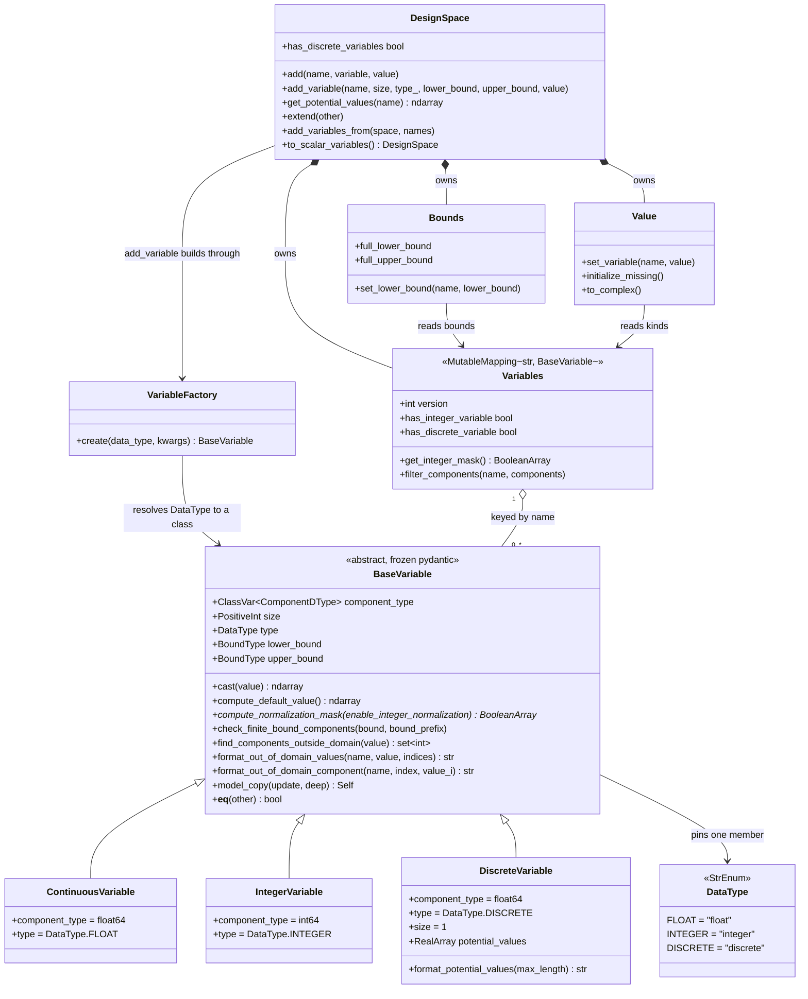

<!--
 Copyright 2021 IRT Saint Exupéry, https://www.irt-saintexupery.com

 This work is licensed under the Creative Commons Attribution-ShareAlike 4.0
 International License. To view a copy of this license, visit
 http://creativecommons.org/licenses/by-sa/4.0/ or send a letter to Creative
 Commons, PO Box 1866, Mountain View, CA 94042, USA.
-->

# Discrete Variables in the DesignSpace

## Requirements

Implement a third kind of design variable, `DiscreteVariable`, whose domain is a finite,
explicit, sorted set of numeric values (`x ∈ {1, 4, 6, 9}` or `x ∈ {0.4, 0.47}`) instead
of a `[lower_bound, upper_bound]` interval, so that a modeller can declare a
catalog-valued quantity — a ply count, a bolt diameter, a qualified material thickness —
in the design space itself rather than maintaining an index-to-value map outside it.

Introduce `DesignSpace.add(name, variable, value=None)` as the kind-agnostic
construction funnel, because a set-shaped domain cannot be expressed by `add_variable`'s
`(size, type_, lower_bound, upper_bound, value)` signature, and route every internal
variable-rebuilding path through it so that a kind-specific field is never silently
dropped.

Boundaries:

- **In scope — the data model only.** A discrete variable becomes *declarable*
  (constructor + `add`), *checkable* (membership on both `check_membership` paths),
  *persistable* (HDF and CSV round-trips are lossless), and *viewable* (tabular view).
- **Out of scope — solving.** No encoder, no relaxation, no working design space, no
  `handle_discrete_variables` capability flag, no `round_ints` rework, no driver guard.
  A discrete variable is treated by an optimizer or DOE as a bounded continuous one; the
  changelog and user documentation must state this limitation explicitly.
- **Also out of scope**: categorical (unordered) variables, catalog-backed variables,
  discrete random variables in `ParameterSpace`, and the deprecation/migration of
  `add_variable` (81 call sites in `src/`, 588 in `tests/`, 133 in `docs/`).
- **Additive only.** Every existing `add_variable` call, every previously written HDF or
  CSV file, and every existing behavior of continuous and integer variables is unchanged.

## Entities

Conservative notes on this model:

- `potential_values` is a **new field on the new subclass only**. `BaseVariable` gains no
  optional field whose meaning depends on `type`.
- No DTOs, no wrappers: the potential values are a frozen 1-D NumPy array, matching how
  `lower_bound` / `upper_bound` are already stored.
- **No `__eq__` override.** `BaseVariable.__eq__` (`_base.py:363`) already walks the
  union of `type(self).model_fields` and `type(other).model_fields`, so
  `potential_values` participates in comparison for free and a field declared by only one
  kind is already an inequality.
- The variable name stays **outside** the variable: `Variables` is keyed by name, the
  model is frozen, and a `name` field would force `rename`, `__eq__`, the factory and both
  I/O readers to learn about it.

## Approach

1. **Kind as a class, not a branch**
    - Add exactly one subclass, `DiscreteVariable`, implementing the existing polymorphic
    interface introduced by #1845. `Variables`, `Normalizer`, `IntegerRounder`, `Bounds`
    and the aggregate-mask machinery get **no new branch**.
    - The only unavoidable non-polymorphic edits are the new `DataType.DISCRETE` member and
    the `(ContinuousVariable, IntegerVariable)` tuple that derives `TYPE_MAP` in
    `space/_variable/__init__.py:32`.
    - **Acceptance rule for the design**: any `if variable.type == …` or
    `isinstance(variable, DiscreteVariable)` that appears in `space/design/` outside the
    two I/O readers and the view is a design smell to be replaced by a hook. (The
    existing `isinstance(variable, IntegerVariable)` sweeps in `Variables` stay as they
    are: a discrete variable falls out of the integer and rounding masks for free.)

2. **Derive the bounds from the sorted set**
    - `lower_bound = potential_values[0]`, `upper_bound = potential_values[-1]`, written by
    the model validator, never supplied by the caller.
    - Rationale: reporting `±inf` is the literal reading of "the bounds have no meaning",
    but it would push a fake unboundedness into `Bounds._rebuild`, into the normalization
    policy and into the tabular view. Because the set is sorted and numeric its extremes
    *are* the true bounds of the domain, so deriving them keeps every bounds consumer
    correct and honest.
    - Supplying `lower_bound` or `upper_bound` explicitly is rejected at construction,
    which is also what makes `set_lower_bound` / `set_upper_bound` fail: `Bounds`
    rebuilds through `variable.model_copy(update={"lower_bound": …})` (`_bounds.py:104`).

3. **Enforce the domain in the membership layer, not the bounds layer**
    - The bound comparison stays a necessary-but-insufficient check. The set-membership
    check runs through `find_components_outside_domain`, which the #1845 hierarchy
    already routes per variable.
    - Close the full-vector hole: `_check_membership_array` (`_checking.py:242`) is
    bounds-only, so `check_membership(array)` would accept a non-candidate that
    `check_membership(dict)` rejects. Route the array path through
    `_check_membership_dict` **only** when the space holds a discrete variable, so the
    vectorized fast path is untouched for every space that has none.

4. **Move the domain-failure wording onto the variable**
    - Two sites phrase a domain failure today, both hard-coded to the integer story:
    `check_addable_value` (`_checking.py:132-140`) and `_check_index_in_domain`
    (`_checking.py:303-308`). `check_domain` (`:330`) and `_check_membership_dict`
    (`:388`) both delegate to the latter, so there are two call sites, not four.
    - Add two formatting hooks on `BaseVariable` whose **base implementations reproduce
    today's text byte for byte**. `IntegerVariable` and `ContinuousVariable` therefore
    need no override and no existing snapshot changes; only `DiscreteVariable` overrides.

5. **`add` as the construction funnel**
    - `DesignSpace.add(name, variable, value=None)` takes the variable object the factory
    already builds, and owns the value pipeline that `add_variable` performs today
    (`__init__.py:349-368`): `atleast_1d` → `check_addable_value` → scalar broadcast when
    `size > 1` → `cast` → `set_variable` → `check_value`, with the existing
    rollback-on-`ValueError` (`remove_variable` then re-raise).
    - `add_variable` keeps its signature and behavior and delegates: build through
    `VARIABLE_FACTORY.create`, then call `add`.
    - `extend`, `_add_variable_from` and the size-1 case of `to_scalar_variables` currently
    destructure a variable into `(size, type, lower_bound, upper_bound, value)` and would
    silently drop the set; route them through `add`, passing the frozen instance itself
    (`__copy__` / `__deepcopy__` return `self`, so sharing is safe).

6. **Persistence: never lossy, never breaking**
    - HDF: one extra dataset per variable group, written only for a variable that has the
    field, read with the existing `_read_opt_attr_array` optional-read helper. Absent
    means "not discrete", so an old file loads exactly as before.
    - CSV: one **space-free** cell, `2|4|6|8`, in a `potential_values` column appended only
    when the space holds a discrete variable. `to_csv` raises when the caller's
    `delimiter` is the cell separator, rather than emitting a file it cannot read back.
    `from_csv` reads that column from the existing string pass of `genfromtxt`.

7. **View: honest but bounded**
    - The tabular view is a human artefact, not a serialization format. Append the
    `potential_values` column with `table.add_column` — the pattern
    `ParameterSpace.get_pretty_table` already uses for its distribution columns
    (`parameter.py:583-594`) — only when the space holds a discrete variable, with a
    blank cell for the other kinds. Elide a long set and append the count. HDF and CSV
    never elide, and the full set is always available from
    `DesignSpace.get_potential_values`.

## Structure

### Inheritance Relationships

1. `BaseVariable(BaseModel, ABC, frozen=True)` declares the kind interface: one
   `@abstractmethod` `compute_normalization_mask`, plus the overridable hooks `cast`,
   `compute_default_component_value`, `compute_default_value`, `check_finite_bound_components`,
   `find_components_outside_domain` and — new in this story —
   `format_out_of_domain_values` and `format_out_of_domain_component`.
2. `DiscreteVariable(BaseVariable)` pins `type: Literal[DataType.DISCRETE]`,
   `size: Literal[1]` and `component_type: ClassVar = float64`, declares
   `potential_values`, and overrides `compute_normalization_mask`,
   `find_components_outside_domain`, `compute_default_value`, the two formatting hooks and
   `__setstate__`.
3. `ContinuousVariable` and `IntegerVariable` are unchanged.
4. `DataType(StrEnum)` gains a third member; it stays a closed enum, publicly re-exported
   as `gemseo.enum.DesignVariableType` (`enum/__init__.py:116`, lazy map at `:275`).
5. `VariableFactory(BaseFactory[BaseVariable])` is unchanged: the new kind self-registers
   by existing as a module in `gemseo.space.variable`, resolved through
   `model_fields["type"].default` (`_factory.py:46`).

### Dependencies

1. `DesignSpace.add_variable` calls `VARIABLE_FACTORY.create`, then `DesignSpace.add`.
2. `DesignSpace.add` calls `Variables.__setitem__`, `_checking.check_addable_value`,
   `Value.set_variable`, `Value.check_value` and, on failure, `DesignSpace.remove_variable`.
3. `DesignSpace.extend`, `_add_variable_from` and `to_scalar_variables` call
   `DesignSpace.add`.
4. `_io.from_hdf` and `_io.from_csv` call `VARIABLE_FACTORY.create` then
   `DesignSpace.add`.
5. `_io.to_hdf`, `_io._to_dataframe` and `_view.get_pretty_table` read
   `variable.potential_values` guarded by `Variables.has_discrete_variable` /
   `hasattr`; they are the only three sites allowed to know the field's name.
6. `_checking.check_addable_value` and `_checking._check_index_in_domain` call the two
   formatting hooks on the variable instead of phrasing the failure themselves.
7. `_checking.check_membership` consults `Variables.has_discrete_variable` to choose
   between `_check_membership_array` and `_check_membership_dict`.
8. `Bounds`, `Normalizer`, `IntegerRounder` and `Value.to_complex` gain **no** dependency
   on the new kind.

### Layered Architecture

1. **Variable layer** (`src/gemseo/space/variable/`): the kinds and their domains. Owns
   validation, freezing, default-value computation, normalization policy, domain
   membership and domain-failure wording. Knows nothing about a design space.
2. **Collaborator layer** (`src/gemseo/space/design/`): `Variables` (registry + versioning
    - masks), `Bounds`, `Normalizer`, `IntegerRounder`, `Value`, `_checking`, `_io`,
   `_view`. Kind-agnostic, apart from the three serialization/rendering sites named above.
3. **Façade layer** (`src/gemseo/space/design/__init__.py`, `space/parameter.py`): the
   public API. Owns `add`, `add_variable`, the accessors, the I/O entry points and the
   rollback semantics. `ParameterSpace` requires **no** edit.
4. **Consumer layer** (outside `space/`): `core/problem/database.py:1102` and
   `doe/core/base_doe_library.py:209` index `VARIABLE_TYPES_TO_DTYPES` (`TYPE_MAP`) by
   variable type and must find the new member there.
5. **Documentation and changelog layer**: `docs/user_guide/concepts/design_space.md` and
   `changelog/fragments/1885.added.md`.

## Operations

Execute in this order; each step leaves the test suite green.

### 1. Update Enum — `DataType` (`src/gemseo/space/variable/_base.py:93`)

1. Responsibility: carry the discriminator of the new kind.
2. Change: add `DISCRETE = "discrete"` after `INTEGER`.
3. Constraints: member key capitalized per the repo convention; value is the string that
   HDF, CSV and every external reader of `variable.type` will see.

### 2. Create Hooks — `BaseVariable` domain-failure wording (`_base.py`)

1. Responsibility: let a kind phrase its own domain failure, with the base implementation
   reproducing today's messages exactly so no existing snapshot moves.
2. Methods:
    - `format_out_of_domain_values(self, name: str, value: ndarray, indices: set[int]) -> str`
        - Logic: reproduce `_checking.check_addable_value:134-139` verbatim —
      `f"The following value{'s' if plural else ''} of variable '{name}' "`
      `f"{'are' if plural else 'is'} neither None nor {self.type} "`
      `f"while variable '{name}' is of type {self.type}: "`
      `f"{format_components(value, indices)}."` with `plural = len(indices) > 1`.
    - `format_out_of_domain_component(self, name: str, index: int, value_i: Any) -> str`
        - Logic: reproduce `_checking._check_index_in_domain:304-307` verbatim —
      `f"The variable {name} is of type {self.type}; got {name}[{index}] = {value_i}."`
3. Constraints: both are plain methods with a default body (not abstract), so the two
   existing kinds need no override; docstrings carry `Args:` and `Returns:`.

### 3. Update Checks — `_checking.py`

1. `check_addable_value` (`:132-140`): replace the inlined message with
   `raise ValueError(variable.format_out_of_domain_values(name, value, indices))`.
2. `_check_index_in_domain` (`:303-308`): replace the inlined message with
   `raise ValueError(variable.format_out_of_domain_component(name, index, value_i))`.
   Type the `variable` parameter as `BaseVariable` instead of `Any` while here.
3. `check_membership` (`:195-214`): in the `isinstance(value, ndarray)` branch with no
   `names`, choose the path on the registry:
    - Logic: if `variables.has_discrete_variable`, call `_check_membership_dict` with
    `split_array_to_dict_of_arrays(value, {name: variables[name].size for name in variables}, list(variables))`
    — reusing the mapping construction already present in the `names` branch — otherwise
    keep calling `_check_membership_array(bounds, value)`.
    - Edge case: `full_value.ndim > 1` must keep recursing row by row; keep that recursion
    in `_check_membership_array` and mirror it in the discrete branch by iterating rows.
4. Constraint: no `isinstance` on a variable kind and no `variable.type` comparison
   appears anywhere in this module.

### 4. Update Registry — `Variables` (`space/design/_variables.py`)

1. Add property `has_discrete_variable -> bool`
    - Logic: `any(isinstance(variable, DiscreteVariable) for variable in self.__name_to_variable.values())`,
    mirroring `has_integer_variable` (`:266`).
2. `filter_components` (`:216`): add a kind-agnostic identity shortcut before the rebuild
    - Logic: `idx = list(components)`; if `idx == list(range(variable.size))`, keep the
    existing frozen instance (`new_variable = variable`) instead of calling
    `model_copy`, then continue with the existing reindex/version bump.
    - Rationale: for a discrete variable the only valid component list is `[0]`, and
    `model_copy` re-validates through `model_validate({**__dict__, **update})` with both
    bounds in the update, which the explicit-bounds rejection refuses. The shortcut is
    also a strict win for every other kind.
3. Constraint: `get_integer_mask` (`:251`) and `has_integer_variable` (`:266`) are
   **unchanged** — a discrete variable is excluded from the integer and rounding masks by
   the existing `isinstance` selection.

### 5. Create Variable — `DiscreteVariable` (`src/gemseo/space/variable/_discrete.py`, new file)

1. Responsibility: a scalar variable whose domain is a finite sorted set of numeric values.
2. Class attributes:
    - `component_type: ClassVar[ComponentDType] = float64`
    - `type: Literal[DataType.DISCRETE] = DataType.DISCRETE`
    - `size: Literal[1] = 1`
3. Fields:
    - `potential_values: PotentialValuesType` — required, no default, where
    `PotentialValuesType = NDArrayPydantic[int] | NDArrayPydantic[float] | list[ScalarBoundType] | tuple[ScalarBoundType, ...]`,
    mirroring `BoundType` (`_base.py:62`).
4. Methods:
    - `__validate_discrete_variable(self) -> Self` — `@model_validator(mode="after")`
        - Logic, in order (pydantic runs the base-class validator first, so the inherited
      `-inf` / `inf` defaults are already converted, checked and frozen when this runs):
       1. Reject explicit bounds: if `{"lower_bound", "upper_bound"} & self.model_fields_set`,
          raise `ValueError` naming the set as the domain, e.g. *"The bounds of a discrete
          variable are derived from its potential values and cannot be set; got
          lower_bound=…"*. This is what makes `set_lower_bound` / `set_upper_bound` fail.
       2. Convert: `values = atleast_1d(asarray(self.potential_values, dtype=float64))`
          via a `try/except (TypeError, ValueError)` that re-raises a message naming the
          offending input for a non-numeric entry.
       3. Reject `values.ndim > 1` — *"The potential values must be one-dimensional."*
       4. Reject an empty set — *"A discrete variable must have at least one potential
          value."*
       5. Reject non-finite components: `indices = (~isfinite(values)).nonzero()[0]`; the
          message names them through `format_components(values, indices)`, consistent with
          `__check_bound` (`_base.py:216-224`).
       6. Sort: `values = sort(values)`.
       7. Reject duplicates **after** sorting: `(values[1:] == values[:-1]).any()` → a
          message naming the repeated values through `format_components`.
       8. Freeze and store: `values.setflags(write=False)`;
          `self.__dict__["potential_values"] = values`.
       9. Derive the bounds, each as its own frozen shape-`(1,)` array:
          `for name, index in (("lower_bound", 0), ("upper_bound", -1)):`
          `bound = array([values[index]], dtype=float64); bound.setflags(write=False);`
          `self.__dict__[name] = bound`. Do not share one array between the two bounds.
       10. `return self`
           - Constraint: every write goes through `self.__dict__[…] =` to bypass the frozen
      model, exactly as `__convert_bound` (`_base.py:184`) does.
    - `compute_normalization_mask(self, enable_integer_normalization: bool) -> BooleanArray`
        - Logic: `return full(1, False)`. A discrete component is never normalized; no
      analogue of `enable_integer_variables_normalization` is introduced.
    - `find_components_outside_domain(self, value: ndarray) -> set[int]`
        - Logic: `value_0 = atleast_1d(value)[0]`; return `set()` when `value_0 is None`
      (mirroring how `IntegerVariable` treats `None` as in-domain, since
      `check_addable_value` may pass a not-yet-set value), otherwise
      `set()` if `(self.potential_values == value_0).any()` else `{0}`.
        - Constraint: strict equality, no tolerance. Comparison is on `.real`, which both
      callers already pass.
    - `compute_default_value(self) -> ndarray`
        - Logic: `return array([self.potential_values[0]], dtype=self.component_type)` — the
      **first** potential value, not the midpoint of the derived interval.
    - `format_potential_values(self, max_length: int = 6) -> str`
        - Logic: with `n = len(self.potential_values)`, return `f"[{', '.join(...)}]"` over
      all values when `n <= max_length`; otherwise
      `f"[{v0}, {v1}, ..., {v[-2]}, {v[-1]}] ({n} values)"`.
        - Returns: the human-readable rendering used by the view and by the failure message.
    - `format_out_of_domain_values(self, name, value, indices) -> str`
        - Logic: *"The value … of variable 'x' is not among its potential values
      {formatted}: {format_components(value, indices)}."*
    - `format_out_of_domain_component(self, name, index, value_i) -> str`
        - Logic: *"The variable x is discrete with potential values {formatted}; got
      x[{index}] = {value_i}."*
    - `__setstate__(self, state: dict[str, Any]) -> None`
        - Logic: call `super().__setstate__(state)` (which re-freezes the two bounds), then
      `self.__dict__["potential_values"].setflags(write=False)`, because NumPy does not
      preserve the writeable flag across pickling.
5. Constraints:
    - **No `__eq__` override** — `BaseVariable.__eq__` already covers the new field.
    - No `model_copy` override: the inherited one rebuilds through `model_validate`, which
    correctly refuses an update carrying explicit bounds.
    - `component_type` is `float64` unconditionally, so `potential_values=[2, 4, 6, 8]`
    yields a current value rendered as `2.0`; `TYPE_MAP` admits one dtype per `DataType`
    member and two consumers outside `space/` read it, so a per-instance dtype is out of
    scope.

### 6. Update Package — `src/gemseo/space/variable/__init__.py`

1. Add `from gemseo.space.variable._discrete import DiscreteVariable` (single-line
   import, isort order).
2. Add `DiscreteVariable` to the `TYPE_MAP` class tuple (`:34`) — without this the map is
   silently incomplete and `core/problem/database.py:1102` /
   `doe/core/base_doe_library.py:209` raise `KeyError` the first time a discrete variable
   reaches them.
3. Add `"DiscreteVariable"` to `__all__`, alphabetically.

### 7. Update Constants — `space/design/_constants.py`

1. `_POTENTIAL_VALUES_GROUP: Final[str] = "potential_values"` — the HDF dataset name, the
   CSV header and the view column, one name end to end.
2. `_POTENTIAL_VALUES_SEPARATOR: Final[str] = "|"` — the intra-cell separator for CSV.
3. `_TABLE_NAMES` stays five fields long: the new column is appended conditionally, never
   declared as a default field.

### 8. Create Method — `DesignSpace.add` (`space/design/__init__.py`)

1. Signature: `def add(self, name: str, variable: BaseVariable, value: complex | Iterable[complex] | None = None) -> None`
2. Responsibility: the single construction primitive; register a variable object and its
   optional current value, atomically.
3. Logic (moved out of `add_variable:337-373`, behavior unchanged):
    - Raise `ValueError(f"The variable {name!r} already exists.")` when `name in self._variables`.
    - `self._variables[name] = variable`
    - When `value is None`: `self._current.set_variable(name, None)` so that every variable
    always has an entry in the current value.
    - Otherwise, inside `try`: `array_value = atleast_1d(value)`;
    `_checking.check_addable_value(self._variables, array_value, name)`;
    broadcast with `full(variable.size, value)` when `len(array_value) == 1 and variable.size > 1`;
    `self._current.set_variable(name, array_value.astype(variable.component_type, copy=False))`;
    `self._current.check_value(name)`.
    - `except ValueError`: `self.remove_variable(name)` then `raise` — the existing
    rollback, so a rejected value leaves the space unchanged rather than half-registered.
4. Docstring: `Args:` for all three parameters, `Raises:` for the duplicate name, a bad
   value and an out-of-bounds value; cross-reference the kinds with
   `[DiscreteVariable][gemseo.space.variable._discrete.DiscreteVariable]`.

### 9. Update Method — `DesignSpace.add_variable` (`:310`)

1. Keep the signature, the docstring and every observable behavior.
2. Logic: after `variable = VARIABLE_FACTORY.create(type_, size=size, lower_bound=lower_bound, upper_bound=upper_bound)`,
   delegate with `self.add(name, variable, value)`; delete the duplicated registration,
   value and rollback code.
3. Constraint: not deprecated, not renamed, no warning emitted.

### 10. Update Methods — the variable-rebuilding paths (`space/design/__init__.py`)

1. `extend` (`:1390`): `for name, variable in other._variables.items(): self.add(name, variable, other._current_value.get(name))`.
2. `_add_variable_from` (`:1445`): `self.add(name, space._variables[name], space._current_value.get(name))`.
3. `to_scalar_variables` (`:1462`): when `self.get_size(name) == 1`, call
   `design_space.add(name, self._variables[name], current_value[0])` and skip the
   per-component loop; keep the existing destructuring path for `size > 1`.
4. `rename_variable` (`:1409`) is unchanged — the set travels on the variable object.
5. Rationale: variables are frozen and `__copy__` / `__deepcopy__` return `self`, so the
   same instance is shared rather than rebuilt, and no kind-specific field is dropped.

### 11. Create Accessors — `DesignSpace` (`space/design/__init__.py`)

1. `get_potential_values(self, name: str) -> ndarray`
    - Logic: `variable = self._variables[name]` (raising `UnknownVariableError` for an
    unknown name through the existing `__getitem__`); raise `ValueError`
    — *"The variable 'x' is of type float; only a discrete variable has potential
    values."* — when the variable has no `potential_values`; otherwise return
    `variable.potential_values.view()`, a read-only view, mirroring
    `Bounds.get_lower_bound` (`_bounds.py:102`).
    - Returns: the sorted potential values; needed by any space reloaded from a file
    without reaching into `_variables`.
2. `has_discrete_variables -> bool` — a property returning
   `self._variables.has_discrete_variable`, mirroring `has_integer_variables` (`:389`).

### 12. Update I/O — HDF (`space/design/_io.py`)

1. `to_hdf` (`:81`), inside the per-variable loop, after the type dataset:
    - Logic: `potential_values = getattr(variable, "potential_values", None)`; when not
    `None`, `pv = array(potential_values, copy=False)`, then the existing
    `require_dataset(_POTENTIAL_VALUES_GROUP, pv.shape, pv.dtype)` / `[...] = pv` pattern,
    so `append=True` adds the dataset under that variable's group without disturbing
    siblings.
2. `from_hdf` (`:136`):
    - Logic: read `potential_values = _read_opt_attr_array(var_group, _POTENTIAL_VALUES_GROUP)`.
    When it is `None`, keep today's `design_space.add_variable(name, size, var_type, l_b, u_b, value)`.
    Otherwise build `variable = VARIABLE_FACTORY.create(var_type, potential_values=potential_values)`
    and call `design_space.add(name, variable, value)` — the persisted `l_b` / `u_b` are
    **ignored** for a discrete variable, since they are derived.
3. Constraint: a file written before this story has no such dataset, so the absent-means-
   not-discrete rule keeps it loading byte-for-byte identically.

### 13. Update I/O — CSV (`space/design/_io.py`)

1. `_to_dataframe` (`:168`):
    - Logic: collect a `potential_values` column alongside the existing five; for a
    variable exposing the field, the cell is
    `_POTENTIAL_VALUES_SEPARATOR.join(map(str, variable.potential_values))`, otherwise the
    empty string. Add the key to the `data` dict only when
    `design_space._variables.has_discrete_variable`, so a continuous-only export is
    byte-identical to today's.
2. `to_csv` (`:202`):
    - Logic: when `design_space._variables.has_discrete_variable`, raise `ValueError` if
    `delimiter` (or its `" "` fallback) equals `_POTENTIAL_VALUES_SEPARATOR` —
    *"A design space holding a discrete variable cannot be exported with '|' as
    delimiter, which separates the potential values within a cell."* — and, when `fields`
    is empty, pass `columns=[*_TABLE_NAMES, _POTENTIAL_VALUES_GROUP]`.
3. `from_csv` (`:226`):
    - Logic: after `var_type` is read, when `_POTENTIAL_VALUES_GROUP in col_map`, take
    `cell = str_data[k, col_map[_POTENTIAL_VALUES_GROUP]]` from the **string** pass; when
    the cell is non-empty and not `"None"`, build
    `variable = VARIABLE_FACTORY.create(var_type, potential_values=[float(v) for v in cell.split(_POTENTIAL_VALUES_SEPARATOR)])`
    and call `design_space.add(name, variable, value)`, ignoring the `l_b` / `u_b`
    columns; otherwise keep today's `add_variable` call.
    - Edge case: the float pass yields `nan` in that column, which is never read.
4. Constraint: `_MINIMAL_FIELDS` is unchanged, so an old file with five columns still
   loads.

### 14. Update View — `space/design/_view.py`

1. `get_pretty_table` (`:38`), after the existing row loop and before the alignment loop:
    - Logic: when `design_space._variables.has_discrete_variable` and (`not fields` or
    `_POTENTIAL_VALUES_GROUP in fields`), build one cell per rendered row —
    `variable.format_potential_values()` for a discrete variable, `""` otherwise, one
    entry per component — and append it with
    `table.add_column("Potential values" if capitalize else _POTENTIAL_VALUES_GROUP, cells)`,
    the pattern `ParameterSpace.get_pretty_table` already uses (`parameter.py:583-594`).
2. Constraints: one line per component is preserved; a space with no discrete variable
   renders exactly as today, five columns wide; `ParameterSpace.get_pretty_table` needs no
   edit, since it calls `super().get_pretty_table` and then appends its own columns.

### 15. Update Documentation and Changelog

1. `docs/user_guide/concepts/design_space.md:32`: the sentence *"a type, either `"float"`
   (continuous, default) or `"integer"` (discrete)"* is now wrong — `"discrete"` is a
   distinct type. Rewrite to present the three types, describe `DiscreteVariable` and
   `DesignSpace.add`, and state that a discrete variable is **not yet solvable**.
2. `changelog/fragments/1885.added.md`: the new variable type, the new
   `DesignSpace.add(name, variable, value)` method, the new `"discrete"` member of
   `DesignVariableType`, the HDF/CSV format extension (files holding a discrete variable
   cannot be read by an older GEMSEO), and — the highest-value line — the explicit
   limitation that an optimizer or DOE treats a discrete variable as a bounded continuous
   one and may return a value that is not among the potential values.
3. Constraint: no changelog entry for anything a user cannot observe.

### 16. Create Tests

1. `tests/space/test_variable.py`
    - `KINDS` (`:43`) and the `variable` fixture (`:46`) build every kind with
    `cls(size=1, lower_bound=0, upper_bound=1)`, which `DiscreteVariable` rejects by
    design. Add a `KIND_TO_KWARGS` mapping (`DiscreteVariable: {"potential_values": [0, 1]}`)
    and parametrize the shared fixture through it, so the copy/deepcopy/pickle and
    read-only-array tests cover the new kind without weakening the rejection.
    - New cases: sorting, derived bounds, rejection of an empty set / duplicates / a
    non-numeric entry / a non-finite entry / `size != 1` / explicit bounds; frozen
    `potential_values` (`.setflags(write=True)` and an in-place write both fail);
    `find_components_outside_domain` on a member, a non-member inside the derived
    interval, and `None`; `compute_default_value`; `format_potential_values` at 6 and 50
    values; two variables sharing derived bounds but not their sets compare unequal.
2. `tests/space/test_variable_factory.py`: `VARIABLE_FACTORY.create("discrete", potential_values=[…])`
   returns a `DiscreteVariable`; use the `reset_factory` fixture, since
   `_data_type_to_class_name` is cached.
3. `tests/space/design/test_checking.py`: the integer messages are **unchanged**; a
   discrete non-member is rejected on both `check_membership` paths (mapping and full
   array) with the set-naming message; a continuous-only space still takes the vectorized
   array path.
4. `tests/space/design/test_variables.py`: `has_discrete_variable`;
   `filter_components(name, [0])` on a discrete variable returns the same instance
   (`is`), and the identity shortcut does not change the behavior for the other kinds.
5. `tests/space/test_design_space.py`: `add` for all three kinds and its rollback on an
   invalid value; `add_variable` unchanged; `get_potential_values` (success, non-discrete
   error, unknown name, read-only result); `initialize_missing_current_values` gives the
   first potential value; a scalar value is stored with shape `(1,)`;
   `normalize_vect` / `round_vect` are the identity on a discrete component;
   `set_lower_bound` / `set_upper_bound` fail; `extend`, `add_variables_from`,
   `rename_variable`, `filter_dimensions`, `to_scalar_variables` and `to_complex` all
   preserve the set; HDF round-trip (including `append=True`) and CSV round-trip yield an
   **equal** space; `to_csv(delimiter="|")` raises; the pre-existing fixture CSV files and
   `fail.hdf5` still load unchanged; the pretty table with and without a discrete
   variable.
6. `tests/space/test_parameter_space.py`: a discrete deterministic variable beside random
   variables — construction, equality, tabular view, HDF round-trip.
7. Conventions: assert messages with `assert_exception` from
   `gemseo.util.testing.helper` plus the `snapshot` fixture rather than
   `pytest.raises(match=…)`; regenerate with `uv run pytest --snapshot-update <path>`
   **without** `-n`, and review the diff.

## Norms

1. **File preamble**: the LGPL license header (inserted by pre-commit) and
   `from __future__ import annotations` first in every source file.
2. **Naming**: a callable name starts with a verb — `format_potential_values`,
   `find_components_outside_domain`, `compute_default_value`; a noun-only name is reserved
   for an attribute or property (`potential_values`, `has_discrete_variable`). Enum member
   keys are capitalized (`DISCRETE`).
3. **Imports**: one import per line (`force-single-line = true`), isort order,
   `TYPE_CHECKING`-only imports for annotations. `DiscreteVariable` is exported from
   `gemseo.space.variable` and imported from there by the `design/` package, never from
   `_discrete` directly.
4. **Docstrings**: Google convention, mkdocs/markdown cross-references
   (`[DataType][gemseo.space.variable._base.DataType]`, never Sphinx RST). Every
   docstring with parameters carries `Args:`, every non-`None` return carries `Returns:`,
   every raising path carries `Raises:` — private, dunder and `@staticmethod` callables
   included. `# noqa: D102` for an override that inherits its docstring, as
   `ContinuousVariable.compute_normalization_mask` already does.
5. **Pydantic mechanics**: `frozen=True` is inherited; a validator writes through
   `self.__dict__[name] = …` to bypass assignment validation; a NumPy array stored on a
   variable is frozen with `setflags(write=False)` and re-frozen in `__setstate__`;
   `component_type` is a `ClassVar`, `type` and `size` are pinned with `Literal` defaults.
6. **Error messages**: build the message into a local `msg` then `raise ValueError(msg)`
   (the pattern every module here uses, required by ruff `EM`); report offending array
   components through `format_components`; use `pretty_str` for a list of names.
7. **Polymorphism over branching**: a behavior that differs per kind is a method on the
   kind. No `if variable.type == …` and no `isinstance(variable, DiscreteVariable)` in
   `space/design/` beyond the two I/O readers and the view, which serialize and render a
   named field.
8. **Testing**: snapshot exception messages with `assert_exception`; use the shared
   fixtures (`tmp_wd`, `reset_factory`) from `gemseo.util.testing.pytest_conftest`; never
   pass `-n` together with `--snapshot-update`; cap xdist at `-n 4` locally.
9. **Changelog**: one fragment, `changelog/fragments/1885.added.md`, describing only
   user-visible net effects relative to the last release; no branch-internal churn.

## Safeguards

1. **Functional constraints**
    - A value is admissible **iff** it equals one of the potential values, compared with
    strict equality (no tolerance). Both `check_membership` paths must agree on every
    input.
    - `size == 1` always; any other size is rejected at construction.
    - The set is non-empty, numeric, finite, duplicate-free, sorted ascending and frozen
    after construction.
    - `lower_bound` / `upper_bound` equal the first and last potential values; supplying
    either explicitly is an error, and `set_lower_bound` / `set_upper_bound` fail.
    - `initialize_missing_current_values` assigns the **first** potential value, never the
    midpoint of the derived interval.
    - A scalar current value is stored as a shape-`(1,)` array.
    - A discrete component is neither normalized nor rounded: `normalize_vect`,
    `unnormalize_vect` and `round_vect` are the identity on it.
2. **Backward-compatibility constraints (hard)**
    - No change to the signature, semantics or error messages of `add_variable`.
    - No change to any message emitted for a continuous or integer variable: the base
    implementations of the two formatting hooks reproduce today's text verbatim, and
    `tests/space/__snapshots__/test_design_space.ambr`,
    `tests/space/__snapshots__/test_variable.ambr` and
    `tests/space/design/__snapshots__/test_checking.ambr` must show **no diff** except
    for genuinely new cases. A diff on an existing entry is a defect, not a snapshot to
    accept.
    - A space with no discrete variable renders and exports byte-identically to today
    (five columns).
    - Every HDF and CSV file written before this story loads unchanged; the fixture files
    under `tests/space/` are the regression baseline.
    - `ParameterSpace` is not edited.
3. **Data and format constraints**
    - `potential_values` is the single name for the model field, the HDF dataset, the CSV
    header and the view column.
    - HDF: one dataset per variable group, written only for a variable that has the field,
    read through `_read_opt_attr_array`; absent means "not discrete". `append=True` must
    not disturb sibling datasets.
    - CSV: one space-free cell `2|4|6|8`; `to_csv` raises when the delimiter is `|` on a
    space holding a discrete variable; a round-trip yields an **equal** space.
    - The persisted `l_b` / `u_b` of a discrete variable are informational: both readers
    ignore them and let the constructor derive the bounds.
4. **Performance constraints**
    - `compute_normalization_mask` is called on rebuild only, inside a
    `RegistryDerivedData` callback; the hot `normalize_vect` path keeps operating on
    cached aggregate masks keyed on `Variables.version`. No per-call kind dispatch may
    appear in it.
    - The vectorized `_check_membership_array` path stays in use for every space with no
    discrete variable; the per-variable loop is entered only when
    `has_discrete_variable` is true.
    - `has_discrete_variable` is an `any(...)` sweep over the registry — call it once per
    operation, not once per component.
5. **Integration constraints**
    - `DiscreteVariable` **must** appear in the `TYPE_MAP` tuple
    (`space/_variable/__init__.py:34`); otherwise the map is silently incomplete and
    `core/problem/database.py:1102` and `doe/core/base_doe_library.py:209` raise
    `KeyError` on the first discrete variable that reaches them.
    - `DataType.DISCRETE` becomes public immediately through
    `gemseo.enum.DesignVariableType`; `tests/test_enums.py::test_all_exports_are_enums`
    guards the lazy string. A third-party consumer matching exhaustively on `DataType`
    with no default branch will break — hence the changelog note.
    - `_variable/_legacy.py` is untouched: a pre-#1845 pickle is never discrete.
    - The factory needs no edit; the new module self-registers, and any test asserting on
    discovery uses the `reset_factory` fixture.
6. **Known limitation to state, not to fix here**
    - With no driver guard, running an optimizer or a DOE on a space holding a discrete
    variable treats it as bounded continuous and can return a value that is not among
    the potential values, **without warning**. This is deliberate and must be written
    into both the changelog fragment and the user documentation. It is the single most
    likely source of user confusion between this MR and the solver-facing one.
7. **Design-quality constraints (reviewable)**
    - No `__eq__` override on `DiscreteVariable`; assert the inherited behavior instead.
    - No optional `potential_values` field on `BaseVariable`.
    - No `name` field on `BaseVariable`.
    - Exactly three sites in `space/design/` may name `potential_values`: `_io.to_hdf` /
    `_io._to_dataframe` (+ the two readers), `_view.get_pretty_table`, and
    `DesignSpace.get_potential_values`. Anything else means a missing hook.
    - `filter_components`' identity shortcut must be kind-agnostic, not a discrete
    special case.
8. **Verification constraints**
    - All existing `tests/space/**` tests pass unchanged; snapshot regeneration is the only
    sanctioned churn and every regenerated entry must be reviewed line by line.
    - Copy, deepcopy and pickle round-trips return a `DiscreteVariable` whose
    `potential_values` and both bounds are read-only.
    - A discrete (`float64`) variable beside an integer one goes through the existing
    `Value.common_dtype` promotion — assert it, no new path expected.
    - `uv run ruff check` and `uv run ruff format --check` are clean; the pre-commit hooks
    (license header, commitizen) pass.
