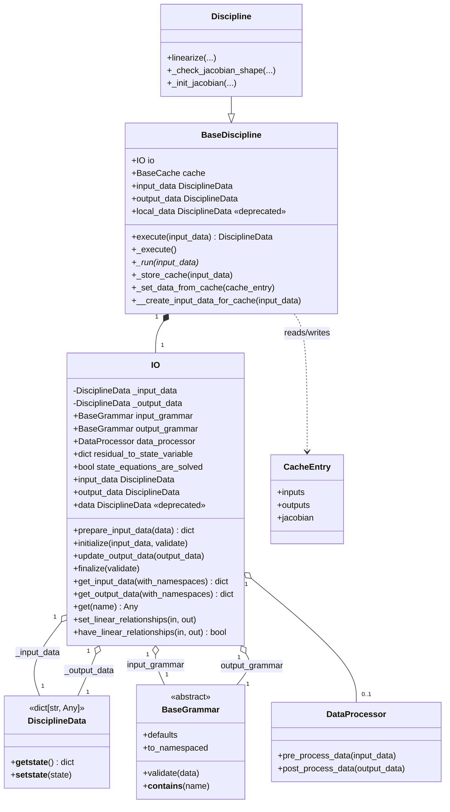

<!--
 Copyright 2021 IRT Saint Exupéry, https://www.irt-saintexupery.com

 This work is licensed under the Creative Commons Attribution-ShareAlike 4.0
 International License. To view a copy of this license, visit
 http://creativecommons.org/licenses/by-sa/4.0/ or send a letter to Creative
 Commons, PO Box 1866, Mountain View, CA 94042, USA.
-->

# Split Discipline Local Data into Input and Output Stores

## Requirements

Split the single merged `DisciplineData` held by `gemseo.core.discipline.io.IO` into two independent stores — one for input data, one for output data — so the input/output side of every value is structurally unambiguous at every stage of the execution lifecycle. Preserve current public behavior of `BaseDiscipline.local_data` and `IO.data` through deprecated compatibility shims that emit `DeprecationWarning` on access. Change the return value of `BaseDiscipline.execute()` from the merged input+output dict to **output data only** (breaking API change, called out in the changelog). Migrate every internal call site inside `src/gemseo/` to the new attributes so the deprecation surface is empty for first-party code. Do not optimize for performance in this iteration; that is an explicit follow-up.

## Entities

Notes on entities:

- Reuse existing `DisciplineData`; do not introduce a new dict subclass. The split is structural (two instances) not type-level.
- `IO.data` and `BaseDiscipline.local_data` remain as **deprecated** read/write properties returning a union view; do not delete.
- No new public DTO is introduced. The grammar layer already classifies names; the new stores rely on grammar membership for routing.
- Auto-coupled names (in both grammars) are stored **only in `_output_data`** after `update_output_data`. Callers that need to feed the post-execution value back as an input (typically MDAs preparing the next fixed-point iteration) must copy it explicitly from `_output_data` into `_input_data`.

## Approach

1. **Storage refactor (IO):**
    - Replace `IO._data: DisciplineData` with `IO._input_data: DisciplineData` and `IO._output_data: DisciplineData`.
    - Expose two new properties `IO.input_data` and `IO.output_data` returning the underlying stores (mutable, no copy).
    - Keep `IO.data` as a deprecated property that materializes the union `{**self._input_data, **self._output_data}` on read (output wins on overlap, matching today's last-write-wins behavior) and emits `DeprecationWarning` once per call site (use `warnings.warn(..., DeprecationWarning, stacklevel=2)`).
    - Keep `IO.data` setter that splits the assigned mapping by grammar membership into the two stores and emits `DeprecationWarning`; names in neither grammar fall into `_output_data` (preserves current permissive behavior for residual-norm keys).

2. **Write-path migration:**
    - `IO.initialize(input_data, validate)`: write input data to `_input_data` only; clear both stores beforehand.
    - `IO.update_output_data(output_data)`: write to `_output_data` only — no mirror. Auto-coupled values land in `_output_data`; `_input_data` retains its pre-execution snapshot.
    - `BaseDiscipline._set_data_from_cache(cache_entry)`: route `cache_entry.inputs` to `_input_data` and `cache_entry.outputs` to `_output_data`. No mirror.
    - `BaseDiscipline._store_cache(input_data)`: read outputs from `io._output_data` (no grammar filtering needed).

3. **Read-path migration (per call site):**
    - `BaseDiscipline._execute`: read `io._input_data` (replaces `io._data` when no namespaces).
    - `Discipline._check_jacobian_shape` / `_init_jacobian`: read input values from `io._input_data`, output values from `io._output_data`.
    - `Discipline._linearize` body that does `self.io._data.update(input_data)`: write to `io._input_data` (plus mirror).
    - `core/chains/*.py`, `mda/*.py`, `parallel_execution/*.py`, `derivatives/jacobian_assembly.py`, `disciplines/*.py`, `problems/**/*.py`, `utils/**/*.py`: replace `io.data` reads by either `io.get(name)` (new helper, see below) for ambiguous names, or by direct access to `io.input_data` / `io.output_data` when the side is known from context.
    - `disciplines/ode/ode_discipline.py` (uses `self.local_data`): replace with `self.input_data` (these are all input reads).
    - `formulations/bilevel.py` `discipline.local_data.items()`: replace with iteration over the merged union via a new internal helper `IO.iter_items()` *or* split by side at the call site (preferred).

4. **New `IO.get(name)` helper:**
    - Resolves the value of `name` from `_input_data` first, falling back to `_output_data`. Used at call sites that previously did `io.data[name]` and where the side is determined dynamically (Jacobian assembly, residual handling). Does not emit a warning. This is the supported replacement for `io.data[name]` lookups whose side depends on runtime context.

5. **Parallel-execution wire format:**
    - `parallel_execution/discipline_execution.py:96`: workers continue to return the discipline's `_output_data` (which is what `Discipline.execute` returns post-split). The parent reconstructs `_input_data` locally from the scheduled `inputs[i]` via `prepare_input_data`, then assigns `_output_data` from the worker return. No tuple wire-format change here.
    - `parallel_execution/discipline_linearization.py`: `_WorkerData` is changed from `(io_data, jacobian)` to `(input_data, output_data, jacobian)` — the linearization functor wraps `disc.linearize` and returns both stores plus the Jacobian. Parent reassigns the two stores and `disc.jac`.

6. **MDA coupling-propagation migration:**
    - `mda/base_parallel_solver.py`, `mda/gauss_seidel.py`, `mda/jacobi.py`, `mda/quasi_newton.py`, `mda/newton_raphson.py`, `mda/chain.py`, `mda/sequential.py`, `mda/base.py`, `mda/base_solver.py`: with no mirroring, every fixed-point iteration must **explicitly copy** the auto-coupled output back to the input store before the next discipline call. Concretely: after each discipline `execute`, the MDA does `self.io._input_data.update({k: discipline.io._output_data[k] for k in discipline.io.output_grammar if k in self.io.input_grammar})` (or the chain-local equivalent). This is the single biggest behavioral migration in the change.
    - `NORMALIZED_RESIDUAL_NORM` is already registered into the MDA's output grammar (`mda/base.py:243`), so it routes naturally to `_output_data` via `update_output_data` — no special-case policy needed.

7. **Backward compatibility:**
    - `BaseDiscipline.local_data` getter emits its own `DeprecationWarning` and returns `self.io.get_merged_data(as_dict=False)` (no-warn helper, `DisciplineData` return) — avoids the double-warning that would occur if it called `self.io.data`.
    - `BaseDiscipline.local_data` setter emits its own `DeprecationWarning` and delegates routing to `self.io._set_data_no_warn(data)` — the canonical split logic shared with `IO.data` setter (the routing loop itself lives one level deeper in `IO.__route_into_stores`).
    - `IO.__setstate__` accepts both legacy state with `_data` (split it by grammar on load) and new state with `_input_data` / `_output_data`. This unpickles old serialized disciplines without intervention.

8. **Deprecation warning policy:**
    - Use `DeprecationWarning` (not `FutureWarning`); GEMSEO already uses `DeprecationWarning` in similar shims (verify by grepping `DeprecationWarning` in `src/gemseo/`).
    - Filter once per stacklevel via Python default filter; do not implement custom dedup.
    - Provide migration message: `"`IO.data` and `Discipline.local_data` are deprecated; use `input_data` / `output_data` instead."`.

9. **Docs and changelog:**
    - Update `docs/disciplines/discipline.md` (the `local_data` how-to section) to show `input_data` / `output_data`.
    - Update `docs/disciplines/jacobian_assembly.md` example to use `self.input_data["y_14"]` etc.
    - Add a new entry in `docs/software/upgrading.md` listing the deprecation and the replacements.
    - Add a towncrier fragment under `changelog/fragments/` describing the deprecation, the new attributes, and the auto-coupled mirroring rule.

## Structure

### Inheritance Relationships

1. `DisciplineData` extends `dict[str, Any]`; unchanged.
2. `BaseDiscipline` extends `BaseMonitoredProcess`; gains two new properties (`input_data`, `output_data`) and keeps `local_data` as deprecated.
3. `Discipline` extends `BaseDiscipline`; internal reads adapted, no API change.
4. `IO` is a concrete class; gains two new properties (`input_data`, `output_data`) and a `get(name)` helper; keeps `data` as deprecated.
5. No new exception class. Migration uses standard `DeprecationWarning`.

### Dependencies

1. `BaseDiscipline.execute` calls `IO.initialize` (writes `_input_data`) → `_execute` → `IO.update_output_data` (writes `_output_data` only — no mirror) → `IO.finalize` (validates `_output_data`).
2. `BaseDiscipline._store_cache` reads `IO._output_data`; `_set_data_from_cache` writes both stores.
3. MDA solvers (`mda/*.py`) read and write `discipline.io.input_data` / `discipline.io.output_data` for coupling propagation.
4. Chains (`core/chains/*.py`) read child `discipline.io.output_data` and write parent `io.input_data` for the next link.
5. Jacobian assembly (`core/derivatives/jacobian_assembly.py`, `core/discipline/discipline.py`) reads sizes from `IO._input_data` and `IO._output_data` via `IO.get(name)`.
6. Parallel-execution workers (`core/parallel_execution/*.py`) serialize `(input_data, output_data[, jacobian])` and re-hydrate the two stores on return.
7. `DataProcessor` interaction unchanged: still wraps `_run`, still must not touch the data attributes (doc clarified).

### Layered Architecture (gemseo idioms — Python library, no controllers)

1. **Public API layer** (`Discipline.execute`, `Discipline.linearize`, `Discipline.input_data`, `Discipline.output_data`, deprecated `Discipline.local_data`): user-facing.
2. **IO container layer** (`IO`): owns grammars, stores, processors, lifecycle methods.
3. **Discipline orchestration** (`BaseDiscipline`): execution and cache integration; uses `IO` exclusively.
4. **Composite disciplines** (`MDA`, `MDOChain`, `ParallelChain`): treat each child's `io.input_data` / `io.output_data` as the coupling exchange surface.
5. **Compatibility shim layer**: `IO.data` getter/setter and `BaseDiscipline.local_data` getter/setter. Each public attribute is its own warning-emission boundary (one `DeprecationWarning` per access). The grammar-routed split logic lives in `IO._set_data_no_warn` (which calls the private `IO.__route_into_stores` shared with `__setstate__`); the union-view build lives in `IO.get_merged_data(as_dict=False)`. Both helpers are shared by `IO` and `BaseDiscipline` shim paths, so no double-warning occurs when one delegates to the other.

### Extension Interfaces

- Subclasses of `BaseDiscipline` that override `_run` are unaffected. `_run` contract (receive `input_data`, return output mapping) is preserved.
- Subclasses overriding `_set_data_from_cache` (rare) must adapt; document the new contract.
- Third-party MDA/chain implementations using `io.data` continue to work via the deprecated shim until they migrate.

## Operations

### Update Class — `IO` (`src/gemseo/core/discipline/io.py`)

1. Responsibility: own input and output data stores for one discipline; provide read/write API and the deprecated merged view.
2. Attribute changes:
    - Remove `_data: DisciplineData`.
    - Add `_input_data: DisciplineData = DisciplineData()`.
    - Add `_output_data: DisciplineData = DisciplineData()`.
3. Constructor (`__init__`):
    - After grammar construction, replace `self.data = {}` with:
        - `self._input_data = DisciplineData()`
        - `self._output_data = DisciplineData()`
4. Add property `input_data -> DisciplineData`:
    - Logic: `return self._input_data`. No copy. No warning.
5. Add property `output_data -> DisciplineData`:
    - Logic: `return self._output_data`. No copy. No warning.
6. Replace property `data`:
    - Getter logic:
        - Emit `DeprecationWarning("`IO.data` is deprecated; use `input_data` / `output_data` instead.", stacklevel=2)`.
        - Return `self.get_merged_data(as_dict=False)`.
    - Setter logic:
        - Emit `DeprecationWarning(...)`.
        - Delegate routing to the private helper `self._set_data_no_warn(data)`.
    - The actual routing logic lives in the private helper so other deprecated public entry points (notably `Discipline.local_data` setter) can reuse it without double-warning.
6a. Add private method `_set_data_no_warn(data)`:
    - Reset both stores: `self._input_data = DisciplineData()`, `self._output_data = DisciplineData()`.
    - Call `self.__route_into_stores(data)` to apply the grammar-based routing.
    - Emits no warning. Single source of truth for the grammar-routed split.
6b. Add public method `get_merged_data(as_dict: bool = True) -> dict[str, Any] | DisciplineData`:
    - When `as_dict=True` (default): return `{**self._input_data, **self._output_data}` (plain dict; output overrides input on overlap — matches today's last-write-wins).
    - When `as_dict=False`: wrap that union in a `DisciplineData` and return it (used by `IO.data` getter and `Discipline.local_data` getter, which historically returned a `DisciplineData`).
    - Implemented with two `@overload` stubs (`Literal[True]` → `dict[str, Any]`, `Literal[False]` → `DisciplineData`) so static type checkers see the narrowed return type per call site.
    - Emits no warning. Replaces the recurring `{**self.io._input_data, **self.io._output_data}` boilerplate at MDA/chain/scenario-adapter call sites.
6c. Add public method `propagate_to_input(updates: StrKeyMapping) -> None`:
    - For each `name, value` in `updates.items()`: if `name in self.input_grammar`, write `self._input_data[name] = value`.
    - Used by MDA solvers and chains to propagate auto-coupled outputs back into the input store between iterations. Centralises the previous five-times-duplicated comprehension.
6d. Add private method `__route_into_stores(data)`:
    - Routes items of `data` into the two stores by grammar membership: input-grammar keys to `_input_data`; output-grammar keys (or keys outside both grammars) to `_output_data` as the legacy catch-all.
    - Inline comment marks the catch-all branch ("keys outside both grammars fall into the output store, matching the legacy merged `data` attribute").
    - Assumes the two stores are already empty (or progressively populated by the caller). Shared between `_set_data_no_warn` and the legacy-pickle branch of `__setstate__`. Emits no warning.
7. Add method `get(name: str) -> Any`:
    - Logic:
        - If `name in self._input_data`: return `self._input_data[name]`.
        - Else: return `self._output_data[name]` (raises `KeyError` if absent, matching dict semantics).
    - No warning. This is the supported replacement for `io.data[name]`.
8. Update method `initialize(input_data, validate)`:
    - Logic:
        - If `validate`: `self.input_grammar.validate(input_data)`.
        - `self._input_data = DisciplineData(input_data)`.
        - `self._output_data = DisciplineData()`.
9. Update method `update_output_data(output_data)`:
    - Logic (preserve namespace handling; **no mirror to `_input_data`**):
        - `out_ns = self.output_grammar.to_namespaced`
        - `out_names = self.output_grammar`
        - For each `key, value` in `output_data.items()`:
            - Resolve effective key `k` (using `out_ns` mapping when applicable, same logic as current code).
            - If `k in out_names`: `self._output_data[k] = value`.
    - Auto-coupled keys (in both grammars) land in `_output_data` only. Callers requiring the input-side value for the next iteration must copy it explicitly.
10. Update method `finalize(validate)`:
    - Logic: if `validate`, `self.output_grammar.validate(self._output_data)`.
11. Refactor method `__get_data` → renamed to `__strip_namespaces(data, grammar)` (static method):
    - Renamed from `__get_data(with_namespaces, grammar)` to `__strip_namespaces(data, grammar)`.
    - Declared `@staticmethod`. Receives an already-copied `dict` from the caller. When the grammar has a `to_namespaced` mapping, strips the namespace separator suffix from each key in-place. Emits no warning.
    - The copy is the caller's responsibility:
        - `get_input_data(with_namespaces)`: copies `self._input_data`, then calls `__strip_namespaces(data, self.input_grammar)` when `with_namespaces=False`.
        - `get_output_data(with_namespaces)`: same pattern with `self._output_data` and `self.output_grammar`.
    - **The grammar-membership filtering loop is dropped.** After the structural split, every item in `_input_data` is in the input grammar by construction (only `IO.initialize` writes to it from validated input data; the deprecated `IO.data` setter routes by grammar) and every item in `_output_data` is in the output grammar or is a permissive catch-all key written via the deprecated setter. Re-filtering would erase those catch-all keys from `get_output_data`, which is a behavior change in the wrong direction; not filtering matches both the new structural invariant and the legacy permissive behavior.
12. `__getstate__` / `__setstate__`:
    - On `__setstate__`, if the incoming state has `_data` (legacy pickle) and not `_input_data`:
        - `legacy = state.pop("_data")`.
        - `self.__dict__.update(state)` so grammars are restored before routing.
        - Initialize empty `_input_data` and `_output_data` `DisciplineData` instances.
        - Delegate to `self.__route_into_stores(legacy)` (shared with `_set_data_no_warn`): input-grammar keys land in `_input_data`; output-grammar keys (or keys outside both grammars) land in `_output_data`; auto-coupled keys land in both.
    - Else: assign `_input_data` / `_output_data` from state directly via `self.__dict__.update(state)`.
13. Docstring update: replace mentions of `data` storage with `input_data` and `output_data`; clarify that the `DataProcessor` contract refers to the (deprecated) merged view and the new typed attributes.

### Update Class — `BaseDiscipline` (`src/gemseo/core/discipline/base_discipline.py`)

1. Add property `input_data -> DisciplineData`:
    - Logic: `return self.io._input_data`.
2. Add property `output_data -> DisciplineData`:
    - Logic: `return self.io._output_data`.
3. Replace property `local_data`:
    - Getter: emit `DeprecationWarning("`Discipline.local_data` is deprecated; use `input_data` / `output_data` instead.", stacklevel=2)`; return `self.io.get_merged_data(as_dict=False)`. The `as_dict=False` overload returns a `DisciplineData` (matching the pre-split return type) and does **not** warn — avoiding the double-warning that would occur if `local_data` getter called `self.io.data`.
    - Setter: emit the same `DeprecationWarning`, then **delegate to the `IO.data` setter**: `self.io._set_data_no_warn(data)` (a private helper on `IO` that performs the routing logic of the deprecated `data` setter without emitting its own warning). The actual routing rule lives one level deeper, in `IO.__route_into_stores`, and is shared with the legacy-pickle branch of `__setstate__`. Each public boundary emits exactly one warning.
    - Rationale: the previous inline duplication of the routing logic in both setters was a maintenance hazard. A single private routing helper on `IO` removes it; the warning is emitted once at each public boundary.
4. Update `execute`:
    - **Return type contract changes**: `execute` now returns `io._output_data` (output data only), not the merged dict. Two return statements (cache-hit branch and post-finalize branch) both become `return io._output_data`.
    - Replace `io.output_grammar.validate(io._data)` (cache-hit branch) with `io.output_grammar.validate(io._output_data)`.
    - Update the docstring: "Returns: The output data." (drop "input and output").
    - Update return type annotation: `DisciplineData` (unchanged), but the semantic content is now outputs only.
5. Update `_execute`:
    - When `io.input_grammar.to_namespaced` is false, replace `input_data = io._data` with `input_data = io._input_data`.
6. Update `_store_cache`:
    - Replace `output_data = self.io._data.copy()` + delete-non-output loop with `output_data = self.io._output_data.copy()`. No filtering needed.
7. Update `_set_data_from_cache`:
    - Replace `self.io.data = cache_entry.inputs` + `self.io._data.update(cache_entry.outputs)` with:
        - `self.io._input_data = DisciplineData(cache_entry.inputs)`
        - `self.io._output_data = DisciplineData(cache_entry.outputs)`
    - No mirroring. The cached entry already separates inputs from outputs; auto-coupled names live in `_output_data` (post-execution state), matching the no-cache execute path.
8. Update `__create_input_data_for_cache`:
    - Logic unchanged in spirit; the input data already comes in as a mapping argument, so no attribute change.

### Update Class — `Discipline` (`src/gemseo/core/discipline/discipline.py`)

1. Update `linearize` body line `self.io._data.update(input_data)` → `self.io._input_data.update(input_data)`. No mirror to `_output_data`.
2. Update `_check_jacobian_shape`:
    - `self.io._data.get(output_name)` → `self.io._output_data.get(output_name)`.
    - `self.io._data.get(input_name)` → `self.io._input_data.get(input_name)`.
3. Update `_init_jacobian`:
    - First `compute_names_to_sizes(input_names, self.io._data)` → `..., self.io._input_data`.
    - Second `compute_names_to_sizes(output_names, self.io._data)` → `..., self.io._output_data`.
4. Update `_compute_approximated_jacobian` (around line 888): `self.io.data |= input_data` → `self.io._input_data |= input_data`.

### Update Module — `src/gemseo/core/parallel_execution/discipline_execution.py`

1. Worker output type: unchanged — workers continue to return the discipline's post-execute output data (now `DisciplineData` of outputs only, since `Discipline.execute` returns `_output_data`). No new tuple wire format is required for `DiscParallelExecution` because the parent already holds the scheduled inputs and can reconstruct `_input_data` locally.
2. Parent-side assignment (line 96): replace `disc.io.data = output` with two assignments per discipline:
    - `disc.io._input_data = DisciplineData(disc.io.prepare_input_data(input_))` — reconstruct the input store from the scheduled input the parent already has, applying `prepare_input_data` so defaults fill match the worker's `IO.initialize` path.
    - `disc.io._output_data = DisciplineData(output)` — assign the worker-returned output dict.
    - The loop iterates over `zip(self._disciplines, inputs, ordered_outputs, strict=False)` so `input_` is available alongside each worker output.
3. Rationale for not introducing a tuple wire format here: workers in `DiscParallelExecution` use the discipline's bound `execute` method as the callable, which already returns the right shape. Reconstructing `_input_data` from the scheduled `inputs[i]` is cheaper than wrapping the worker callable and matches the worker's own `IO.initialize` semantics. The tuple wire format is only used by `DiscParallelLinearization` where the `_Functor` wrapper exists anyway.

### Update Module — `src/gemseo/core/parallel_execution/discipline_linearization.py`

1. Update `_WorkerData` to wrap `(input_data, output_data, jacobian)` instead of `(io_data, jacobian)`.
2. Worker construction (line 78): `_WorkerData(self.__disc.io._input_data, self.__disc.io._output_data, jacobian)`.
3. Parent-side assignment (lines 137, 155): `disc.io._input_data, disc.io._output_data = output.input_data, output.output_data`.

### Update Module — `src/gemseo/core/derivatives/jacobian_assembly.py`

1. Line 366: `discipline.io.data[output]` → `discipline.io._output_data[output]` (this is the output name from a coupling output dict).
2. Line 911: `discipline.io.data[name]` → `discipline.io._output_data[name]`, guarded by the existing outer `if name in discipline.io.output_grammar:` check. The outer guard already ensures the name is on the output side, making direct `_output_data` access correct and sufficient; `discipline.io.get(name)` is not required here.

### Update Modules — `src/gemseo/core/chains/*.py`

1. `chain.py:_execute` (DisciplineChain): `self.io.data.update(discipline.execute(self.io.data))`. `execute` now returns outputs only. Replace with:
    - Build the feed **once** before the loop: `merged = self.io.get_merged_data()` (plain dict, no warning).
    - For each discipline: `output = discipline.execute(merged)`; `self.io._output_data |= output`; `merged.update(output)`.
    - Updating `merged` in place propagates earlier outputs into the feed of subsequent disciplines, with one allocation instead of N per chain step.
2. `additive_chain.py`: replace `discipline.io.data[output_name]` with `discipline.io._output_data[output_name]`; replace `self.io.data[output_name] = ...` with `self.io._output_data[output_name] = ...`.
3. `warm_started_chain.py`: `self.io.data.update(...)` for warm-started variables — these are inputs by design, so target `self.io._input_data`; warm-start *reads* of last-iteration values target `self.io._output_data`.
4. `parallel_chain.py`:
    - `_get_input_data_copies` builds the worker payload from `input_data = self.io._input_data`. When `_use_deep_copy` is true, each worker gets a `DisciplineData(deepcopy_dict_of_arrays(input_data))`; otherwise the input store is shared directly (each `ndarray` value has its `writeable` flag cleared, as before). No defensive `DisciplineData(input_data)` wrap in the non-deepcopy branch — workers are pickled (multiprocessing) or read-only by array-flag (threading), so the wrap was redundant.
    - `_execute` post-pass: `self.io._output_data.update(discipline.io._output_data)` for each discipline (insertion order = input priority). The grammar-membership filter is dropped because `discipline.io._output_data` is already restricted to output-grammar names by `update_output_data`. No mirror to `_input_data`: parallel disciplines are independent by construction; downstream consumers of the chain see the values through `output_data` and the deprecated union shim.

### Update Modules — `src/gemseo/mda/*.py`

For each file, the migration is mechanical once the policy is fixed; concrete edits:

0. `base.py`: Add a no-op stub `_execute_disciplines_and_update_local_data(self) -> None` in `BaseMDA` (body: just a docstring). Concrete solvers (`MDAGaussSeidel`, `BaseMDAParallelSolver`, etc.) override it. This stub is the common extension point referenced by `_pre_solve` in `BaseMDASolver`.
1. `base.py:415`: `self.io.data` (passed to `assembly.total_derivatives`) → `self.io.get_merged_data()` (assembly indexes by name; plain dict is sufficient).
2. `base.py:548`: `self.io.data.update(dict(self.__get_cached_outputs(...)))` → couplings are inputs to the MDA's next iteration: `self.io._input_data.update(...)`.
3. `base_solver.py:178, 302, 435`: reads — replace with appropriate store; in particular line 435 (`data = self.io.data`) used to compute residual vectors is reading **outputs** of resolved couplings → `data = self.io._output_data`. Lines 178 and 302 use `self.io.get_merged_data()` (resolved-variable assembly indexes both sides).
4. `base_solver.py:_update_local_data_from_array`: writes resolved-variable outputs back as `self.io._output_data |= updates`, then propagates auto-coupled names into the input store via `self.io.propagate_to_input(updates)` (the shared helper, not an inline comprehension).
5. `base_parallel_solver.py:_execute_disciplines_and_update_local_data`: passes `self.io._input_data` directly to `_execute_disciplines`; then per child discipline, `self.io._output_data |= discipline.io._output_data` and `self.io.propagate_to_input(discipline.io._output_data)`. Passing `_input_data` alone is correct here because `_update_local_data_from_array` (called between iterations) already writes all resolved coupling values to **both** `_input_data` and `_output_data`.
6. `jacobi.py`, `gauss_seidel.py`, `quasi_newton.py`, `newton_raphson.py`: snapshots `io.data.copy()` before iteration → `local_data_before_execution = self.io.get_merged_data()` (plain dict, no warning); reads of `io.data[name]` → `io.get(name)` or the explicit side; writes → routed by grammar membership.
    - **Gauss-Seidel feed maintenance**: `_execute_disciplines_and_update_local_data` builds the `merged` feed **once** before the loop (`merged = self.io.get_merged_data()`) and updates it **in place** with each discipline's output (`merged.update(output)`). At every step of the loop, the next discipline sees the prior discipline's outputs through `merged` — the correctness property is identical to the old "inline `_input_data | _output_data` rebuild per discipline", but it avoids allocating a fresh union dict per iteration. This is a perf-equivalent of the original spec, not a semantic change.
    - **`_input_data` is propagated after the full discipline loop**, not per discipline: `self.io.propagate_to_input(self.io._output_data)`. This is correct because the in-place `merged` already ensures every discipline in the loop sees the latest outputs; `_input_data` only needs to be consistent for the subsequent `_compute_residuals` snapshot taken at the top of `_iterate_once`.
    - `quasi_newton.py`: `discipline.linearize({**self.io._input_data, **self.io._output_data})` → `discipline.linearize(self.io.get_merged_data())`.
    - `quasi_newton.py` writes `NORMALIZED_RESIDUAL_NORM = array([0.0])` → `self.io._output_data[self.NORMALIZED_RESIDUAL_NORM] = array([0.0])` (key is in MDA output grammar — natural routing).
7. `chain.py:_solve`: `self.io.data = self.discipline_chain.execute(self.io.data)` → `execute` returns outputs only:
    - `output = self.discipline_chain.execute(self.io.get_merged_data())`
    - `self.io._output_data.update(output)`
    - `self.io.propagate_to_input(output)` to refresh auto-coupled inputs for the next iteration.
8. `chain.py`: `mda.io.data.get(self.NORMALIZED_RESIDUAL_NORM)` → `mda.io._output_data.get(self.NORMALIZED_RESIDUAL_NORM)`.
9. `chain.py`: `for key, value in init_chain.execute(input_data).items()` — already correct shape (outputs); no change to the loop body, only confirm semantics.
10. `sequential.py:_solve`: each iteration runs `output = mda.execute(self.io.get_merged_data())`, then `self.io._output_data.update(output)` + `self.io.propagate_to_input(output)`. Same shape as `chain.py:_solve`.
11. `formulations/idf.py`: `final = mda_chain.execute(initial)` — `final` is now outputs only; audit downstream usage for any reliance on inputs being present in `final`.

### Update Modules — `src/gemseo/disciplines/*.py`

1. `concatenater.py:95`: `local_data = self.io.data` → `local_data = self.io._input_data` (used to read inputs to concatenate).
2. `constraint_aggregation.py:155, 167`: iterates `self.io.data.items()` and reads input names → `self.io._input_data`.
3. `auto_py.py:389`: `for name, value in self.io.data.items()` — context-dependent; inspect: it iterates to set outputs from a callable's return → write target is `self.io._output_data`.
4. `ode/ode_discipline.py:242, 251, 258, 261, 327, 330-332`: `self.local_data.get(...)` for input-side names → `self.input_data.get(...)`.

### Update Modules — `src/gemseo/formulations/bilevel.py`

1. Line 613: `for k, v in discipline.local_data.items() if k in discipline.output_grammar.names` — iterates the discipline's last full state to record outputs in the outer MDO database. Replace with `for k, v in discipline.output_data.items()` (no `output_grammar.names` filter). After the split, `output_data` is already pre-filtered to output-grammar names by `update_output_data`, so the legacy filter is a no-op and was only needed when iterating the merged `local_data`.

### Update Modules — `src/gemseo/problems/**/*.py`, `src/gemseo/utils/**/*.py`

Mechanical replacements analogous to the above (audit via grep `io\.data\|io\._data\|local_data` and apply by side determined from local context). All occurrences must be migrated; tests later assert no `DeprecationWarning` is emitted under `pytest -W error::DeprecationWarning` for `gemseo.*` modules.

### Update Tests — `tests/`

1. Audit `grep -rln "io\.data\|local_data" tests/` (≈ 43 files). For each file:
    - If the test asserts on the value of an input or output, migrate the access to `discipline.input_data[...]` or `discipline.output_data[...]`.
    - If the test specifically exercises the deprecation path (assertion that `local_data` still works), keep it under a `pytest.warns(DeprecationWarning)` block.
2. Add new tests in `tests/core/discipline/test_io.py` (create if missing) for:
    - `IO.input_data` and `IO.output_data` are present and distinct after `initialize` + `update_output_data`.
    - Auto-coupled key is present in `_output_data` only after `update_output_data`; `_input_data` retains the pre-execution value (regression test for the no-mirror decision).
    - Setting `IO.data = {...}` routes by grammar; non-grammar keys go to `_output_data`; emits `DeprecationWarning`.
    - Reading `IO.data` emits one `DeprecationWarning` and returns the union (output overrides input on overlap).
    - `IO.get(name)` returns the value preferring `_input_data`.
    - Legacy pickle (constructed by setting `state = {"_data": {...}, ...}` and calling `__setstate__`) hydrates into the two stores correctly.
3. Add new test in `tests/core/discipline/test_base_discipline.py`:
    - `discipline.local_data` getter and setter both emit `DeprecationWarning`.
    - `discipline.input_data` / `output_data` exposed and return the underlying `IO` stores.
    - Cache hit path: after `_set_data_from_cache`, both stores are populated from `cache_entry.inputs` / `cache_entry.outputs` respectively; auto-coupled keys live in `_output_data` only.

### Update Documentation

1. `docs/disciplines/discipline.md` (section "How to store data in the `local_data` attribute?"):
    - Retitle to "How to read input and output data" and switch the example to `sellar_system.input_data` / `sellar_system.output_data`.
    - Keep a small note that `local_data` still works but is deprecated.
2. `docs/disciplines/jacobian_assembly.md` lines 198-201: replace `self.local_data["y_14"]` etc. with `self.input_data["y_14"]` etc.
3. `docs/software/upgrading.md`: add a new subsection entry listing:
    - `.local_data` → `.input_data` / `.output_data` (or the deprecated union view).
    - `IO.data` → `IO.input_data` / `IO.output_data`.
    - `IO.get(name)` as the dynamic-side helper.
    - **`BaseDiscipline.execute()` returns output data only.** Code that indexed inputs from the return value must read `discipline.input_data[name]` after `execute()` instead.
    - Auto-coupled names live in `_output_data` only after execution; callers reusing them as inputs for a follow-up call must explicitly read from `output_data` and feed into the next `execute` call.
4. `src/gemseo/core/discipline/io.py` docstrings: clarify that `data_processor`-decorated `_run` "does not use the `io.data`, `local_data`, `io.input_data`, or `io.output_data` attributes."

### Add Changelog Fragment

1. Files under `changelog/fragments/`, one per towncrier category:
    - `split-local-data.deprecated`: deprecate `Discipline.local_data` and `IO.data`; introduce `input_data` / `output_data` attributes on both `Discipline` and `IO`; add `IO.get(name)` helper for runtime-side-determined lookups. Removal version: TBD.
    - `split-local-data.changed`: **breaking** — `BaseDiscipline.execute()` now returns the output data only (was the merged input+output dict). Migration: replace `result = discipline.execute(...); result[name]` with `discipline.execute(...); discipline.input_data[name]` (or `output_data[name]`). Auto-coupled values live in `_output_data` only after `_run`; MDA solvers propagate them back to `_input_data` explicitly between iterations.
    - `split-local-data.added`: new public helpers `IO.get_merged_data(as_dict=True)` (fresh union of input and output stores; `as_dict=False` returns a `DisciplineData`) and `IO.propagate_to_input(updates)` (copy auto-coupled keys from `updates` into `_input_data`).
2. Towncrier categories `added` / `changed` / `deprecated` are confirmed against `towncrier.toml`.

## Norms

1. **Python style**: every modified file keeps `from __future__ import annotations` (enforced by ruff isort).
2. **Docstrings**: Google convention, mkdocs/markdown format. Cross-references use `[label][module.qualname]` syntax; never Sphinx `:class:` / `:meth:`.
3. **Type hints**: full hints on new public API (`input_data`, `output_data`, `IO.get`). Use `DisciplineData` as the public type for both stores.
4. **Imports**: single import per line (`force-single-line`); license header preserved automatically by pre-commit.
5. **Deprecation pattern**:
    - Use `import warnings` and `warnings.warn(<msg>, DeprecationWarning, stacklevel=2)`.
    - Message format: `"`X` is deprecated; use `Y` instead."`. No version number unless decided.
    - Do not implement custom deduplication; rely on Python's default filter.
6. **Test conventions**:
    - Use `assert_raises_snapshot` (project preference) where exception messages are asserted.
    - Run pytest with `-n 6` (project memory) for the full suite. **Never** combine `-n` with `--snapshot-update`.
    - For deprecation tests: `with pytest.warns(DeprecationWarning, match="local_data"):` (literal substring match, not regex with `match=` on raises).
7. **Naming**:
    - New public attributes: `input_data` and `output_data` (mirroring `default_input_data` / `default_output_data`).
    - New private storage: `_input_data` / `_output_data`. Old `_data` removed.
    - New helper: `IO.get(name)` — short, dict-like, no warning.
8. **Compatibility shim placement**: a single emission point per legacy attribute (`IO.data`, `Discipline.local_data`) to avoid double-warning when one delegates to the other. The grammar-routed split logic lives in `IO._set_data_no_warn` (delegating to the private `IO.__route_into_stores`, shared with `__setstate__`); the union-view build is `IO.get_merged_data(as_dict=False)`. Both helpers are shared by `IO` and `BaseDiscipline` shim paths.
9. **Pickling compatibility**: `IO.__setstate__` accepts both legacy `_data`-keyed state and new state. Add a comment line on the legacy branch noting it is a one-way upgrade.
10. **Changelog**: every public-API change has a towncrier fragment under `changelog/fragments/`. Run `towncrier build --draft` to preview before commit.
11. **Lint/format**: `just check` must pass after every commit.

## Safeguards

1. **Functional constraints**:
    - **Breaking change**: `Discipline.execute(input)` returns **output data only** (the `_output_data` store), not the union of inputs and outputs as before. User code that read `result = discipline.execute(...); result[input_name]` will break and must be migrated to `discipline.input_data[input_name]` or `discipline.execute(...); discipline.input_data[input_name]`. This change is intentional and follows the input/output separation principle; it must be called out prominently in the changelog and the upgrading guide. Output validation behavior is unchanged.
    - `Discipline.linearize(input)` produces identical Jacobians (verified by the Sellar / Sobieski / springs MDA test suites).
    - MDA convergence and residual histories are byte-identical on the existing reference tests. **This is the critical regression gate**: with the no-mirror policy, every MDA solver must explicitly propagate auto-coupled outputs back to inputs between iterations. A missed propagation site produces a different (likely diverging) iteration sequence. The Sellar / Sobieski / springs / aerostructure MDA tests are the early-warning line.
    - Cache hit/miss paths produce the same `local_data` value as before.
    - Auto-coupled key `name` (in both grammars) is present in `discipline.output_data` after `_run` returns. `discipline.input_data[name]` retains its pre-execution value (the value passed in to `execute`). MDA loops are responsible for the explicit copy between iterations.
2. **Performance constraints**:
    - **No performance optimization in this iteration** beyond what is structurally enabled by the split.
    - One specific cleanup is in scope: the defensive filtering loops inside `IO.get_input_data` / `IO.get_output_data` are removed. After the split, `_input_data` only holds items in the input grammar (by construction at `initialize` time and via the deprecated setter's routing), so the loop is redundant. Dropping the loop also preserves the permissive catch-all behavior of the deprecated setter for `_output_data` (ad-hoc keys written via `io.data = ...` remain visible through `get_output_data`).
    - The compatibility shim allocates one fresh `DisciplineData` per `local_data` / `io.data` read. Acceptable for deprecation period; not used inside `src/gemseo/`.
    - Pickling cost is unchanged in steady state (two small dicts vs one merged dict).
3. **Security / data-integrity constraints**:
    - No new external input parsing; no new attack surface.
    - `IO.__setstate__` legacy branch must not silently lose keys: if a legacy `_data` key matches neither grammar, route it to `_output_data` (matches the deprecated setter rule) and assert no key is dropped (test in `test_io.py`).
4. **Integration constraints**:
    - Third-party disciplines reading `discipline.local_data[name]` continue to work; emit one `DeprecationWarning` per call site.
    - Third-party MDAs writing `discipline.io.data[name] = value` continue to work via the deprecated setter; emit one `DeprecationWarning` per call site.
    - Plugins discovered via entry points are not affected at import time (no eager warnings).
    - Pickles produced by previous gemseo versions load successfully on this version.
5. **Business rule constraints**:
    - Side-purity: no name from input grammar only appears in `_output_data`; no name from output grammar only appears in `_input_data` (asserted by a property-style test).
    - Auto-coupled keys (in both grammars) live in `_output_data` after `execute()`. `_input_data` keeps the pre-execution snapshot. Cross-iteration propagation is the caller's responsibility.
    - Ad-hoc keys outside both grammars (rare; written via the deprecated `io.data` setter only) land in `_output_data`. The `NORMALIZED_RESIDUAL_NORM` MDA key is **not** in this category — it is registered into the MDA output grammar at `mda/base.py:243` and routes naturally.
6. **Deprecation constraints**:
    - `DeprecationWarning` (not `FutureWarning`).
    - First-party code in `src/gemseo/` does **not** trigger any of the new deprecations (enforced by running the test suite with `-W error::DeprecationWarning` filtered to `gemseo` modules; add a small CI step or pytest fixture).
    - Warning message is a single sentence and names the replacement attribute(s).
    - No removal in this iteration; removal is tracked in the changelog with version `TODO` until pinned.
7. **Technical constraints**:
    - Public surface additions: `IO.input_data`, `IO.output_data`, `IO.get`, `BaseDiscipline.input_data`, `BaseDiscipline.output_data`.
    - Public surface deprecations: `IO.data` (read/write), `BaseDiscipline.local_data` (read/write).
    - No grammar API change. No cache API change. No `_run` contract change.
    - Migration of internal call sites is one PR; do **not** split into staged commits that leave gemseo emitting its own deprecations.
8. **Data constraints**:
    - Both stores use `DisciplineData` so pickling, deepcopy, and `Path`-handling remain consistent.
    - Namespaced names are stored verbatim (with separator) in both stores; namespace stripping happens only at read time inside `get_input_data` / `get_output_data`.
9. **API constraints**:
    - Property getters return the underlying `DisciplineData` by reference (mutable). Document this on the property docstring so callers do not assume copy-on-read.
    - `IO.get(name)` raises `KeyError` for unknown names; no silent `None` (mirrors dict semantics).
    - `IO.data` setter accepts any `MutableMapping`-shaped argument; behavior identical to today's setter except routing.
