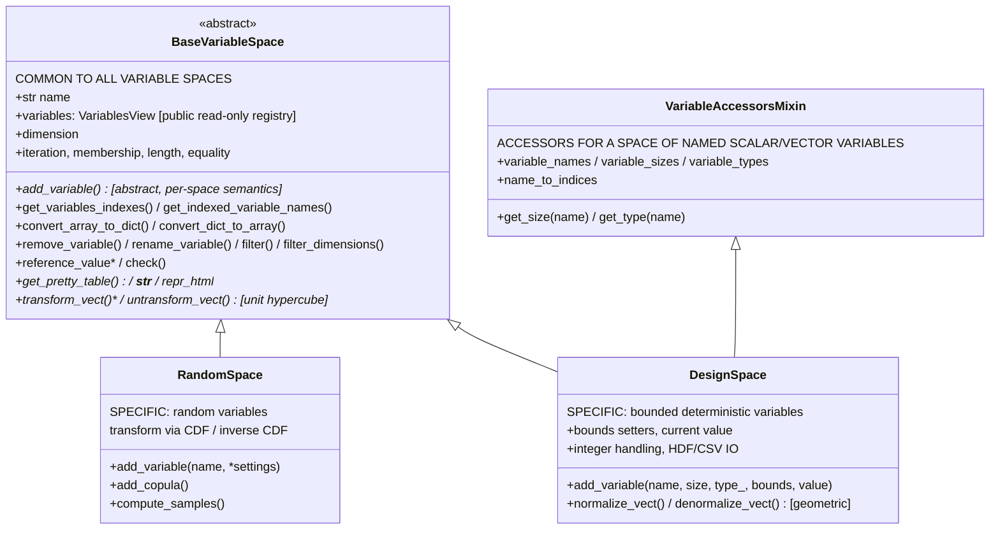
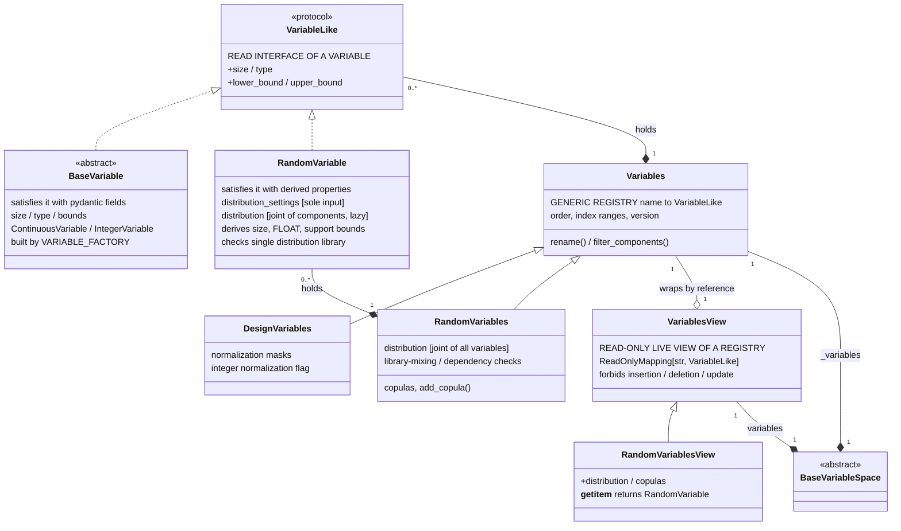

<!--
 Copyright 2021 IRT Saint Exupéry, https://www.irt-saintexupery.com

 This work is licensed under the Creative Commons Attribution-ShareAlike 4.0
 International License. To view a copy of this license, visit
 http://creativecommons.org/licenses/by-sa/4.0/ or send a letter to Creative
 Commons, PO Box 1866, Mountain View, CA 94042, USA.
-->

# RandomSpace: a dedicated space of random variables

## Requirements

Implement a `RandomSpace` class representing a space of random variables defined by probability distributions, replacing `ParameterSpace` wherever the space is purely uncertain, so that GEMSEO users manipulate a clearly-named concept ("uncertain space") instead of the misunderstood "parameter space".

- **Essence**: separate the concept "space of random variables" (distributions, sampling, probabilistic transformations) from the concept "space of design variables" (bounds, current value, normalization policy, integer management) that `ParameterSpace` used to conflate. Both are *spaces of variables*: a common abstract parent `BaseVariableSpace` factors the shared variable-registry behavior (names, sizes, order, indexing, conversions), while each subclass carries only its specific semantics. A `RandomSpace` therefore defines a variable from probability distributions alone — `add_variable(name, *settings)` — and exposes *no* bounds setter, *no* `normalize_vect`/`denormalize_vect`, *no* current value and *no* integer management: these notions do not exist for a space of random variables. What *is* common to every variable space is the mapping to/from the unit hypercube (`transform_vect`/`untransform_vect`, declared abstract on `BaseVariableSpace`): geometric for a `DesignSpace`, iso-probabilistic (CDF/inverse CDF) for a `RandomSpace` — which lets `BaseDOELibrary` sample any `BaseVariableSpace` polymorphically.
- **Terminology rule**: the class is named `RandomSpace`, and this same term — *random space* — is used consistently across every user-facing occurrence (argument names, attribute names, docstrings, messages, factory function), including the strings derived from the class name — the title of the tabular view ("Random space") and the driver log introducing the space ("over the random space:"). Arguments/attributes currently named `parameter_space` are renamed `random_space`.
- **Boundary**: a space of variables is either a `DesignSpace`, defined by bounds and current value and consumed by the optimization/execution machinery, or a `RandomSpace`, defined by probability distributions and consumed for sampling — a single space can no longer mix both kinds of variables. `ParameterSpace` and its mixed deterministic + uncertain capability are removed, together with `create_parameter_space` and the factory `ParameterSpaceFactory` (replaced by `RANDOM_SPACE_FACTORY`). Rather than bridging a `RandomSpace` into an equivalent `DesignSpace` to reach the `DesignSpace`-based execution machinery, that machinery itself — `EvaluationProblem`, `Database`, `EvaluationScenario`, `BaseDOELibrary` — is generalized to accept any `BaseVariableSpace`, so a `RandomSpace` is consumed as is, with no conversion at any boundary.
- **Follow-up (carried out within this change)**: the deprecation that this migration originally planned to investigate afterwards was carried out directly, not staged behind a plugin survey: `ParameterSpace`, `create_parameter_space` and `ParameterSpaceFactory` are removed rather than deprecated. What the mixed capability used to serve is now served by two separate spaces: joint design × uncertain DOE sampling and `EvaluationScenario` accept a `RandomSpace` directly, as any other `BaseVariableSpace`; the `add_uncertain_variables` option of `ScalableDesignSpace` — the one in-tree consumer of the mixed capability — is removed along with it, `ScalableDesignSpace` now deriving from `DesignSpace`; the splitting utilities that had no internal caller (`extract_uncertain_space`/`extract_deterministic_space`/`to_design_space`/`init_from_dataset`) are gone with the class they belonged to.
- **Value**: clearer mental model for UQ users; purely-uncertain APIs (sensitivity analysis, reliability, PCE/FCE, uncertainty benchmark problems) advertise the right type; impossible to misuse a `RandomSpace` as a design space; a single well-defined place (`BaseVariableSpace`) for variable-container behavior.

## Entities

The space hierarchy — **what is common** (one box, at the top) vs what is specific to each space. All inheritance arrows point up to the parent:



`RandomSpace` does not mix in `VariableAccessorsMixin`: it has no `variable_names`, `variable_sizes`, `variable_types`, `name_to_indices`, `get_size` or `get_type` — a random variable's size and bounds are read through `variables[name]` (a `RandomVariable`) instead.

The registry layer mirrors the same split — one generic registry, one specialization per side:



Registry usage: `BaseVariableSpace` is generic in the type of its registry *and* of the read-only view exposed over it (`Generic[_VariablesT, _VariablesViewT]`, both bound to `Variables`/`VariablesView` respectively), so `_variables: _VariablesT` and the public `variables: _VariablesViewT` property are typed once and a subclass declares both types in its class header: `DesignSpace(VariableAccessorsMixin[DesignVariables], BaseVariableSpace[DesignVariables, VariablesView])`, `RandomSpace(BaseVariableSpace[RandomVariables, RandomVariablesView])`. The registry and its view are still *instantiated* from the class attributes `_variables_class`/`_variables_view_class`, which stay `ClassVar[type[Variables]]`/`ClassVar[type[VariablesView]]` because a `ClassVar` cannot hold a type variable; `BaseVariableSpace.__init__` bridges the two with a `cast`. `DesignSpace` mixes in `VariableAccessorsMixin[DesignVariables]` for the names/sizes/types/indices accessors; `RandomSpace` does not, since a random variable has no name-keyed size/type accessor of its own — its size and bounds are read through `variables[name]`.

Around the hierarchy (no diagram needed):

- `IshigamiSpace`, `WingWeightRandomSpace` extend `RandomSpace`; `ScalableDesignSpace` extends `DesignSpace`.
- `RandomSpaceFactory` (`BaseFactory[RandomSpace]`) creates `RandomSpace` objects.

Key entity decisions (conservative):

- `BaseVariableSpace` is extracted from the *existing* `DesignSpace` code: the `Variables`-registry ownership and every method whose implementation only reads names/sizes/order move up unchanged. No new abstraction is invented beyond this common parent; `Variables` and `Variable` already exist and are reused. The accessors that key off a variable's name (`variable_names`, `variable_sizes`, `variable_types`, `name_to_indices`, `get_size`, `get_type`) are further factored into a `VariableAccessorsMixin`, mixed into `DesignSpace` but not into `RandomSpace`, so a random space cannot expose them by construction rather than by omission.
- The `Variables` registry is split along the same line: a generic `Variables` (name→`VariableLike` mapping, order, index ranges, version, `rename`, `filter_components`) moves to `gemseo/space/_core/variables.py` (its `__rename_key` helper becomes protected `_rename_key`, so a subclass can rename the keys of its own side maps); the normalization machinery (`name_to_normalization_mask`, `enable_integer_variables_normalization`, `__compute_normalization_mask`) stays in `gemseo/space/design/_variables.py` as `DesignVariables(Variables)`, hooking the mask updates into the inherited mutation methods, while the aggregate integer queries (`get_integer_mask`, `has_integer_variables`) sit on the generic `Variables`: they only read `variable.type`, so they answer for a random variable too. `BaseVariableSpace` owns a `Variables`; `DesignSpace` instantiates a `DesignVariables`.
- The random side mirrors the design side symmetrically: `RandomVariable` is a frozen model whose *sole* input is the settings of the marginal probability distributions of its components — everything else is derived from them and read-only: its `distribution` (the joint distribution of its components, built lazily on first read), its `size` (= the number of marginal settings), `type=FLOAT` and its bounds (= the limits of the distribution support, exactly the values `ParameterSpace.add_random_vector` used to register). `RandomVariables(Variables)` is the registry holding `RandomVariable` entries plus the cross-variable state: the copulas, the joint distribution of all variables, and the library-mixing/dependency-support validations. No parallel bookkeeping maps remain (`__random_vector_name_to_settings`, the `distributions` dict and `uncertain_variables` list all become views over the registry).
- `RandomVariable` does **not** inherit the design-side variable: a random variable has no settable size, type or bounds, so reusing those fields would mean injecting derived values into a model that then has to be kept consistent with the distribution. What the registry actually needs of a variable is its *read* interface, which is factored as the runtime-checkable protocol `VariableLike` (`size`, `type`, `lower_bound`, `upper_bound`) in the public package `gemseo/space/variable/` (module `_base.py`, re-exported by the package root): `BaseVariable` and its kinds `ContinuousVariable` / `IntegerVariable` satisfy it with their pydantic fields, `RandomVariable` with properties deriving from its probability distribution, and the generic registry is a `MutableMapping[str, VariableLike]`.
- Full symmetry: `BaseVariableSpace`+`Variables`+`VariableLike` (generic), `DesignSpace`+`DesignVariables`+`BaseVariable` kinds built by `VARIABLE_FACTORY` (design side), `RandomSpace`+`RandomVariables`+`RandomVariable` (random side).
- `RandomSpace` does **not** inherit `DesignSpace`. Blocking inherited methods (e.g. `add_variable` raising) was rejected as user-unfriendly; overriding `normalize_vect`/`denormalize_vect` was rejected as meaningless for a random space.
- `ParameterSpace` is not kept and not delegated to: rather than owning a private `RandomSpace` and replaying it into a `DesignSpace`-shaped bridge, the consumers that used to require this bridge (`EvaluationProblem`, `Database`, `EvaluationScenario`, `BaseDOELibrary`) are generalized to accept any `BaseVariableSpace`, so a `RandomSpace` reaches them unconverted. `RandomSpace` knows nothing about `DesignSpace`, `EvaluationProblem` or the execution world — no conversion method at all, so there is no `random ↔ design`/`random ↔ evaluation` import cycle to avoid either. A space that defines no current value (a `RandomSpace`) is handled explicitly at the few points that are meaningful only for a `DesignSpace`: `EvaluationProblem.reset` skips the current-value restore, `Database.to_hdf` omits the input space with a warning, and a driver's `normalize_design_space=True` is refused for a non-`DesignSpace`.
- `DesignSpace`-only accessors are kept out of `RandomSpace` by construction rather than by an `isinstance` gate: `variable_names`, `variable_sizes`, `variable_types`, `name_to_indices`, `get_size`, `get_type` are factored into a `VariableAccessorsMixin`, mixed into `DesignSpace` (with `BaseVariableSpace`) but not into `RandomSpace`, so a random space cannot expose them at all.
- No new DTOs; distribution settings, distributions and copulas keep their existing types.
- Three more *generic* modules are extracted from the design package so that `BaseVariableSpace` and the `random` package never import `gemseo.space.design`: `gemseo/space/_core/codec.py` (moved verbatim from `design/_codec.py`, already fully generic), `gemseo/space/_core/rendering.py` (the space-agnostic `render_string`/`render_html`) and `gemseo/space/_core/checking.py` (`check_array_shape_and_dtype`, moved out of `design/_checking.py`). `design/_view.py` keeps only the design-specific `get_pretty_table`, which reads the current value, the bounds and `design/_constants._TABLE_NAMES`; the HDF/CSV (de)serialization it used to share the module with is itself extracted to `design/_io.py`, imported by `design/__init__.py`'s `to_hdf`/`from_hdf`/`to_csv`.

## Approach

1. Class architecture (common abstract parent, no bridge class):
    - `BaseVariableSpace` (new module `src/gemseo/space/base.py`, `Generic[_VariablesT, _VariablesViewT]`, both bound to `Variables`/`VariablesView`, metaclass `ABCGoogleDocstringInheritanceMeta`) owns `name` and the `_variables: _VariablesT` registry and provides the container behavior shared by any space of variables: the public `variables: _VariablesViewT` view, `dimension`, `get_variables_indexes`, `get_indexed_variable_names`, `convert_array_to_dict`/`convert_dict_to_array`, `check`, base `remove_variable`/`rename_variable`/`filter`/`filter_dimensions`, `__contains__`/`__len__`/`__iter__`, registry-based `__eq__`, and `__str__`/`_repr_html_` built on an abstract `get_pretty_table`; `add_variable`, `reference_value` and the unit-hypercube mapping are abstract too; a current value being a `DesignSpace` notion, `has_current_value` stays on `DesignSpace` and `reference_value` is what a consumer of any space uses to read its reference value. All of this is *moved* from `DesignSpace`, not rewritten; the generic helpers it needs move with it (`gemseo/space/_core/codec.py`, `gemseo/space/_core/rendering.py`, `gemseo/space/_core/checking.py`). The name-keyed accessors (`variable_names`, `variable_sizes`, `variable_types`, `name_to_indices`, `get_size`, `get_type`) are factored separately into `VariableAccessorsMixin[_VariablesT]` (`gemseo/space/_core/accessors.py`), mixed into `DesignSpace` only. The registry is split: the generic part of `Variables` moves to `gemseo/space/_core/variables.py`; its normalization-mask and integer machinery stays behind in `gemseo/space/design/_variables.py` as the subclass `DesignVariables(Variables)`. The registry class and its view class a space uses are the class attributes `_variables_class: ClassVar[type[Variables]] = Variables` and `_variables_view_class: ClassVar[type[VariablesView]] = VariablesView`, instantiated by `BaseVariableSpace.__init__`, overridden by `DesignSpace` with `DesignVariables`/`VariablesView` and by `RandomSpace` with `RandomVariables`/`RandomVariablesView`; the *types* are carried by the type parameters (`DesignSpace(VariableAccessorsMixin[DesignVariables], BaseVariableSpace[DesignVariables, VariablesView])`), so no subclass redeclares `_variables`.
    - `DesignSpace` extends `BaseVariableSpace` (and mixes in `VariableAccessorsMixin`) and keeps everything bounds/value/normalization/IO-related: `add_variable`, bounds accessors/setters, current value, `normalize_vect`/`denormalize_vect` and gradients, `transform_vect`/`untransform_vect`, rounding, `check_membership`, HDF/CSV IO, `extend`, `add_variables_from`, `to_scalar_variables`, integer-normalization toggle. Its public API and behavior are strictly unchanged (methods only change *defining class*).
    - `RandomSpace` (new package `src/gemseo/space/random/`) extends `BaseVariableSpace[RandomVariables, RandomVariablesView]` with `_variables_class = RandomVariables` and `_variables_view_class = RandomVariablesView`, and is a thin facade over its registry: `add_variable(name, *settings)` builds a `RandomVariable` from the marginal settings and registers it; `add_copula` and `compute_samples` delegate to the registry, which is exposed read-only: `variables: RandomVariablesView`. All distribution access goes through it — `variables.distribution` (joint distribution of the space), `variables[name].distribution` (per-variable), `variables[name].distribution.range`/`.support` (no `distribution`/`distributions`/`get_range`/`get_support` on `RandomSpace`). The state that used to be spread over `ParameterSpace` private maps (`__random_vector_name_to_settings`, `distributions`, copulas, joint distribution, library-mixing and dependency-support checks) now lives in `RandomVariable`/`RandomVariables` (package layout mirrors `space/design/`: `random/__init__.py` = `RandomSpace`, `random/variable.py` = `RandomVariable`, `random/_variables.py` = `RandomVariables`, `random/variables_view.py` = `RandomVariablesView`).
    - No bridge class and no owned/private space: `EvaluationProblem`, `Database` and `EvaluationScenario` are widened to accept `input_space: BaseVariableSpace`, so a `RandomSpace` reaches them exactly as constructed by the caller, with no replaying, no delegating properties and no pickling care for a mixed layout. The few behaviors that only make sense for a space with a current value are guarded with `isinstance(input_space, DesignSpace)` at the point of use (see below), rather than centralized in a conversion.
    - Unit-hypercube mapping: `BaseVariableSpace` declares `transform_vect(x_vect, out=None)` and `untransform_vect(x_vect, no_check=False, out=None)` abstract ("map a point of the space to/from the unit hypercube"). `DesignSpace` implements them geometrically (with rounding of integer variables); `RandomSpace` implements them iso-probabilistically via the joint distribution (`map_to_uniform`/`map_from_uniform`, i.e. the uncertain-variables branch of the former `ParameterSpace.__transform`, with the same 1D/2D vectorization and the $[0,1]$ component check controlled by `no_check`). This is a probabilistic transformation, not a normalization policy — the excluded notion stays excluded.
    - Rationale: `BaseDOELibrary.sample_space` accepts any `BaseVariableSpace` directly through this contract (unit samples + `untransform_vect`) — no conversion. The scenario/driver machinery (`Database`, current value, `EvaluationProblem`) is generalized the same way: it consumes a `BaseVariableSpace` and gates its `DesignSpace`-only steps (current-value restore, normalization, integer rounding, HDF serialization) on `isinstance(input_space, DesignSpace)`, so a `RandomSpace` runs the non-`DesignSpace` branch instead of being converted into one.
    - `ParameterSpace(uncertain_space=...)` construction, `convert_to_parameter_space` and the `RandomSpace | ParameterSpace` union type hints described in earlier drafts of this approach do not exist in the code: there is nothing to construct or convert to, since `ParameterSpace` itself is removed (see Requirements § Boundary).

2. Terminology migration:
    - `RandomSpace` table title, `__repr__`, `__str__` and `_repr_html_` header: "Random space", derived from the class name as for `DesignSpace` (no `get_tabular_view` on `RandomSpace`: the statistics of a random variable are read through `variables[name].distribution`).
    - The library-mixing error message reads "A random space cannot mix probability distributions based on different libraries; got ..." — raised by `RandomVariable`'s field validator (single variable) and by `RandomVariables.__setitem__` (across variables), both delegating to the shared `_check_distribution_libraries` function.
    - Arguments named `parameter_space` become `random_space` (note: `reasons.md` line 12 literally says `uncertains_space`, but line 13 mandates the term *uncertain space* elsewhere; `random_space` matches existing usage in `is_form_sobol.py` and `reliability/openturns/base.py`).
    - Purely-uncertain consumer type hints are plain `RandomSpace` (no union: there is no second type to accept).
    - New top-level helper `gemseo.create_random_space() -> RandomSpace`; `create_parameter_space()` is removed, not kept, along with the class it built.

3. Compatibility and deprecation:
    - `DesignSpace` public behavior, string representations, HDF/CSV round-trips and equality are unchanged; only internals change (base-class extraction), which requires no pickling care beyond what `DesignSpace` already had, since there is no owned sub-space to restore. `ParameterSpace`'s removal is itself the compatibility break for its former users; there is no compatibility shim, per Requirements § Boundary.
    - Argument renames recorded in `src/gemseo/_deprecation/bump-version.yml` (bare class names, under the pre-existing `#### ParameterSpace` heading, kept as the section title for these sensitivity-analysis renames even though the class is gone) — plus the `design_space` → `input_space` renames described below, and the removed `__init__` arguments of `ScalableDesignSpace` (`add_uncertain_variables`) and (transiently, before `IshigamiProblem` was moved back onto `EvaluationProblem`) of `IshigamiProblem`. `ParameterSpace`, `create_parameter_space` and `ParameterSpaceFactory`, which shipped in the last release, are removed with no strict replacement, so they are redirected onto their closest successors (`RandomSpace`, `create_random_space`, `RandomSpaceFactory`) and every `ParameterSpace` member without one is mapped to `null` with a comment naming what to use instead — see Operations § Update deprecation map. What the codemod cannot rewrite is a `ParameterSpace` that actually mixed deterministic and uncertain variables: it has to be split into a `DesignSpace` and a `RandomSpace` by hand.
    - `SobolAnalysis` dataset key `misc["parameter_space"]` → `misc["random_space"]`; documented compatibility break for persisted datasets; the legacy key is still read (`__read_random_space`) so that datasets pickled before this change still load. This key is local to `SobolAnalysis.compute_samples`'s own dataset and is unrelated to the generic `dataset.misc["input_space"]` that `Database.to_dataset` attaches to any dataset built from a database (see the terminology-migration item below) — the two coexist.
    - `IshigamiSpace`/`WingWeightRandomSpace` re-based on `RandomSpace`: they leave `gemseo.algos.parameter_space_factory.ParameterSpaceFactory` (the released, removed factory) and appear in the new `RANDOM_SPACE_FACTORY` — documented in the changelog fragment.
    - Terminology migration that followed this change (`design_space` → `input_space`, since the space of an evaluation problem or scenario is not necessarily a design space): `EvaluationProblem.input_space`/`.reset(input_space=)`, `EvaluationScenario.input_space` and `BaseFormulation.input_space` (typed `BaseVariableSpace`) are renamed from `design_space`; `Database` already used `input_space`, including its dataset key `misc["input_space"]` written by `Database.to_dataset`. Argument renames that go with it: `EvaluationProblem.evaluate_functions(input_value, input_value_is_normalized, preprocess_input_value)` (were `design_vector*`), `BaseVariableSpace.get_variables_indexes(use_space_order=)` (was `use_design_space_order`), `convert_dict_to_array(variable_values=)` (was `design_values`), and the driver setting `max_design_space_dimension_to_log` → `max_input_space_dimension_to_log`. `OptimizationProblem` and `MDOScenario` keep a read-only `design_space` property (typed `DesignSpace`), since their input space is necessarily a design space, and `normalize_design_space` keeps its name, since only a design space can be normalized.

## Structure

### Inheritance Relationships

1. `BaseVariableSpace` is an abstract class (metaclass `ABCGoogleDocstringInheritanceMeta`); `get_pretty_table`, `add_variable`, `transform_vect` and `untransform_vect` are its abstract methods and `reference_value` its abstract property.
2. `DesignSpace` extends `BaseVariableSpace` and mixes in `VariableAccessorsMixin[DesignVariables]` (public API unchanged).
3. `RandomSpace` extends `BaseVariableSpace`; it does **not** derive from `DesignSpace` and does **not** mix in `VariableAccessorsMixin`.
4. `RandomVariable` is a `BasePydanticModel` satisfying the `VariableLike` protocol, not a `BaseVariable` subclass; `BaseVariable` — also a `BasePydanticModel` — satisfies the same protocol. `RandomVariables` extends `Variables` (as `DesignVariables` does).
5. `IshigamiSpace` and `WingWeightRandomSpace` extend `RandomSpace` (were: `ParameterSpace`).
6. `ScalableDesignSpace` extends `DesignSpace` (was: `ParameterSpace`; its mixed-space option is removed with it).
7. `RandomSpaceFactory` extends `BaseFactory[RandomSpace]`.

### Dependencies

1. `gemseo.space.base` imports `gemseo.space._core.variables` (generic registry) and `gemseo.space.variables_view` (`VariablesView`) at runtime for their default `_variables_class`/`_variables_view_class`, `gemseo.space._core.codec` (moved from `design/_codec.py`), `gemseo.space._core.rendering` (the generic renderers extracted from `design/_view.py`), `gemseo.util.metaclass.ABCGoogleDocstringInheritanceMeta` and `gemseo.util.string`; `prettytable`, `numpy.ndarray`, `gemseo.util.read_only_mapping` and `typing_extensions.Self` under `TYPE_CHECKING` only (the base merely type-hints the abstract `get_pretty_table` return).
2. `gemseo.space._core.accessors` (`VariableAccessorsMixin`) imports only `gemseo.space._core.variables`. `gemseo.space.design._variables` (`DesignVariables`) imports `gemseo.space._core.variables`; `gemseo.space.design` imports `gemseo.space.base`, `gemseo.space._core.accessors` and `DesignVariables` (and keeps its `_bounds`/`_normalizer`/`_value`/`_io`/... internal modules, whose mask/integer accesses now go through `DesignVariables`).
3. `gemseo.space.random` package: `random/variable.py` (`RandomVariable`) imports `DataType` from the `gemseo.space.variable` package, `gemseo.uncertainty.distribution.factory`, `gemseo.util.pydantic.BasePydanticModel`, `gemseo.util.string.pretty_repr` and — at runtime, because it is the annotation of the only pydantic field — `gemseo.uncertainty.distribution.core.base_settings`; `gemseo.uncertainty.distribution.core.base_joint` is `TYPE_CHECKING`-only, the joint distribution being a property rather than a field. `random/_variables.py` (`RandomVariables`) imports `gemseo.space._core.variables`, `random/variable.py` and `gemseo.uncertainty.distribution.factory`; `random/variables_view.py` (`RandomVariablesView`) imports `gemseo.space.variables_view`; `random/__init__.py` (`RandomSpace`) imports `gemseo.space.base`, `gemseo.space._core.checking`, `gemseo.space._core.rendering`, `random/variable.py`, `random/_variables.py`, `random/variables_view.py` and `gemseo.util.string`; the `random` package never imports `gemseo.space.design` — there is no bridge module to import it *from* any more, so there is nothing to cycle with.
4. `gemseo.space.util` no longer hosts a bridge helper (`gemseo.space.parameter` does not exist, and neither does `convert_to_parameter_space`): it keeps its pre-existing `get_value_and_bounds` overloads, importing `gemseo.space.design.DesignSpace` under `TYPE_CHECKING` only.
5. `gemseo.uncertainty.sensitivity.{core.base, sobol, morris, form, is_form_sobol, base_ro}`: `random_space: RandomSpace`, imported under `TYPE_CHECKING`; no conversion call anywhere in these modules.
6. `gemseo.uncertainty.reliability.{problem, scenario}`: `ReliabilityProblem.__init__(design_space: RandomSpace, ...)`, `RandomSpace` imported under `TYPE_CHECKING`; no conversion before reaching `EvaluationProblem`.
7. `gemseo.doe.core.base_doe_library.sample_space`: accepts `BaseVariableSpace | int` and samples it polymorphically via `untransform_vect` — no conversion; the abstract `_generate_unit_samples(input_space)` is widened to `BaseVariableSpace` accordingly. The integer-normalization toggle and the unbounded-components check apply only to the `DesignSpace` branch, detected with `isinstance`; a `RandomSpace` skips both by nature of the iso-probabilistic transform.
8. `gemseo.scenario.evaluation.EvaluationScenario`: accepts `input_space: BaseVariableSpace` (imported under `TYPE_CHECKING`), passed unconverted to the `EvaluationProblem` it builds; `gemseo.space.design.DesignSpace` is still imported at runtime, for the `isinstance` check guarding the complex-step branch.
9. `gemseo.space.__init__` facade re-exports `BaseVariableSpace`, `RandomSpace` and `RANDOM_SPACE_FACTORY`; `gemseo.__init__` gains `create_random_space()` and widens `sample_disciplines(input_space: DesignSpace | RandomSpace, ...)` (it builds an `EvaluationScenario`, which passes the input space through unconverted).
10. `gemseo.machine_learning.regression.{model.pce, core.base_fce}` import `gemseo.space.random.RandomSpace` at runtime and check `data.misc["input_space"]`/`self.learning_set.misc["input_space"]` with `isinstance`, raising `TypeError` when it is not a `RandomSpace` — no normalization, no `convert_to_parameter_space`; `model.fce` reads the checked space via the protected property `BaseFCERegressor._input_space`.
11. `gemseo.problem.uncertainty.ishigami.ishigami_problem` imports `gemseo.core.problem.evaluation.EvaluationProblem` and its own `IshigamiSpace`: `IshigamiProblem` extends `EvaluationProblem` directly over the `IshigamiSpace`, with no `DesignSpace`/`ParameterSpace` in between; the Ishigami function is registered with `self.add_observable(IshigamiFunction())`, since an evaluation problem has no objective.
12. `tests/test_import_invariants.py`: the frozen per-top-level-package dependency allowlist carries the `space` edge for the `scenario` package (commented: `EvaluationScenario` imports `gemseo.space.design` directly, and `MDOScenario` imports `gemseo.space.random` directly) and for the `uncertainty` package (commented: the sensitivity analyses and the reliability problems import `gemseo.space.random` directly); `space` is already in that test's `base_allowed_segments` for domain-core SPI packages, so the edges are sanctioned, they only need to be recorded in the frozen graph.

### Layered Architecture

1. Definition layer (`gemseo.space`): `BaseVariableSpace` (abstract variable container) → `DesignSpace` (bounded deterministic variables, value, normalization) and `RandomSpace` (random variables, distributions); no third, mixed class.
2. Registry layer: the `VariableLike` protocol and the `BaseVariable` hierarchy implementing it (`space/variable/`, with its `VariableFactory`), the generic `Variables` registry of `VariableLike` objects (`space/_core/variables.py`, extracted) and its read-only `VariablesView` (`space/variables_view.py`), alongside the other generic modules `space/_core/codec.py`, `space/_core/rendering.py`, `space/_core/checking.py` and the name-keyed `VariableAccessorsMixin` (`space/_core/accessors.py`); per side: `DesignVariables` (`space/design/_variables.py`, normalization masks + integer machinery) and `RandomVariable`/`RandomVariables`/`RandomVariablesView` (`space/random/variable.py`, `space/random/_variables.py`, `space/random/variables_view.py`, distributions + copulas + joint distribution) — single source of truth for which variables exist, their order, sizes and side-specific data.
3. Factory layer (`gemseo.space.factory`): `DESIGN_SPACE_FACTORY`, `RANDOM_SPACE_FACTORY` (new); no third, mixed-space factory.
4. Consumer layer: DOE library, evaluation problems/databases/scenarios, sensitivity analyses, reliability problems, ML regressors, benchmark problems — accept any `BaseVariableSpace`, with no conversion layer between them and the definition layer; each guards its `DesignSpace`-only behavior with `isinstance` where that behavior does not generalize (current value, normalization, HDF serialization).
5. Deprecation layer: `bump-version.yml` argument-rename mappings; changelog fragments.

## Operations

Execute the tasks in the order below — each task leaves the full test suite green, so the work lands as a reviewable ladder of commits (registry split → base extraction → random side → parameter refactor → API/consumers → docs).

### Add protocol - `VariableLike` (`src/gemseo/space/variable/_base.py`)

1. Responsibility: the read interface of a variable, whatever its kind, so that the generic registry can hold design-side and random-side entries without a common base class.
2. Definition: `@runtime_checkable class VariableLike(Protocol)` declaring the read-only properties `size: int`, `type: DataType`, `lower_bound: BoundArray` and `upper_bound: BoundArray`. Its docstring names both implementations: `BaseVariable` satisfies it with its pydantic fields, `RandomVariable` with properties deriving from its probability distribution. It lives beside the base of the hierarchy in `space/variable/_base.py` and is re-exported by the `gemseo.space.variable` package root, so consumers import it from there.
3. The design-side hierarchy is unchanged apart from this: `BaseVariable` and its kinds `ContinuousVariable` / `IntegerVariable` keep their four fields, their validation, their `__copy__`/`__deepcopy__`/`model_copy`/`__setstate__` and their data-based `__eq__`, and are built through `VARIABLE_FACTORY`.

### Split registry - `Variables` (`src/gemseo/space/_core/variables.py`) / `DesignVariables` (`src/gemseo/space/design/_variables.py`)

1. Create `src/gemseo/space/_core/variables.py` with the generic registry, moved from `design/_variables.py`: `UnknownVariableError`, `Variables` holding `__name_to_variable`, `__name_to_indices`, `__size`, `__version`, `name_to_indices`, `size`, `version`, `bump_version`, `__setitem__`/`__delitem__`/`__getitem__`/`__iter__`/`__len__`, `__reindex`, `rename`/`_rename_key` (renamed from `__rename_key` so `DesignVariables` and `RandomVariables` can rename the keys of their own side maps), `filter_components` (which rebuilds the entry through `VARIABLE_FACTORY.create(variable.type, …)`, so the kind pinning the data type is preserved), plus the aggregate integer queries `get_integer_mask` and `has_integer_variables`, which read `variable.type` only. Bodies unchanged except removal of the mask bookkeeping lines; generalize the class docstring ("which variables exist in a variable space..."). The registry is a `MutableMapping[str, VariableLike]` — the protocol added to `space/variable/_base.py`, so a random-side entry that is no `BaseVariable` still types — and carries the `ABCGoogleDocstringInheritanceMeta` metaclass, as `DesignVariables` and `RandomVariables` inherit its docstrings.
2. Rewrite `src/gemseo/space/design/_variables.py` as `class DesignVariables(Variables)` keeping the design-specific machinery: `__name_to_normalization_mask` + `name_to_normalization_mask` read-only view, `enable_integer_variables_normalization` property/setter and `__compute_normalization_mask`, which only forwards the flag to `BaseVariable.compute_normalization_mask` and freezes the mask; the aggregate integer queries stay on the generic `Variables`, and `DesignSpace.get_integer_mask()` delegates to it. Override `__setitem__`, `__delitem__`, `rename` and `filter_components` to call `super()` then maintain the mask map (same net behavior and version-bump counts as today — the derived-data staleness guard compares versions, so avoid double bumps: reuse the single `bump_version` performed by the base mutation).
3. Update imports/references in `design/__init__.py` and `design/_*.py` to `DesignVariables`: the design collaborators (`_bounds.py`, `_checking.py`, `_integer_rounder.py`, `_normalizer.py`, `_value.py`) all serve a design space, so they are annotated with `DesignVariables`; their base `_registry_derived_data.py` and the `_staleness_guard.py` it uses are generic and move up to `gemseo/space/_core/registry_derived_data.py` and `gemseo/space/_core/staleness_guard.py`, annotated with the generic `Variables`, as `_codec.py` is (the guard itself is keyed on an opaque version object and its body is untouched). Update `tests/space/design/test_variables.py` imports and split its generic-registry test cases into `tests/space/test_variables.py`.

### Create class - `BaseVariableSpace` (`src/gemseo/space/base.py`)

1. Responsibility: abstract base for spaces of variables; owns the variable registry and its read-only view, and everything derivable from the registry alone.
2. Registry ownership: the class is `Generic[_VariablesT, _VariablesViewT]` where both type variables are bound to `Variables`/`VariablesView`, and declares `_variables: _VariablesT` and a private `__variables_view: _VariablesViewT`, exposed publicly as the `variables` property; the registry and view classes remain the class attributes `_variables_class: ClassVar[type[Variables]] = Variables` and `_variables_view_class: ClassVar[type[VariablesView]] = VariablesView` (a `ClassVar` cannot hold a type variable), and `__init__` sets `name` and builds both from them via `cast`.
3. Move from `DesignSpace` (bodies unchanged, only the defining class changes):
    - Constructor part: `name` handling and `_variables = Variables()` creation.
    - Properties: `dimension`.
    - Methods: `get_variables_indexes`, `get_indexed_variable_names`, `convert_array_to_dict`, `convert_dict_to_array`, `remove_variable` (registry deletion part), `rename_variable` (registry rename part), `filter` (generic deepcopy-and-remove version returning `Self`), `filter_dimensions` (public, returning `Self`: it validates the dimensions — pluralized "Dimension(s) ... of variable '...' do(es) not exist." — then delegates to the protected hook `_filter_dimensions`, whose base implementation calls `Variables.filter_components`; `DesignSpace` overrides *the hook only*, to reslice the current value around the `super()` call, so the validation still runs before anything is read or mutated).
    - The name-keyed accessors `variable_names`, `variable_sizes`, `variable_types`, `name_to_indices`, `get_size`, `get_type` do **not** move to `BaseVariableSpace`: they move into a sibling mixin, `VariableAccessorsMixin[_VariablesT]` (`gemseo/space/_core/accessors.py`), mixed into `DesignSpace` only, so that `RandomSpace` cannot expose them.
    - Dunders: `__contains__`, `__len__`, `__iter__`, `__repr__`, `__str__` (an alias of `__repr__`, both rendered from `get_pretty_table` via `render_string`) and `_repr_html_`, registry-comparison part of `__eq__` (subclasses extend with their own state).
    - Split `gemseo/space/design/_view.py`: the space-agnostic renderers `render_string` and `render_html` move to `gemseo/space/_core/rendering.py` (the title of the table is always derived from the class name, through `_convert_camel_case_to_lower_case_words` from `gemseo/util/string.py`, so a space cannot override its header), while the design-specific `get_pretty_table` stays in `design/_view.py` — it reads the current value, the bounds and `design/_constants._TABLE_NAMES`, so moving it would make the generic module import the design package. Update the references in `design/__init__.py` and `tests/core/algorithm/test_driver_lib.py`.
    - Move `gemseo/space/design/_codec.py` to `gemseo/space/_core/codec.py` verbatim (its body is already generic; only the `Variables` type hint changes) and move `check_array_shape_and_dtype` out of `design/_checking.py` into the new `gemseo/space/_core/checking.py`. Both are needed by `base.py`/`random/` and must not drag in the design package. Update `design/_bounds.py`, `design/_value.py`, `design/__init__.py`, `design/_normalizer.py` and the corresponding tests (`tests/space/design/test_codec.py` becomes `tests/space/test_codec.py`; `tests/space/design/test_checking.py` keeps its `check_array_shape_and_dtype` cases with the new import path).
4. Declare abstract: `get_pretty_table(fields=(), with_index=False, capitalize=False)` (signature aligned with `DesignSpace.get_pretty_table`, whose `simplify` argument is removed: it only served the mixed `ParameterSpace`, whose tabular view of uncertain variables had design columns to drop), `add_variable(name, *args, **kwargs)` (each subclass adds a variable through its own semantics, so there is nothing generic to implement) and the unit-hypercube mapping `transform_vect(x_vect, out=None)` / `untransform_vect(x_vect, no_check=False, out=None)` (docstrings: map a point of the space to/from the unit hypercube; `DesignSpace`'s existing implementations become overrides).
5. Where a moved method's current body touches bounds/current value (e.g. `remove_variable`, `filter`, `__eq__` in `DesignSpace`), split: base implements the registry part; `DesignSpace` overrides, calls `super()`, and applies its specific part.
6. Docstrings: class docstring "A space of variables." with the registry semantics; `Args:`/`Returns:` sections per repo convention.

### Create mixin - `VariableAccessorsMixin` (`src/gemseo/space/_core/accessors.py`)

1. Responsibility: the accessors that key off a variable's name — `variable_names`, `variable_sizes`, `variable_types`, `name_to_indices`, `get_size(name)`, `get_type(name)` — factored out of `BaseVariableSpace` into a `Generic[_VariablesT]` mixin, so that a space mixes them in only if it wants to expose them.
2. `DesignSpace(VariableAccessorsMixin[DesignVariables], BaseVariableSpace[DesignVariables, VariablesView])` mixes it in; `RandomSpace` does not — a random variable's size is read through `variables[name].size` instead, there being no name-keyed "get me the size of this random variable" use case distinct from reading the variable itself.
3. `__slots__ = ()` and a bare `_variables: _VariablesT` class-level annotation: the mixin owns no state of its own, it only reads the `_variables` attribute of the `BaseVariableSpace` it is mixed into.

### Update class - `DesignSpace` (`src/gemseo/space/design/__init__.py`)

1. Base classes → `VariableAccessorsMixin[DesignVariables]` and `BaseVariableSpace[DesignVariables, VariablesView]`; set `_variables_class = DesignVariables`; delete the moved members; add `super()` calls where behavior was split (see above).
2. Public API, signatures, behavior, error messages, string representations strictly unchanged — `tests/space/test_design_space.py` and `tests/space/design/*` must pass without modification (import-path updates for `_variables` excepted).
3. The comment and docstring mentioning `ParameterSpace` are gone, `ParameterSpace` itself having been removed (see Requirements § Boundary); no `DesignSpace` source line refers to it any more.

### Create model - `RandomVariable` (`src/gemseo/space/random/variable.py`)

1. Responsibility: an immutable random variable defined by the settings of the marginal probability distributions of its components; the random-side counterpart of a plain `Variable`, satisfying the same `VariableLike` read interface.
2. Definition: `class RandomVariable(BasePydanticModel, frozen=True)` — **not** a `Variable` subclass — whose *sole* field is `distribution_settings: tuple[BaseDistributionSettings, ...] = Field(min_length=1)` (one setting per component). Everything else is derived and read-only, exposed as properties rather than injected fields, so there is no state to keep consistent with the distribution:
    - `distribution: BaseJointDistribution` — the joint distribution of the components, `cls = marginal.JOINT_DISTRIBUTION_CLASS; cls(cls.settings_class(marginal_settings=settings))` (the logic that used to be inline in `ParameterSpace.add_random_vector`), built **lazily** by a private `cached_property` and exposed through a plain `distribution` property, because pydantic lets a `functools.cached_property` be overwritten even on a frozen model.
    - `size` = `len(distribution_settings)` — there is one marginal per component, so the size is readable without building the joint distribution.
    - `type` = `DataType.FLOAT`.
    - `lower_bound` / `upper_bound` = `distribution.math_lower_bound` / `math_upper_bound`, handed out as **read-only views** (a private `__view` static helper clears the writeable flag), since these arrays belong to the joint distribution and an in-place mutation would corrupt it.
    - No `arbitrary_types_allowed`: the distribution is not a field, so the model needs no relaxed field types.
3. Lifecycle (the delicate part — specify explicitly):
    - Library consistency: a `field_validator` on `distribution_settings` calls the module-level `check_distribution_libraries(library_names)`, so a variable mixing e.g. OpenTURNS and SciPy marginals fails with the message of Approach §2 instead of an obscure error from the wrapped library — and it fails at validation time, before any distribution is built. `RandomVariables.__setitem__` reuses the same function for the cross-variable check, so the message exists exactly once.
    - Copy semantics: **decision** — `__copy__`/`__deepcopy__` return `self`, documented in a `Note:` of the class docstring and covered by test. The entry is frozen, its bounds are read-only views and its `distribution` is only *read* (statistics, support, marginals); the samples of a space come from the joint distribution of the *space*, which is rebuilt from the settings on every mutation, so sharing the per-variable distribution across copies cannot desynchronize anything.
    - `model_copy(update=..., deep=...)` is overridden: it returns `self` when there is no update, otherwise rebuilds through `model_validate({distribution_settings, **update})`. The pydantic implementation writes the update into the `__dict__` of the object returned by `__copy__`/`__deepcopy__` — this very instance — which would both mutate the original and leave the cached joint distribution stale.
    - Pickling: `__getstate__` keeps in `state["__dict__"]` only the entries that are model fields, which drops the cached joint distribution, so the pickle carries the settings alone instead of an object graph of a third-party library; the distribution is rebuilt on demand after unpickling. No `__setstate__` is needed: there is no bound array of its own to refreeze, the bounds being views computed from the distribution.
4. No convenience statistics on the entry (`mean`, `standard_deviation`, `range`, `support`, `transformation`): reporting reads them from `variable.distribution`, which keeps the model to its single input and its `VariableLike` interface.
5. `__eq__`: none of its own — the inherited pydantic equality compares the type and the only field, `distribution_settings`, which is exactly the intended semantics.

### Create registry - `RandomVariables` (`src/gemseo/space/random/_variables.py`)

1. Responsibility: the registry of `RandomVariable` objects plus the cross-variable state; the random-side counterpart of `DesignVariables`.
2. Definition: `class RandomVariables(Variables)` holding `RandomVariable` entries; adds:
    - `__copulas: list[tuple[tuple[str, ...], Any]]`, `__supports_dependency: bool`, `__distribution_library_name: str` — moved from the former `ParameterSpace`.
    - `distribution: BaseJointDistribution | None` — the joint distribution of all variables, rebuilt from the entries' settings and the copulas (body of the former `ParameterSpace.__set_joint_distribution`, index computation from the registry sizes).
    - Validations on `__setitem__` (before `super()`): library mixing across entries, delegated to `_check_distribution_libraries` from `random/variable.py` — message "A random space cannot mix probability distributions based on different libraries; got ..." (was "A parameter space cannot..."; see Safeguards §7 for why the wording says *random*, not *uncertain*) — and dependency-support detection.
    - Read-only property `copulas: tuple[tuple[tuple[str, ...], Any], ...]` exposing the stored copulas.
    - `add_copula(copula, *names)`: moved from the former `ParameterSpace` (unknown-name and already-has-copula errors preserved).
    - Overridden mutations (`__setitem__`, `__delitem__`, `rename`) call `super()` then update copulas where needed and rebuild the joint distribution — one version bump per operation, as `DesignVariables`. `__delitem__` drops the copulas mentioning the deleted name; `rename` renames the name inside its copulas (which the former `ParameterSpace.rename_variable` used to fail to do) and rebuilds only when a copula was actually touched. Eager rebuild is the spec (the former `ParameterSpace` behavior, so adding N variables costs N rebuilds — no regression); a lazy version-keyed rebuild (the `_registry_derived_data` pattern) is an allowed optimization provided observable behavior is identical.
    - Empty registry: `distribution` is `None` while the registry is empty (as the former `ParameterSpace.distribution`); this precondition is documented and enforced with a clear error where it matters (see `RandomSpace`).
3. `filter_components(name, components)` rebuilds the random variable from the settings of the marginal probability distributions of the components to be kept — `self[name] = RandomVariable(distribution_settings=tuple(settings[i] for i in components))` — so the size, the bounds and the distributions follow, and the reassignment reuses `__setitem__` (reindexing, one version bump, joint-distribution rebuild). The copulas covering the variable are dropped *before* the reassignment, so the joint distribution is rebuilt once from the new sizes; the random variables they covered become independent. Keeping no component raises `ValueError` ("A random variable cannot be empty; got no component for '...'."), since a random variable without a marginal has no distribution. `super().filter_components` is deliberately not called: it would build a plain `Variable` with sliced bounds and lose the marginal settings.

### Create class - `RandomSpace` (`src/gemseo/space/random/__init__.py`)

1. Responsibility: a space of random variables defined by probability distributions; extends `BaseVariableSpace[RandomVariables, RandomVariablesView]` with `_variables_class = RandomVariables` and `_variables_view_class = RandomVariablesView`; variables are added only via distribution settings, and no `VariableAccessorsMixin` is mixed in. Thin facade over the registry.
2. Methods:
    - `add_variable(name, *settings)`: `self._add_variable(name, RandomVariable(distribution_settings=settings))`, the base method raising the duplicate-name error before the assignment. One setting per component, so an iid random variable is added by repeating its settings, e.g. `space.add_variable("x", *[settings] * 3)`.
    - `add_copula(copula, *names)`: delegates to the registry.
    - `compute_samples(n_samples=1, as_dict=False)`: moved from the former `ParameterSpace`, sampling `self.variables.distribution`.
    - `transform_vect(x_vect, out=None)` / `untransform_vect(x_vect, no_check=False, out=None)`: iso-probabilistic mapping to/from the unit hypercube via the joint distribution's `map_to_uniform`/`map_from_uniform` — the uncertain-variables branch of the former `ParameterSpace.__transform` (same 1D/2D vectorization, same `__store`-style `out` handling, $[0,1]$ component check when `no_check=False`).
    - Empty-space behavior: `compute_samples`/`transform_vect`/`untransform_vect` on an empty space raise a clear `ValueError` ("The random space is empty; add random variables first.") instead of an `AttributeError` on the `None` joint distribution; `len == 0`, iteration and `__str__` work on an empty space. `untransform_vect` performs this emptiness guard *before* its $[0,1]$/dimension check, otherwise an empty space would report a zero-dimension mismatch instead of the documented message.
    - The $[0,1]$ check (`no_check=False`) also validates the dimension of the point ("Expected an array of shape (..., {dimension}); got {shape}.") and rejects out-of-range components ("The components of x_vect must be in [0, 1]."). It is a guard, not a value change: `no_check=True` returns the very same result for a valid unit point.
3. Public registry: expose the inherited `_variables` as the public read-only property `variables: RandomVariablesView` (inherited from `BaseVariableSpace`) — the single access path for all distribution data: `variables.distribution` (joint), `variables[name].distribution` (per-variable), `variables[name].distribution_settings`. No `distribution`/`distributions` members on `RandomSpace`, and no name-keyed `variable_names`/`variable_sizes`/`get_size`/`get_type` either, since `RandomSpace` does not mix in `VariableAccessorsMixin` — a random variable's size, type and bounds are read through `variables[name]` directly.
    - A single mutation path: the methods of the space. The view forbids insertion, deletion and update, and `add_variable(name, ...)` raises on an existing name, so a random variable is replaced by `remove_variable` then `add_variable`, which moves it to the end of the space. State this in the docstrings of `add_variable` and of the `variables` property, and cover it in tests.
4. Inherited from `BaseVariableSpace` for free: `dimension`, indexing/conversion helpers, container dunders, `remove_variable`/`rename_variable` (registry overrides handle the random-side upkeep), `filter` and `filter_dimensions` (overridden only to document the uncertain-space semantics: rebuild from the marginal settings, copula dropped, error when no component is kept).
5. `__eq__`: registry comparison from base suffices (`RandomVariable.__eq__` covers settings; copulas compared via the registry).
6. Reporting: implement `get_pretty_table` only (name / distribution columns — plus initial distribution/transformation when a transformation is present, mirroring the former `ParameterSpace.get_pretty_table` distribution columns), titled "Random space" after the class name; reuse `_format_value_in_pretty_table_16`. No `get_tabular_view` on `RandomSpace`: the statistics of a random variable are read through `variables[name].distribution`. `get_pretty_table` keeps the abstract signature but documents `fields` as ignored, the columns of an uncertain space being fixed. The string representations inherited from `BaseVariableSpace` are kept as they are: their title derives from the class name ("Random space"), as for `DesignSpace`.
7. Deliberately absent: `distribution`/`distributions` (use `variables.distribution` / `variables[name].distribution`), `get_range`/`get_support` (read `variables[name].distribution.range`/`.support`), `to_design_space`, and no conversion of any kind to or from any other space — `RandomSpace` knows nothing about `DesignSpace` or any space that used to mix deterministic and uncertain variables.
8. Module docstring: overview in mkdocs cross-reference style; states that a `RandomSpace` has no bounds setters/current value/normalization; all distribution data is read through the public `variables` registry.

### Update module - `src/gemseo/space/factory.py`

1. Add `RandomSpaceFactory(BaseFactory[RandomSpace])` with `_CLASS = RandomSpace`, `_PACKAGE_NAMES = ("gemseo.problem.uncertainty",)`.
2. Add `RANDOM_SPACE_FACTORY: Final[RandomSpaceFactory] = RandomSpaceFactory()` with docstring "The factory for `RandomSpace` objects."
3. Only `DesignSpaceFactory`/`DESIGN_SPACE_FACTORY` and `RandomSpaceFactory`/`RANDOM_SPACE_FACTORY` remain: `ParameterSpaceFactory` and `PARAMETER_SPACE_FACTORY` are removed with `ParameterSpace`.

### Update facade - `src/gemseo/space/__init__.py`

1. Add TYPE_CHECKING re-exports and lazy-map entries: `"BaseVariableSpace": "base"`, `"RandomSpace": "random"`, `"RANDOM_SPACE_FACTORY": "factory"` (follow the existing facade pattern in the file).
2. `tests/space/test_package_imports.py` is generated from the lazy map (`make_lazy_reexport_tests`), so the new symbols are covered without editing it and its snapshot is unaffected — verify rather than update.

### Update top-level API - `src/gemseo/__init__.py`

1. Add `create_random_space() -> RandomSpace`:
    - Docstring: "Create an empty random space." with `Returns:` section.
    - Lazy import `from gemseo.space.random import RandomSpace` in the body; TYPE_CHECKING import at the top.
2. `create_parameter_space()` is removed along with `ParameterSpace`, not kept: there is nothing left for it to build.
3. Widen `sample_disciplines(input_space: DesignSpace | RandomSpace, ...)`: the function builds an `EvaluationScenario`, which now accepts either space directly, so the input space reaches it unconverted; no "equivalent parameter space" is built at any point.

### Update consumers - accept `RandomSpace`, rename `parameter_space` → `random_space`

1. `src/gemseo/uncertainty/sensitivity/core/base.py`: rename `parameter_space` → `random_space` and type `RandomSpace` (plain, no union: `ParameterSpace` no longer exists) in the abstract and concrete `compute_samples`; no conversion at the top of the concrete body — it passes `random_space` straight through; update body usages, docstrings and the module docstring.
2. `src/gemseo/uncertainty/sensitivity/sobol.py`: same rename, no conversion; `dataset.misc["parameter_space"]` → `dataset.misc["random_space"]` (store the `random_space` argument, an unconverted `RandomSpace`). Tolerant read for legacy data, factored as the private static helper `__read_random_space(misc)` returning `misc.get("random_space", misc.get("parameter_space"))`, so analyses pickled before this change still load.
3. `src/gemseo/uncertainty/sensitivity/morris.py`, `form.py`, `is_form_sobol.py`, `base_ro.py`: rename signatures/bodies/docstrings; in `is_form_sobol.py` private helpers only the type hint changes (already named `random_space`).
4. `src/gemseo/uncertainty/reliability/problem.py` and `scenario.py`: `ReliabilityProblem.__init__(design_space: RandomSpace, ...)` — plain `RandomSpace`, no conversion before reaching `EvaluationProblem`; `ReliabilityScenario` inherits the unconverted pass-through from `EvaluationScenario`.
5. `src/gemseo/doe/core/base_doe_library.py`: `sample_space(space: BaseVariableSpace | int, ...)` — no conversion; `untransform_vect(unit_samples, no_check=True)` is called polymorphically. Guard the `DesignSpace`-only steps: `__enable_integer_variables_normalization`/`__reset_integer_variables_normalization` and `__check_unnormalization_capability` run only for `isinstance(space, DesignSpace)`; update type hints/docstrings and drop the `ParameterSpace` import.
6. `src/gemseo/scenario/evaluation.py`: `EvaluationScenario.__init__(..., input_space: BaseVariableSpace, ...)` — no conversion, the space is stored and passed to the `EvaluationProblem` it builds exactly as given. Document in the class docstring that `scenario.input_space` holds whatever space was passed. `MDOScenario` (the only scenario requiring a design space) is guarded separately (see item 10).
7. `src/gemseo/problem/uncertainty/ishigami/ishigami_space.py` and `wing_weight/random_space.py`: base class → `RandomSpace`; update imports and docstrings; check `wing_weight/__init__.py` wording. Consequence to handle in the same step: `src/gemseo/problem/uncertainty/ishigami/ishigami_problem.py` derives from `EvaluationProblem` (not `OptimizationProblem`) directly over the `IshigamiSpace` — `super().__init__(IshigamiSpace(uniform_distribution_name))` — with no bridge in between; the Ishigami function, which used to be the problem's objective, is registered as an observable instead (`self.add_observable(IshigamiFunction())`), since an evaluation problem has no objective. `WingWeightRandomSpace` needs no wrapper either: its only in-tree consumers sample it through `sample_disciplines`/`EvaluationScenario`, which accept it as is.
8. `src/gemseo/machine_learning/regression/model/pce.py`, `model/fce.py`, `core/base_fce.py`: no normalization at entry — `data.misc["input_space"]`/`self.learning_set.misc["input_space"]` is checked with `isinstance(..., RandomSpace)` and a `TypeError` is raised otherwise ("`PCERegressor`/`{class}` requires a random space; got a `{other_class}`."), since these regressors only ever make sense over a purely uncertain space. `BaseFCERegressor` exposes this check as the protected property `_input_space: RandomSpace`, which `fce.py` uses in place of `self.learning_set.misc["input_space"]`. A property rather than an `__init__` attribute, because an empty `IODataset` has no `input_space` entry and the `learn_jacobian_data`/`use_special_jacobian_data` errors must still be raised. Document in the `data` docstrings that `misc["input_space"]` is expected to be a `RandomSpace`.
9. `src/gemseo/uncertainty/__init__.py`: docstring reference → `RandomSpace`; also mention `gemseo.create_random_space()` in the module docstring — it is the entry point UQ users read first.
10. No wrong-door guard: `MDOScenario.__init__` and `OptimizationProblem.__init__` type their `design_space` parameter `DesignSpace`, and that annotation is the contract — neither checks it at runtime, so neither carries an `isinstance` branch on a space kind. `EvaluationScenario` and `EvaluationProblem` type their `input_space` parameter `BaseVariableSpace` and use it as is, so a `RandomSpace` is a legitimate value there; that is the door to use for sampling.

### Update lint configuration - `.ruff.toml`

1. No entry is added. Ruff matches the base class *written in the class statement*, not the MRO, so a pydantic model declared with a gemseo base needs that base listed in `[lint.flake8-type-checking].runtime-evaluated-base-classes`, otherwise ruff moves the field annotations under `TYPE_CHECKING` and pydantic then fails to build the model with "… is not fully defined". `RandomVariable(BasePydanticModel, frozen=True)` is already covered by the existing `gemseo.util.pydantic.BasePydanticModel` entry, which is what keeps `BaseDistributionSettings` — the annotation of its only field — imported at runtime.
2. The design-side entry stays, as `"gemseo.space.variable._base.BaseVariable"`: the kinds declare that base in their class statement and pin `type` with a `Literal[DataType.*]` annotation, which must stay runtime-evaluated. `ruff check src/gemseo tests` stays clean.

### Update deprecation map - `src/gemseo/_deprecation/bump-version.yml`

1. Under `#### ParameterSpace` (line ~613, currently `# TODO`), add argument-rename entries with bare class names for every public sensitivity class whose `compute_samples` renames `parameter_space` → `random_space`. The public classes are `CorrelationAnalysis`, `FORMAnalysis`, `HSICAnalysis`, `ISFORMSobolAnalysis`, `MorrisAnalysis` and `SobolAnalysis`:

    ```yaml
    CorrelationAnalysis:
      compute_samples:
        parameter_space: random_space
    FORMAnalysis:
      compute_samples:
        parameter_space: random_space
    HSICAnalysis:
      compute_samples:
        parameter_space: random_space
    ISFORMSobolAnalysis:
      compute_samples:
        parameter_space: random_space
    MorrisAnalysis:
      compute_samples:
        parameter_space: random_space
    SobolAnalysis:
      compute_samples:
        parameter_space: random_space
    ```

    This `#### ParameterSpace` heading is kept as the section title after `ParameterSpace` itself is removed later in the same effort: it ends up grouping both the `ParameterSpace` class block of §3 and these six entries, which are about the sensitivity analyses' `compute_samples` rather than about the class.
2. The `design_space` → `input_space` terminology migration that follows this change (see Approach §3) needs its own entries: `EvaluationProblem` (`design_space: input_space` on the class, on `__init__` and on `reset`, plus `evaluate_functions`'s `design_vector`/`design_vector_is_normalized`/`preprocess_design_vector` → `input_value`/`input_value_is_normalized`/`preprocess_input_value`), `BaseScenario` and `BaseFormulation` (`design_space: input_space` similarly), `DesignSpace` (`get_variables_indexes`'s `use_design_space_order` → `use_space_order`, `convert_dict_to_array`'s `design_values` → `variable_values`) and `BaseDriverSettings`/`BaseDriverLibrary.execute` (`max_design_space_dimension_to_log` → `max_input_space_dimension_to_log`). Also record the removed argument that goes with the mixed-space removal: `ScalableDesignSpace.__init__(add_uncertain_variables: null)`.
3. `ParameterSpace`, `create_parameter_space` and `ParameterSpaceFactory`, which shipped in the last release, are removed with no strict replacement, and the file's `modules:`/`attributes:`/`dissolved:`/`classes:` sections all express a *rename* or a *move* rather than "this symbol is simply gone". Rather than leaving an upgrader with a bare `ImportError`, they are mapped onto the closest successor and the members that have none are mapped to `null` with an inline explanation:
    - `modules:` — `gemseo.algos.parameter_space: gemseo.space.random` (with a comment stating that the class itself has no direct replacement and that this entry only redirects a module-level reference lacking a more specific `names:` entry) and `gemseo.algos.parameter_space_factory: gemseo.space.factory`.
    - `attributes:` — `gemseo.create_parameter_space: create_random_space`, `gemseo.algos.parameter_space.ParameterSpace: RandomSpace` and `gemseo.algos.parameter_space_factory.ParameterSpaceFactory: RandomSpaceFactory`.
    - `classes:` — a `ParameterSpace` block replacing the former `# TODO`: `add_random_variable` and `add_random_vector` renamed to `add_variable` with their `distribution`/`size`/`interfaced_distribution`/`interfaced_distribution_parameters` arguments mapped to `null` (the settings model replaces both the distribution name and its parameters, so the call cannot be rewritten mechanically), and `null` entries with a comment naming the successor for `distribution`, `distributions`, `uncertain_variables`, `get_range`, `get_support`, `get_tabular_view`, `build_joint_distribution`, `evaluate_cdf`, `normalize_vect`, `unnormalize_vect`, `add_variables_from`, `deterministic_variables`, `is_deterministic`, `is_uncertain`, `extract_deterministic_space`, `extract_uncertain_space`, `to_design_space` and `init_from_dataset`.

    The codemod therefore redirects an import and flags every member whose port is manual; what it cannot do is rewrite a `ParameterSpace` that actually mixed deterministic and uncertain variables, which has to be split into a `DesignSpace` and a `RandomSpace` by hand. `tools/bump-version-from-develop.yml` carries the same `gemseo.algos.parameter_space: gemseo.space.random` redirection, with a comment saying so.

### Update import invariants - `tests/test_import_invariants.py`

1. Add `"space"` to the frozen `PACKAGE_DEPENDENCY_ALLOWLIST` entries of the `scenario` and `uncertainty` packages, each with a comment naming the reason (`scenario`: `EvaluationScenario` imports `gemseo.space.design` directly; `uncertainty`: the sensitivity analyses and the reliability problems import `gemseo.space.random` directly). The scanner skips `TYPE_CHECKING` and function-local imports, so these edges appear only because these are runtime imports (the `isinstance(..., DesignSpace)`/`isinstance(..., RandomSpace)` guards need the real classes, not just a type hint); `space` already belongs to that test's `base_allowed_segments`, so the edges do not violate the layering rule, they only need to be recorded in the frozen graph.

### Create tests

1. `tests/space/random/test_variable.py` and `tests/space/random/test_variables.py` (mirroring `tests/space/design/test_variables.py`): `RandomVariable` construction from settings (derived size/type/bounds/distribution, empty and library-mixing settings rejected, read-only bound views, `distribution` built once and cached, immutability, equality, `model_copy` with and without an update, `VariableLike` conformance) and `RandomVariables` behavior (validations, copulas, joint-distribution rebuild on mutations, single version bump, `filter_components` rebuilding the variable from the kept marginals, dropping the copula covering it, keeping the copulas of the other variables, and raising on an empty or unknown selection).
2. `tests/space/test_random_space.py`: `add_variable` (iid and heterogeneous components, per-variable and joint distributions, registry bounds = support), duplicate-name and library-mixing errors (snapshot messages with `assert_exception`), `add_copula` (including no-dependency-support and already-has-copula errors), `compute_samples` (array and dict), the public `variables` registry access paths (`variables.distribution`, `variables[name].distribution` and its `range`/`support`), `remove_variable`/`rename_variable`, inherited container behavior (`dimension`, dunders, `filter`) and the absence of the accessors that only a space mixing in `VariableAccessorsMixin` has (`variable_names`, `variable_sizes`, `get_size`, `get_type`), `__eq__`, `__str__`/`get_pretty_table` ("Random space" titles, snapshot), absence of `distribution`/`distributions`/`get_range`/`get_support`/`to_design_space` in the public API, and `transform_vect`/`untransform_vect` (round-trip, $[0,1]$ check vs `no_check`).
3. `tests/space/test_random_space_factory.py` mirroring `test_design_space_factory.py` (checks `RANDOM_SPACE_FACTORY` finds `IshigamiSpace`, `WingWeightRandomSpace`, having left `DESIGN_SPACE_FACTORY`).
4. DOE: `BaseDOELibrary.sample_space` sampling a `RandomSpace` directly — a seeded algorithm gives the same unit samples as sampling an equivalent `DesignSpace` of the same dimension through `untransform_vect`; plus a `sample_space(random_space, use_unit_samples=True)` case.
5. `BaseVariableSpace` is exercised through both concrete subclasses; `tests/space/test_base.py` adds only what is not reachable through them: the class cannot be instantiated, its five abstract members (`get_pretty_table`, `add_variable`, `reference_value`, `transform_vect`, `untransform_vect`) are declared, the state shared by every space is checked through the subclass inheriting it (`check` rejecting an empty space, `reference_value` being empty when the space defines no reference value), `_variables_class`/`_variables_view_class` are the expected registry/view per space, `_filter_dimensions` is overridden by `DesignSpace` only, and `RandomSpace` is not a `DesignSpace` subclass.
6. Serialization/copy: pickle round-trip and deepcopy tests for `RandomVariable` (distribution rebuilt or preserved per the documented choice) and `RandomSpace` (including `filter(copy=True)`).
7. End-to-end acceptance: one sensitivity analysis `compute_samples(disciplines, random_space=RandomSpace(...))` and one `EvaluationScenario` built directly from a `RandomSpace`.
8. Registry mutation semantics: `add_variable` raising on duplicate, and the read-only view rejecting `variables[name] = ...` and `del variables[name]`.
9. Empty space: `len == 0`, iteration, `__str__`; `compute_samples`/`transform_vect`/`untransform_vect` raising the documented `ValueError` (snapshot).

### Update tests - existing suites

1. `tests/space/test_design_space.py` and `tests/space/design/*`: must pass unchanged except import-path/class-name updates following the registry split (`Variables` → `DesignVariables` where mask/integer behavior is tested; generic cases moved to `tests/space/test_variables.py`).
2. `tests/space/test_parameter_space.py` is **deleted**, not adjusted: once `ParameterSpace` is removed there is no class left for it to exercise. Its equivalence assertions between a `RandomSpace` and a `ParameterSpace(uncertain_space=...)` built from it are dropped along with the file; the coverage they gave the random side is retained by `tests/space/test_random_space.py`, `tests/space/random/test_variable.py` and `tests/space/random/test_variables.py`, which exercise `RandomSpace`/`RandomVariable`/`RandomVariables` directly rather than through a mixed space.
3. Sensitivity tests: `parameter_space=` → `random_space=` keyword renames; `misc["parameter_space"]` → `misc["random_space"]`. Only the *keyword* occurrences need renaming; local fixture variables named `parameter_space` and passed positionally are left alone.
4. Benchmark-space tests: `tests/problem/uncertainty/{ishigami/test_ishigami_space.py,wing_weight/test_random_space.py}` read the distributions through `space.variables[...].distribution` instead of `space.distributions`; `tests/problem/uncertainty/ishigami/test_ishigami_problem.py` asserts that `IshigamiProblem.input_space` is the `IshigamiSpace` itself (no bridge space in between) and that the Ishigami function is among `problem.functions` (registered as an observable), instead of asserting a `DesignSpace`-shaped `problem.design_space`/`problem.objective`. Factory tests follow the re-basing: `IshigamiSpace`/`WingWeightRandomSpace` leave `test_design_space_factory.py` (there is no `test_parameter_space_factory.py` to leave any more) and are asserted in the new `test_random_space_factory.py`.
5. `tests/space/test_package_imports.py` needs no change: it is generated from the facade lazy map by `make_lazy_reexport_tests`, so the three new symbols are covered automatically and its snapshot is unaffected.
6. Regenerate affected snapshots with `uv run pytest --snapshot-update <path>` (never with `-n`).

### Update documentation - `docs/`

1. Purely-uncertain material migrates to `RandomSpace`/`create_random_space()`:
    - `docs/examples/howtos/uncertainty/distribution/plot_howto_define_random_space.py` (currently 12 `ParameterSpace` references — this is the flagship page for the new class),
    - `plot_howto_propagate_uncertainty_through_discipline.py`, which samples disciplines over a purely uncertain space and has no mixed-space part to preserve, migrates to `RandomSpace` in full,
    - concept pages `docs/user_guide/concepts/uncertainty/{uncertainty_propagation,uncertainty_characterization,sensitivity_analysis}.md`, `docs/user_guide/use_cases/uncertainty_quantification.md`, `docs/user_guide/concepts/benchmarking/uncertainty_problems.md`,
    - `docs/examples/howtos/machine_learning/regression/plot_pce_regression.py` and `plot_howto_compute_empirical_statistics.py` where applicable.
2. `plot_howto_define_parameter_space.py` does not stay: with `ParameterSpace` removed, there is no mixed case left to demonstrate under that name; `docs/examples/howtos/uncertainty/distribution/` now carries only `plot_howto_define_random_space.py`, so the page is retired rather than kept alongside it.
3. `docs/software/upgrading.md`: new section for this version — `RandomSpace` introduction, `parameter_space` → `random_space` argument renames, `misc["random_space"]` key change, benchmark spaces re-based, factory addition, and — once the mixed-space removal lands (see Requirements § Boundary) — the removal of `ParameterSpace`/`create_parameter_space`/`ParameterSpaceFactory` and of `ScalableDesignSpace(add_uncertain_variables=...)`, and the `design_space` → `input_space` renames of Approach §3.
4. Terminology sweep in the touched pages: "random space" wording per the terminology rule.

### Create changelog fragment - `changelog/fragments/`

1. The prompt carries no issue number (`GGQPA-XXX`), so append to the existing number-less catch-all fragments `changelog/fragments/added.md` and `changelog/fragments/changed.md`, alongside the numbered fragments that later work in this same effort also touches (e.g. `1717.changed.md`, `1717.removed.md`, `1719.added.md`, `1801.changed.md`, `removed.md`) — split into `<issue>.added.md`/`<issue>.changed.md` once the number is known. Describe, relative to the last release: the new `BaseVariableSpace` and `RandomSpace` classes and `create_random_space()`; the `parameter_space` → `random_space` argument renames; acceptance of `RandomSpace` by sensitivity analyses, reliability problems, `EvaluationScenario` and `BaseDOELibrary.sample_space`; `IshigamiSpace`/`WingWeightRandomSpace` now `RandomSpace` subclasses, found by `RANDOM_SPACE_FACTORY` instead of `DESIGN_SPACE_FACTORY`; the `misc["random_space"]` key change; and, once it lands, the removal of `gemseo.algos.parameter_space.ParameterSpace`, `gemseo.create_parameter_space` and `gemseo.algos.parameter_space_factory.ParameterSpaceFactory` (name the released path, not the module-level singleton, matching `changelog/fragments/removed.md`), and the `design_space` → `input_space` renames.

### Harden registry - `RandomVariables` mutators (`src/gemseo/space/random/_variables.py`)

1. Responsibility: close the gaps found once `RandomSpace`/`RandomVariables` were exercised more widely, after the operations above had already landed.
2. `add_copula` raises `ValueError` ("A copula must cover at least one random variable.") when called with no variable name, instead of silently registering a copula that covers nothing.
3. `__setitem__`, `__delitem__`, `rename` and `add_copula` are made atomic: each builds its candidate joint probability distribution (via the private classmethod `__build_distribution`, which does not mutate the registry) and, for `__delitem__`/`rename`, its candidate copulas, *before* touching `self`'s state. Only once the candidate has been built successfully are the registry mutation and the `__copulas`/`__distribution`/`__distribution_library_name` assignments performed. A failure partway through — a library mismatch, a copula whose dimension does not match its covered variables — therefore leaves the space exactly as it was, instead of committing a partial mutation and raising on top of it. `rename` additionally short-circuits to the base implementation when the rename cannot succeed anyway (unknown name or name collision), so it raises with `Variables`'s usual message rather than a confusing one built from an inconsistent candidate state.

### Harden database - HDF export of a non-`DesignSpace` input space (`src/gemseo/core/problem/_hdf_database.py`)

1. Responsibility: an input space that is not a `DesignSpace` (typically a `RandomSpace`) cannot be serialized to HDF, since only a `DesignSpace` has a `to_hdf` method; `HDFDatabase.to_file` must degrade gracefully instead of raising.
2. When `isinstance(input_space, DesignSpace)` is `False`, skip the design-space HDF group and log a warning ("The input space %r cannot be written to the HDF file %s because it is not a design space; the database is written without it.") instead of calling `to_hdf` on it.
3. Emit this warning **once per database**, not once per `to_file`/`to_hdf(append=True)` call: track `__non_design_space_warned: bool` on the `HDFDatabase`, set once the warning fires. Without this, a sampling run that backs up its database at every iteration would log the same warning once per stored iteration, since the HDF file never gains a design-space group for a non-design-space input space that would otherwise make the check short-circuit on subsequent calls.

### Harden evaluation - `EvaluationProblem` over a space with no current value (`src/gemseo/core/problem/evaluation.py`)

1. Responsibility: a `RandomSpace` (or any `BaseVariableSpace` that is not a `DesignSpace`) has no current value and no `set_current_value` method, so the paths of `EvaluationProblem` that read or restore a current value must guard on `isinstance(input_space, DesignSpace)` rather than assume one exists.
2. `__init__`: `self.__initial_current_x` is `deepcopy(input_space.get_current_value(as_dict=True))` only `if isinstance(input_space, DesignSpace) else None`, documented with the comment "A space that does not define a current value, e.g. a random space, has nothing to restore when the problem is reset."; `reset()` (which restores `__initial_current_x`) is consequently a no-op on the current-value front for such a space, instead of raising.
3. Preparing an input value for evaluation (the private helper behind `evaluate_functions`) and preprocessing the functions for normalized/rounded input both branch on the same `isinstance` check: for a non-`DesignSpace`, membership and normalization are not notions that apply, so an explicit input value is required (`ValueError`: "The input value cannot be None because a {class} has no current value.") and normalized/rounded functions are refused (`ValueError`: "The functions cannot take normalized inputs because a {class} cannot be normalized.") instead of silently reading a current value or bounds that do not exist.

## Norms

1. File preamble: every new/edited source file starts with `from __future__ import annotations`; license header inserted by pre-commit — do not hand-edit it.
2. Naming: method names start with a verb; attributes/properties are nouns; enum members capital-cased; abstract base classes named `Base*` per repo convention.
3. Docstrings: Google convention, mkdocs/markdown cross-references (`[RandomSpace][gemseo.space.random.RandomSpace]`, never RST `:class:` roles); `Args:` section for every parametered callable (including private and static), `Returns:` when non-`None`.
4. Imports: one per line (`force-single-line`); type-only imports under `TYPE_CHECKING`; no `random → design` import anywhere in `gemseo.space.random` (there is no bridge module for it to be a dependency *of*, so no cycle and no local-import workaround is needed).
5. Exceptions: reuse built-in `TypeError`/`ValueError` with precise messages matching the existing style; no new exception hierarchy.
6. Pydantic: `RandomVariable` follows the `BasePydanticModel` conventions of `BaseVariable` without inheriting from it (frozen model, field validator, `__copy__`/`__deepcopy__`/`model_copy`/`__getstate__` care for the non-pydantic cached state). Every gemseo pydantic base written in a class statement is registered in `.ruff.toml` `[lint.flake8-type-checking].runtime-evaluated-base-classes` so that the field annotations of its subclasses stay importable at runtime.
7. Tests: pytest, shared fixtures from `gemseo.utils.testing.pytest_conftest`; exception messages asserted via `assert_exception` + syrupy snapshot, not `match=` regex; snapshot updates run without xdist.
8. Commits: conventional-commit messages (commitizen hook).
9. Code movement: move code verbatim where possible; do not reformat, rename locals, or "improve" moved bodies beyond the adaptations listed in Operations.

## Safeguards

1. Backward compatibility: `DesignSpace`'s public API, behavior, string representations, HDF/CSV round-trips, equality, `filter(copy=True)` and pickling remain unchanged; existing test suites pass with no modification other than the explicit renames, import-path/private-name-mangling adjustments and snapshot regeneration. `ParameterSpace`'s compatibility claims are void — it is removed, not preserved (see Requirements § Boundary) — but the numerical results computed over a space of variables (DOE samples, sensitivity indices, PCE/FCE predictions and statistics) are unchanged with respect to the last release for the workflows that keep working, whether they go through a `DesignSpace` or a `RandomSpace`.
2. Purity constraint: `RandomSpace` exposes no bounds setters, no current value, no normalization/denormalization and no integer management — not as blocked methods but by construction (no `DesignSpace` inheritance, no `VariableAccessorsMixin`). Its only vector mapping is the iso-probabilistic `transform_vect`/`untransform_vect` contract inherited from `BaseVariableSpace`; its own `add_variable(name, *settings)` adds a random variable, not a bounded one.
3. Base-extraction constraint: `BaseVariableSpace` contains only members whose implementation reads the registry and its view (order, membership, filtering); the name-keyed accessors (names, sizes, types, indices) live in `VariableAccessorsMixin`, mixed into `DesignSpace` only; anything touching bounds, current value, normalization or distributions stays in the subclasses. Likewise the generic `Variables` registry contains no normalization-mask or integer machinery — that lives in `DesignVariables`. Moved method bodies are not rewritten.
4. Registry-split constraint: `DesignVariables` mutations bump the version exactly once per operation (as before the split), so the `_registry_derived_data`/`_staleness_guard` cache invalidation behavior is bit-for-bit identical; mask contents after any mutation sequence equal what they were before the split. `RandomVariables` mutations follow the same one-bump discipline, and are atomic: each mutator builds its candidate joint probability distribution (and, where relevant, its candidate copulas) through a pure builder *before* touching the registry, so a failure to build it (e.g. a copula whose dimension does not match its covered variables) leaves the registry completely unchanged.
5. Sampling-equivalence constraint: since there is no equivalent `ParameterSpace` to compare against any more, the constraint is that a `RandomSpace` sampled through `BaseDOELibrary.sample_space` for a given seeded algorithm reproduces the samples produced by the last release for the same distributions and the same algorithm — the migration must not silently change what a DOE returns.
6. No duplication: random-variable logic exists exactly once (in `RandomVariable`/`RandomVariables`, faced by `RandomSpace`); registry/container logic exists exactly once (generic `Variables` / `BaseVariableSpace` / `VariableAccessorsMixin`); no consumer duplicates the `isinstance(..., DesignSpace)` guards that replace what used to be conversion logic.
7. Terminology constraint: "random space" is the term used everywhere a space of random variables is named in user-facing text (args, docstrings, messages, changelog), matching the class name `RandomSpace`, its module and the strings derived from the class name (the title of the tabular view, the driver log introducing the space); no user-facing occurrence of "parameter space" is introduced in new code. The library-mixing message follows this rule literally: it reads "A random space cannot mix probability distributions based on different libraries; got ...", not "A parameter space cannot ...".
8. Scope constraint (revised): removing `ParameterSpace`, `create_parameter_space` and `ParameterSpaceFactory`, and re-basing `ScalableDesignSpace` onto `DesignSpace` (dropping its `add_uncertain_variables` option) are now in scope and intended, not excluded — this is the change this prompt now documents, not a boundary it stops at. `MDOScenario` is unchanged, signature and body alike. `DesignSpace` internals (`space/design/_*.py`) change only as listed in Operations — the `DesignVariables` rewrite of `design/_variables.py`, the `_view.py` split, the `_codec.py`/`_io.py`/`check_array_shape_and_dtype` moves, and the resulting import/type updates in `_normalizer.py`/`_registry_derived_data.py`/`_bounds.py`/`_value.py`/`_integer_rounder.py`/`_checking.py` — with no behavioral change. `DESIGN_SPACE_FACTORY` legitimately stops finding `IshigamiSpace`/`WingWeightRandomSpace`, which is a consequence of the re-basing and is documented in the changelog and the upgrade guide.
9. Conversion constraint: there is no conversion anywhere, from a `RandomSpace` to anything else or back. `BaseDOELibrary.sample_space` needs none (polymorphic `untransform_vect`); the consuming APIs (sensitivity, reliability, `EvaluationScenario`, `Database`, `EvaluationProblem`, the ML regressors) accept a `RandomSpace` as is and either work with it directly or guard their `DesignSpace`-only behavior with `isinstance` — none of them builds an equivalent space of another type.
10. Facade constraint: every new public symbol exported from `gemseo.space` is added to the facade lazy map and covered by `tests/space/test_package_imports.py`.
11. Deprecation-map constraint: every public argument rename is mapped in `bump-version.yml` with bare class names under the `#### ParameterSpace` section (kept as the heading for the sensitivity renames) or the equivalent entries for the `design_space` → `input_space` migration; a removal with no strict replacement (`ParameterSpace`, `create_parameter_space`, `ParameterSpaceFactory`) is redirected onto its closest successor, with the members that have none mapped to `null` and commented, per Operations § Update deprecation map.
12. Quality gates: full test suite green — `uv run pytest tests/space tests/uncertainty tests/doe tests/machine_learning/regression tests/scenario tests/problem tests/core/problem tests/formulation tests/optimization tests/post tests/test_gemseo.py tests/test_import_invariants.py` at minimum, this being the actual footprint of the branch's diff (`tests/problem` validates the Ishigami/WingWeight re-basing; `tests/core/problem` and `tests/formulation` validate the `input_space` rename); ruff/pre-commit clean; snapshots regenerated deliberately and diff-reviewed. Two failures are pre-existing on this platform and unrelated to this change: the `check-yaml` pre-commit hook on `docs/footer.yml`, and the Windows-only missing snapshots of `tests/core/test_parallel_execution.py::test_multiprocessing_context[fork-...]`.
