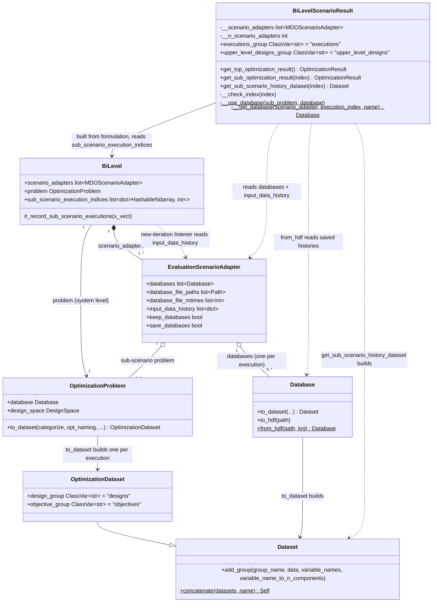

<!--
 Copyright 2021 IRT Saint Exupéry, https://www.irt-saintexupery.com

 This work is licensed under the Creative Commons Attribution-ShareAlike 4.0
 International License. To view a copy of this license, visit
 http://creativecommons.org/licenses/by-sa/4.0/ or send a letter to Creative
 Commons, PO Box 1866, Mountain View, CA 94042, USA.
-->

# BiLevel Sub-Scenario History Dataset

## Requirements

Implement a way to export, for one sub-scenario of a `BiLevel` formulation, the entire
history of its optimization iterations across *all* of its executions as a single
[Dataset][gemseo.dataset.dataset.Dataset], with every row tagged by the execution that
produced it, its position within that execution's sub-optimization, and the upper-level
values that were passed into the sub-scenario for that execution — so that a user can
post-process the coupled history of the two levels in one object, instead of manually
zipping `adapter.databases` (or a set of saved HDF5 files) against the upper-level values
that drove them.

Boundaries:

- **In scope**: `MDOScenarioAdapter`/`EvaluationScenarioAdapter` instances used as
  sub-scenarios of a `BiLevel` formulation, for both retention modes already offered by
  `BiLevel_Settings` — `keep_opt_history` (in-memory `databases`) and `save_opt_history`
  (HDF5 files) — used separately or together.
- **Out of scope**: `BiLevel_Settings.disciplines_as_sub_scenario` entries (plain
  `Discipline`s, no `databases`, no optimization history to export). They are guarded
  rather than supported: the `BiLevelScenarioResult` constructor reads the design spaces of
  the real adapters only, `get_sub_scenario_history_dataset` raises a `ValueError` ("The
  sub-scenario at index {index} is a discipline and has no optimization history.") for an
  index pointing at such a discipline, and `get_sub_optimization_result` returns `None` for
  it; any change to what is stored *during* execution (no new fields on
  `Database`); any streaming/incremental access to the dataset while the BiLevel scenario is
  still running (the dataset is built on demand, once the adapter has executed at least
  once).
- **Additive only, with two documented exceptions**: `BiLevel_Settings`,
  `BiLevelScenarioResult`'s existing public methods (`get_top_optimization_result`,
  `get_sub_optimization_result`) and `EvaluationScenarioAdapter`'s
  `databases`/`keep_databases`/`save_databases` semantics keep their meaning, and
  `Dataset.concatenate` is a new, generic addition with no interaction with any existing
  `Dataset` method. The two exceptions, both user-visible and both changelogged: the
  `BiLevel` database file prefix now carries the sub-scenario index (Operations §2), and
  `get_sub_optimization_result` raises `ValueError` for a negative index instead of
  returning `None` (Operations §4). The HDF5 file written under `save_databases=True` still
  holds only the database, as before. One behavioral fix is also changelogged:
  `get_sub_optimization_result` returns the execution that produced the system-level
  outputs at the optimum, paired with each system-level iteration when that iteration is
  stored (Operations §2), instead of always pairing executions and system-level
  evaluations positionally; it returns `None` only when no history was retained in the
  main process, or when the adapter cache can hold several entries (neither `None` nor a
  `SimpleCache`), as the matching execution cannot be identified then (Operations §4). A
  second one: this result is also built when only `save_opt_history` is enabled. A third
  one: `BiLevelScenarioResult` no longer raises `AttributeError` when the `BiLevel`
  formulation uses `disciplines_as_sub_scenario`.

## Entities

Conservative notes on this model:

- **No new domain class.** Each execution's dataset is exactly the shape an
  `OptimizationDataset` already produces (`designs`/`objectives`/… groups from
  `Database.to_dataset`/`OptimizationProblem.to_dataset`); the two new groups
  (`upper_level_designs`, `executions`) are added to the *concatenated* dataset through the
  existing, generic `Dataset.add_group`. No `HistoryRecord`, no `IterationMetadata` wrapper
  class is introduced.
- **The returned dataset is a plain `Dataset`, not an `OptimizationDataset`.** It stacks
  several independent optimization histories, so it is not itself an optimization history
  and carries no optimization metadata; its docstring states that it is not meant to be
  passed to [execute_post][gemseo.execute_post]. The per-execution datasets it is built from
  *are* `OptimizationDataset`s; `Dataset.concatenate` downgrades them deliberately, by virtue
  of being called on `Dataset`.
- **Three new stored fields on the adapter**, all appended in `_post_run` and aligned by
  construction: `database_file_paths` (written under `save_databases`),
  `database_file_mtimes` (written under `save_databases`, right after `to_hdf`, aligned
  with `database_file_paths`, and used to detect a file overwritten afterwards) and
  `input_data_history` (written under `keep_databases or save_databases`). None changes
  what `keep_databases`/`save_databases` mean. `database_file_paths` makes the on-disk case
  as order-reliable as the in-memory case, closing the UUID-naming ordering risk flagged in
  the analysis without requiring any particular `NameGenerator.Naming` mode;
  `input_data_history` is what makes the upper-level labelling possible at all, without the
  adapter needing any reference to the system-level problem.
- **`Dataset.concatenate` is formulation-agnostic** and lives beside `Dataset`, not beside
  `BiLevel`: it knows nothing about system/sub-scenario levels, only about stacking rows of
  datasets that share the same columns. `BiLevelScenarioResult.get_sub_scenario_history_dataset`
  is the only place that knows about the outer/inner linkage.
- **`get_sub_scenario_history_dataset` reuses the existing swap-database idiom** already
  present in `BiLevelScenarioResult.__init__` (`sub_problem.database = scenario_adapter.databases[execution_index]`
  / `finally: sub_problem.database = database`), generalized from the single optimum
  execution to every retained execution, in memory or reloaded from disk with
  `Database.from_hdf`.
- **The formulation pairs the executions with the system-level iterations.** A
  new-iteration listener of the system-level database, added by `BiLevel`, records for
  each adapter the index of its last execution in `input_data_history` when an iteration is
  stored, in the public `BiLevel.sub_scenario_execution_indices`. The constructor looks up
  `x_opt` there, instead of indexing `databases` with the system-level optimum index or
  guessing the pairing from the recorded inputs after the run.

## Approach

1. **Track file order at the source, not by parsing file names**
    - `NameGenerator.Naming.UUID` (required for multiprocess-safe parallel sub-scenarios)
    produces names with no numeric order, and even `NUMBERED` names are plain integers
    (`"1"`, `"2"`, …, unpadded — confirmed in `BaseNameGenerator._generate_name`), so a
    lexicographic glob-sort is wrong past 9 files. Reconstructing order from disk after the
    fact is therefore unreliable under either naming mode.
    - Instead, add `EvaluationScenarioAdapter.database_file_paths: list[Path]`, appended in
    `_post_run` in the same place and under the same condition (`save_databases`) as the
    existing `to_hdf` call, so its order is simply the order in which the adapter executed —
    correct for every `naming` mode, with no parsing.
    - This is the same trick already used for `databases` (`keep_databases`): the adapter
    itself is the source of truth for order, not the filesystem.
    - The path is `.resolve()`d before being used and stored, because the directory manager
    changes the current directory during execution: a relative path recorded under one
    working directory would not be readable later from another.

2. **Reuse `to_dataset`, add only the concatenation layer**
    - `Database.to_dataset()` / `OptimizationProblem.to_dataset()` already build exactly the
    `designs`/`objectives`/`equality_constraints`/`inequality_constraints`/`observables`
    groups the requirement's example shows, for one database. The new work is limited to:
    (a) building one such dataset per retained execution, (b) stacking them, (c) decorating
    the stacked dataset with its `executions` and `upper_level_designs` groups.
    - Decorate **after** concatenating, not before: the two new groups are added once, to the
    whole stacked dataset, from per-execution row counts (`[len(d) for d in datasets]`).
    Decorating each per-execution dataset first would call `add_group` N times for the same
    two groups and force the row-block bookkeeping into the loop.
    - `Dataset.concatenate(datasets, name="")` is added as a small, generic classmethod: it
    validates that every dataset shares the same columns (`MultiIndex`), then delegates to
    `pandas.concat(datasets, ignore_index=True)` and re-wraps the result as `cls(...)`.
    The explicit re-wrap is what makes the receiving class win — `Dataset.concatenate(...)`
    returns a `Dataset` and `OptimizationDataset.concatenate(...)` an `OptimizationDataset`,
    whatever the classes of the inputs — rather than leaving the result class to whatever
    `pandas.concat` infers from the first frame. This is precisely how the history dataset
    becomes a plain `Dataset` while being built from `OptimizationDataset` pieces.
    - `misc` is reset to `{}` on the result: merging the miscellaneous information of several
    datasets is not well defined.
    - Mismatched columns (e.g. concatenating datasets from two different sub-scenarios, whose
    variables differ) is a programming error, not a case to silently pad with `NaN`: raise
    `ValueError` from `concatenate` when the datasets' columns are not all equal.

    **Indexing convention**: both `execution` and `sub_iteration` are 1-indexed, matching
    `Database`'s own 1-based iteration numbering (`Database.get_x_vect(iteration)`,
    `Database.__get_index`) so the two counters share one convention instead of mixing a
    0-based and a 1-based axis in the same dataset.

3. **Label each execution from the adapter's own recorded inputs, not from the system-level
   design history**
    - The first version of this design read the label from
    `main_problem.database.get_x_vect_history()[i]`, assuming `adapter.databases[i]` is the
    sub-scenario run of the `i`-th system-level evaluation. That assumption is false: an
    adapter can be executed a different number of times than the system-level problem is
    evaluated — it is skipped when its inputs are unchanged (cache hit), and MDA/warm-start
    paths can execute it more than once per system-level point. The indices then silently
    slide, mislabelling every row after the first divergence.
    - The shared design vector is also the wrong *content*: what actually drove a
    sub-optimization is the full adapter input vector, which includes the couplings computed
    by MDA1, not only the shared design variables of the system-level design space.
    - Therefore record, on the adapter itself, `input_data_history: list[dict[str, Any]]` —
    a deep copy of `self.io.get_merged_data()` restricted to `self._input_names`, appended in
    `_post_run` under `keep_databases or save_databases`. It is aligned with `databases` and
    `database_file_paths` **by construction**, because they are appended in the same
    branch of the same method, so no index reconciliation is ever needed.
    - The adapter is the only object that can know these values without reaching outside
    itself; recording them there also keeps the mechanism reusable by any future
    adapter-based, non-BiLevel nested-scenario setup.

4. **Keep the BiLevel-specific assembly in `BiLevelScenarioResult`, not in the adapter**
    - The adapter records raw material (`databases`, `database_file_paths`,
    `database_file_mtimes`, `input_data_history`) but builds no dataset: it stays a discipline, unaware of datasets
    and of BiLevel.
    - `BiLevelScenarioResult` already receives `formulation.scenario_adapters` in its
    constructor and already swaps `sub_problem.database` in and out to reconstruct a single
    execution's result; `get_sub_scenario_history_dataset(index)` generalizes
    exactly that pattern to every retained execution, concatenates, then adds the two extra
    groups.
    - It no longer needs the system-level problem at all, so the `__main_problem` attribute
    introduced by the first version is removed.

5. **In-memory takes precedence; on-disk is the fallback for the same call**
    - `get_sub_scenario_history_dataset(index)` uses `scenario_adapter.databases` when
    non-empty (no disk I/O, no HDF5 round-trip cost); otherwise it falls back to
    `scenario_adapter.database_file_paths`, reading each file through
    `Database.from_hdf(path, log=False)` and swapping it into the live sub-problem, exactly
    as the in-memory branch does. The files hold only the database: the live sub-problem
    already carries the objective, constraint and design-space metadata `to_dataset` needs,
    so exporting the whole problem would only make the files larger (54% on a Sobieski
    BiLevel), the export slower (65%) and log an INFO line per execution outside
    `sub_scenarios_log_level`.
    - If neither is populated, two cases are told apart. When `keep_databases` or
    `save_databases` is on, the lists were filled in separate processes
    (`parallel_scenarios=True`, `multithread_scenarios=False`) and stay empty in the main
    process: the `ValueError` says the histories are not collected in that case. Otherwise
    the `ValueError` explains that `keep_opt_history` or `save_opt_history` must be enabled
    on the `BiLevel` formulation.
    - Both branches produce the same shape of dataset, so callers never need to know which
    retention mode produced it.
    - **Guard against an overwritten file.** Two runs in the same directory with the same
    sub-scenario name and index write the same file names (the per-adapter `NameGenerator`
    counter restarts and `to_hdf` uses the mode "w"), so a stored path can later point to
    the file of another run. The adapter therefore stores `path.stat().st_mtime_ns` in
    `database_file_mtimes` after `to_hdf`, and `__get_database` compares it with the current
    modification time before reading the file and raises a `ValueError` rather than
    silently returning the history of another run. The `zip(strict=True)` cannot detect
    this, as the lengths match. The file names are unchanged.

6. **`upper_level_designs` layout: sorted, per-component, numeric-only**
    - The variable names come from `sorted(input_data_history[0])`. Sorting is required:
    the order of the adapter's input names is not deterministic, and an unsorted layout would
    make the column order of the returned dataset vary between runs.
    - Sizes come from the recorded values themselves (`input_data_history[0][name].size`),
    and each execution's row block is built by `numpy.tile`-ing that execution's concatenated
    input vector over its number of sub-iterations. This keeps the same per-component column
    layout already used for `designs`/`objectives`, so a vector-valued input is not silently
    flattened into one column.
    - The values become dataset columns, so they must be numeric: a non-`ndarray` input value
    (e.g. a string input of the sub-scenario's disciplines) raises `ValueError` naming the
    variable and its type. `ValueError` rather than `TypeError` — with `# noqa: TRY004` and a
    comment saying so — for consistency with every other error raised by this method.
    - An adapter may have no input at all (a sub-scenario using no shared design variable
    and no coupling). `variable_names` is then empty and the `upper_level_designs` group is
    not added, instead of failing on `concatenate([])`.

7. **Record the pairing of executions and system-level iterations as it happens**
    - Pairing `databases[i_opt]` with the system-level optimum index is only right when the
    adapter was executed exactly once per evaluation of the system-level problem. A cache
    hit skips an execution; the Gauss-Seidel loop of `BiLevelBCD` runs each adapter several
    times per evaluation, with the same system-level design values and different couplings;
    a system-level optimizer with finite differences runs it at perturbed points. Guessing
    the pairing after the run, by counts or by matching the recorded inputs, fails in each
    of these setups, so it is recorded instead.
    - `BiLevel` adds a new-iteration listener to the system-level database. The database
    notifies it once per iteration, when the first outputs of a new input value are
    stored, i.e. right after the chain that computed them ran. At that moment the last
    execution of each adapter is the one that produced these outputs: the converged iterate
    of a `BiLevelBCD` loop, or, after a cache hit, the execution the cache returned. The
    listener stores `len(adapter.input_data_history) - 1` under the system-level input
    value, for each adapter whose history is not empty.
    - The execution at the optimum is then the one stored under `x_opt`. A system-level
    point that fails after the adapter ran stores no outputs and so records nothing. One
    rule covers cache hits, `BiLevelBCD` loops, finite differences and sub-scenarios
    without any system-level design variable as input.
    - The "last execution" rule holds only when a cache hit returns the latest execution,
    i.e. with a `SimpleCache` (or no cache). A cache holding several entries
    (`MEMORY_FULL`, HDF5 cache) can serve an older execution without running `_post_run`,
    so the last execution is then not the one that produced the outputs. The listener skips
    the pairing for such an adapter, checking the cache at record time because it can be
    changed after the formulation is built, and `get_sub_optimization_result` returns `None`
    instead of a wrong result. Matching the current inputs against the recorded ones was
    rejected: the `BiLevelBCD` couplings differ by about 1e-13 at listener time.

8. **Tell the adapters from the disciplines treated as sub-scenarios**
    - `formulation.scenario_adapters` is the list of the real adapters followed by the
    `disciplines_as_sub_scenario`. The number of real adapters is
    `len(formulation.sub_scenario_execution_indices)`, which has one mapping per real
    adapter only.
    - `BiLevelScenarioResult` stores it as `__n_scenario_adapters` and reads the design
    spaces of `scenario_adapters[: self.__n_scenario_adapters]` only.
    `__n_sub_problems` keeps the total, so the index checks are unchanged and
    `get_sub_optimization_result` still answers `None` for a discipline.

## Structure

### Inheritance Relationships

No new class and no new inheritance edge. `OptimizationDataset` (already a `Dataset`
subclass) is the type of each per-execution dataset, while the concatenated result is a plain
`Dataset`; `Dataset` itself is extended with one new classmethod.

### Dependencies

1. `EvaluationScenarioAdapter._post_run` calls `self.io.get_merged_data()` and appends to
   `self.input_data_history`, then `Path(...).resolve()`/`database.to_hdf(path)`,
   `self.database_file_paths.append(path)` and
   `self.database_file_mtimes.append(path.stat().st_mtime_ns)`.
2. `BiLevelScenarioResult.get_sub_scenario_history_dataset` first rejects an index
   pointing at a discipline (before any history lookup), then calls `__get_database` for
   each execution index of `input_data_history`
   (`self.__scenario_adapters[index].databases[execution_index]`, else
   `Database.from_hdf(database_file_paths[execution_index], name=..., log=False)` after
   comparing `path.stat().st_mtime_ns` with `database_file_mtimes[execution_index]`), then
   `__use_database` around each `sub_problem.to_dataset(opt_naming=True)`,
   `Dataset.concatenate`, then `Dataset.add_group` twice (for `executions` and
   `upper_level_designs`) on the concatenated dataset, reading the labels from
   `scenario_adapter.input_data_history`. It does **not** touch the system-level problem.
3. `BiLevelScenarioResult.__init__` reads the design spaces of
   `scenario_adapters[: self.__n_scenario_adapters]` only, converts `main_problem.solution.x_opt` with
   `Database.get_hashable_ndarray` and looks it up in each mapping of
   `formulation.sub_scenario_execution_indices` to find the execution at the system-level
   optimum (see Operations §4); the constructor then gets the corresponding database with
   `__get_database` and swaps it in using `__use_database`.
4. `Dataset.concatenate` calls `pandas.concat`, validates `Dataset.columns` equality across
   its inputs and re-wraps the result as `cls(...)`; it depends on nothing BiLevel-specific.
5. `BiLevel._create_scenario_adapters` (`src/gemseo/formulation/bilevel.py`) builds the
   adapters with `database_file_prefix=f"{scenario.name}_{index}"`, and
   `BiLevel._create_multidisciplinary_process` registers
   `_record_sub_scenario_executions` with `self.problem.database.add_new_iter_listener`;
   the listener reads `adapter.input_data_history`, checks
   `adapter.cache is None or isinstance(adapter.cache, SimpleCache)` (`SimpleCache` is
   imported at runtime from `gemseo.core.cache.simple`) and calls
   `Database.get_hashable_ndarray(x_vect, copy=True)` (see Operations §2).

### Layered Architecture

1. **Adapter layer** (`src/gemseo/scenario/adapter/evaluation.py`): owns retention
   (`databases`, now also `database_file_paths`, `database_file_mtimes` and
   `input_data_history`) — unaware of
   BiLevel, of datasets and of any outer scenario.
2. **Formulation layer** (`src/gemseo/formulation/bilevel.py`): owns the uniqueness of the
   database file prefix across sub-scenarios, and the pairing of the adapter executions
   with the system-level iterations; still the layer that knows both the sub-scenario
   adapters and the system-level problem.
3. **Result layer** (`src/gemseo/scenario/scenario_result/bilevel_scenario_result.py`):
   gains the one new public method; owns the assembly and labelling rules specific to BiLevel.
4. **Dataset layer** (`src/gemseo/dataset/dataset.py`): gains one new, formulation-agnostic
   classmethod; unaware of scenarios, adapters or optimization at all.
5. **Documentation and changelog layer**: `docs/user_guide/concepts/formulations/bilevel.md`
   (usage example and separate-process warning), the how-to
   `docs/examples/howtos/formulations/plot_howto_bilevel_sub_scenario_history.py`, and the
   `../../changelog/fragments/1968.added.md` / `changelog/fragments/1968.changed.md` /
   `changelog/fragments/1968.fixed.md` fragments.

## Operations

Execute in this order; each step leaves the test suite green.

### 1. Update Adapter — `EvaluationScenarioAdapter` (`src/gemseo/scenario/adapter/evaluation.py`)

1. Responsibility: record, in memory and in execution order, the raw material the result
   layer needs to rebuild and label a sub-scenario history — the HDF5 file paths written by
   this adapter (mirroring `databases` for the on-disk retention mode), their modification
   times right after the export, and the input values of each retained execution.
2. Imports: add `from pathlib import Path` at module level (runtime import, used to
   construct real `Path` instances, not only for annotations) and `from typing import Any`
   (for the `input_data_history` annotation).
3. Attributes, declared next to `databases`:
    - `database_file_paths: list[Path]` — "The paths of the HDF5 files exported after each
    execution, in execution order."
    - `database_file_mtimes: list[int]` — "The modification times (ns) of the HDF5 files
    right after their export." Its docstring adds that it is aligned with
    `database_file_paths`, that it makes it possible to detect that a file was overwritten
    afterwards, e.g. by another adapter exporting to the same path, and carries the same
    parallel-execution caveat.
    - `input_data_history: list[dict[str, Any]]` — "The input values of each execution, in
    execution order." Its docstring states that it is appended to whenever a database is kept
    or saved, so it is aligned by construction with `databases` and `database_file_paths`.
    - Extend the `databases` and `database_file_paths` docstrings with the parallel-execution
    caveat already documented for `keep_databases` in `BiLevel_Settings`: when the adapter is
    executed in parallel by separate processes, the sub-processes do not fill these lists in
    the main process. `input_data_history` carries the same caveat.
    - The `save_databases` attribute docstring and its `Args:` entry are unchanged: the
    adapter still saves "the database of the scenario".
4. Constructor (`__init__`, right after `self.databases = []`):
    - `self.database_file_paths = []`
    - `self.database_file_mtimes = []`
    - `self.input_data_history = []`
5. `_post_run`:
    - Before the two retention branches, under `if self.keep_databases or self.save_databases:`,
    record the input values of this execution so the kept and saved databases can be labelled
    afterwards: take `data = self.io.get_merged_data()` and append
    `{input_name: deepcopy(data[input_name]) for input_name in self._input_names}`.
    The deep copy matters because the adapter's I/O data are mutated by the next execution.
    - Replace the inlined f-string passed to `to_hdf` with a local
    `path = Path(f"{self.__database_file_prefix}_{self.__name_generator.generate_name()}.h5").resolve()`.
    The `.resolve()` is required because the directory manager changes the current directory
    during execution, so a relative path would not be readable back from elsewhere.
    - Save through `database.to_hdf(path)`, as before this story, **not**
    `self.scenario.formulation.problem.to_hdf(path)`: the reader swaps the reloaded
    database into the live sub-problem, which already carries the objective, constraint and
    design-space metadata, so a whole-problem dump only costs size, time and an INFO log
    line (see Approach §5).
    - If `self.save_databases`: `self.database_file_paths.append(path)`, then, right after
    `to_hdf`, `self.database_file_mtimes.append(path.stat().st_mtime_ns)` (Approach §5).
6. Constraints: no change to `keep_databases`/`save_databases` semantics. `database_file_paths`
   is appended under exactly the same `if self.save_databases:` condition as the existing
   `to_hdf` call, so it is empty whenever no file was written and its length always equals the
   number of files written by this adapter instance. `database_file_mtimes` is appended in
   the same branch, so it is aligned 1:1 with `database_file_paths`.
   `input_data_history` is appended under
   the union of the two conditions, so it is never shorter than either list and is index-
   aligned with whichever of them is populated.
7. **Scope note**: the on-disk *content* of the files written under `save_databases=True`
   is unchanged by this story; only their paths are now recorded. A first version dumped
   the whole problem so that `OptimizationProblem.from_hdf` could read it back; review
   showed the `Database.from_hdf` plus database-swap reader yields the exact same dataset
   (`pandas.testing.assert_frame_equal(check_exact=True)`), so that deviation was reverted.
8. Docstring: `Args:`/`Returns:` unaffected; add the attribute docstrings per Google
   convention.

### 2. Update Formulation — `BiLevel` (`src/gemseo/formulation/bilevel.py`)

1. Responsibility: guarantee that two sub-scenarios cannot overwrite each other's exported
   HDF5 files, and record which execution of each adapter produced each system-level
   iteration.
2. `_create_scenario_adapters`: iterate `for index, scenario in enumerate(self.get_sub_scenarios())`
   and pass `database_file_prefix=f"{scenario.name}_{index}"` instead of
   `database_file_prefix=scenario.name`, with a comment stating that the index makes the
   prefix unique because two sub-scenarios can have the same name.
3. Public attribute `sub_scenario_execution_indices: list[dict[HashableNdarray, int]]`,
   with a docstring: one mapping per adapter of an optimization sub-scenario (the
   `_scenario_adapters`, not the `disciplines_as_sub_scenario`), in the order of the
   adapters, from the system-level input value of a new iteration to the index, in the
   adapter's `input_data_history`, of its last execution before this iteration was
   stored; recorded only when the adapter keeps or saves the histories and runs in the
   main process. `HashableNdarray` is imported under `TYPE_CHECKING`, `Database` at
   runtime.
   The docstring adds that the pairing is also skipped when the cache of the adapter can
   hold several entries, i.e. when it is neither `None` nor a `SimpleCache`, as an
   execution may then be replaced by a cached one and the last execution is no longer the
   one that produced the outputs.
4. `_create_multidisciplinary_process`: after registering
   `_store_optimal_local_design_values`, set `self.sub_scenario_execution_indices = [{} for
   _ in self._scenario_adapters]` and register `self._record_sub_scenario_executions` with
   `self.problem.database.add_new_iter_listener`.
5. Protected method `_record_sub_scenario_executions(self, x_vect: DatabaseKeyType) ->
   None` (Approach §7): `hashable_x_vect = Database.get_hashable_ndarray(x_vect,
   copy=True)`; for each `adapter, execution_indices` of `zip(self._scenario_adapters,
   self.sub_scenario_execution_indices, strict=True)`, if `adapter.input_data_history` is
   not empty — it is empty when the history is neither kept nor saved, or when the
   adapter runs in separate processes — and `adapter.cache is None or
   isinstance(adapter.cache, SimpleCache)`, set `execution_indices[hashable_x_vect] =
   len(adapter.input_data_history) - 1`. `SimpleCache` is imported at runtime from
   `gemseo.core.cache.simple`. The cache is checked here, at record time, because it can
   be changed after the formulation is built; an in-code comment says so.
6. Constraints: the formulation still exposes `scenario_adapters` and `problem` exactly as
   before.
7. **Scope note**: the prefix change is user-visible — the exported files are now named e.g.
   `"FooScenario_0_1.h5"` instead of `"FooScenario_1.h5"` — and is the second documented
   exception to the "additive only" boundary. Without it, two sub-scenarios sharing a name
   silently clobber each other's history files, which this feature would then read back as
   one scenario's history. Changelogged.

### 3. Create Utility — `Dataset.concatenate` (`src/gemseo/dataset/dataset.py`)

1. Responsibility: stack the rows of several datasets sharing the same columns into one
   dataset of the receiving class, generic over any
   `Dataset`/`OptimizationDataset`/`IODataset`.
2. Method (added as a `classmethod`, near `add_group`):
    - `concatenate(cls, datasets: Iterable[Dataset], name: str = "") -> Self`
      (`Self` is imported from `typing` under `TYPE_CHECKING`)
        - Logic:
       1. `datasets = list(datasets)`; if empty, raise `ValueError`
          ("At least one dataset is required.").
       2. Compare `datasets[0].columns` against every other dataset's `columns`; if any
          differ, raise `ValueError` naming the mismatched dataset's index.
       3. `concatenated_dataset = cls(concat(datasets, ignore_index=True))` (using
          `pandas.concat`, added to the module-level `from pandas import ...` block).
       4. `concatenated_dataset.name = name or datasets[0].name`;
          `concatenated_dataset.misc = {}`.
       5. Return it.
3. Constraints: no reordering, no deduplication — rows keep the order of `datasets` and,
   within each dataset, their own row order.
4. Docstring must state the two non-obvious behaviors: the result is an instance of the class
   the method is *called on*, whatever the classes of the inputs (`Dataset.concatenate(...)`
   returns a `Dataset`, `OptimizationDataset.concatenate(...)` an `OptimizationDataset`);
   and `misc` is empty, because merging the miscellaneous information of several datasets is
   not well defined. Use single-backtick mkdocs style for `datasets`, not RST double
   backticks.

### 4. Update Result — `BiLevelScenarioResult` (`src/gemseo/scenario/scenario_result/bilevel_scenario_result.py`)

1. Responsibility: expose the combined, execution-labelled history dataset of one
   sub-scenario, reusing the same database-swap idiom the constructor uses for the
   optimum index, both now going through the shared `__use_database` context manager.
2. Constructor changes (`__init__`):
    - Add a docstring with `Args:` and `Raises:` (`ValueError` if the scenario has not yet
    been executed, or if the HDF5 file of a sub-scenario execution needed to build the
    sub-optimization results was overwritten after this execution), with
    `# noqa: D205 D212 D415`.
    - Store `self.__scenario_adapters = scenario_adapters` (already computed locally). The
    system-level problem is **not** stored: the labels come from the adapter.
    - Store `self.__n_scenario_adapters = len(formulation.sub_scenario_execution_indices)`
    (with an in-code comment: the adapters of the sub-scenarios come first, followed by the
    disciplines treated as sub-scenarios, which have no scenario), and read the design
    spaces of `scenario_adapters[: self.__n_scenario_adapters]` only. `__n_sub_problems`
    keeps `len(scenario_adapters)`.
    - No early return: an adapter without retained history has an empty mapping in
    `formulation.sub_scenario_execution_indices`, so a sub-result is built whenever a
    history is kept or saved, including when only `save_opt_history` is enabled.
    - Identify the sub-optimization at the system-level optimum from the recorded pairing
    (Approach §7): compute `x_opt =
    Database.get_hashable_ndarray(main_problem.solution.x_opt)` and, for each `index,
    execution_indices` of `enumerate(formulation.sub_scenario_execution_indices)`,
    `execution_index = execution_indices.get(x_opt)`; `continue` when it is `None`.
    Otherwise `scenario_adapter = scenario_adapters[index]`, get the database with
    `self.__get_database(scenario_adapter, execution_index, sub_problem.database.name)`,
    and swap it into `sub_problem` with `__use_database` to build the
    `OptimizationResult`.
    - Private static context manager `__use_database(sub_problem, database)`: sets
    `sub_problem.database = database`, yields, and restores the original database in a
    `finally`.
    - Private static method `__get_database(scenario_adapter, execution_index: int, name:
    str) -> Database`, shared by the constructor and `get_sub_scenario_history_dataset`:
    returns `scenario_adapter.databases[execution_index]` when kept in memory, else
    `Database.from_hdf(path, name=name, log=False)` where `path =
    scenario_adapter.database_file_paths[execution_index]`, after checking that
    `path.stat().st_mtime_ns` equals
    `scenario_adapter.database_file_mtimes[execution_index]`; otherwise it raises
    `ValueError` ("The HDF5 file {path} was overwritten after the execution; its
    optimization history is no longer available."). Callers only pass an index of an
    execution with a retained history, so no third branch is needed. Its docstring has a
    `Raises:` entry for the overwritten file.
    - Document the consequence in `get_sub_optimization_result`'s docstring: the result is
    the one of the last execution of the sub-scenario before the system-level optimum was
    stored, i.e. the execution that produced the system-level outputs at the optimum; it is
    `None` when the history was neither kept in memory nor saved to disk, or when the
    sub-scenario was executed in separate processes, or when the sub-scenario is a
    discipline, or when the adapter of the sub-scenario uses a cache that can hold several
    entries.
    - Private method `__check_index(index) -> None`, shared by `get_sub_optimization_result`
    and `get_sub_scenario_history_dataset`: raise `ValueError` ("The index ({index}) of a
    sub-scenario must be between 0 and {max_index}.") unless
    `0 <= index <= max_index`. Before, `get_sub_optimization_result(-1)` returned `None`
    while `get_sub_scenario_history_dataset(-1)` raised; both now raise, and both
    docstrings say "If the index is negative or greater than N-1".
3. Class attributes:
    - `executions_group: ClassVar[str] = "executions"`
    - `upper_level_designs_group: ClassVar[str] = "upper_level_designs"`
    - `__execution_variable: Final[str] = "execution"`
    - `__sub_iteration_variable: Final[str] = "sub_iteration"`
4. Method:
    - `get_sub_scenario_history_dataset(self, index: int) -> Dataset`
        - Logic:
       1. Validate `index` with `self.__check_index(index)`. The negative half matters:
          a negative index would otherwise silently select an adapter from the end of the
          list.
       2. If `index >= self.__n_scenario_adapters`, the index points at a discipline treated
          as a sub-scenario: raise `ValueError` ("The sub-scenario at index {index} is a
          discipline and has no optimization history.").
       3. `scenario_adapter = self.__scenario_adapters[index]` and `sub_problem =
          scenario_adapter.scenario.formulation.problem`.
       4. `input_data_history = scenario_adapter.input_data_history`; it is empty exactly
          when neither `databases` nor `database_file_paths` holds anything, as
          `_post_run` appends to them together.
       5. If `input_data_history` is empty, raise `ValueError`: when `scenario_adapter.keep_databases
          or scenario_adapter.save_databases`, "No sub-scenario history is available; the
          sub-scenario histories are not collected when the sub-scenarios are executed in
          separate processes."; otherwise "No sub-scenario history is available; enable
          `keep_opt_history` or `save_opt_history` on the `BiLevel` formulation."
       6. Otherwise, build one `OptimizationDataset` per execution: for each
          `execution_index` of `range(len(input_data_history))`, get the database with
          `self.__get_database(scenario_adapter, execution_index,
          sub_problem.database.name)` (a database loaded from HDF5 is named after the
          sub-scenario, not left at the "Database" default), swap it into `sub_problem`
          with `__use_database` and call
          `sub_problem.to_dataset(opt_naming=True)` — the single loop replacing the three
          copies of the swap-and-restore idiom that used to live here (twice) and in the
          constructor.
       7. Derive `variable_names = sorted(input_data_history[0])` (sorted for a deterministic column
          layout — the adapter's input name order is not deterministic) and
          `variable_sizes = {name: input_data_history[0][name].size for name in variable_names}`.
          Before that, reject any non-`ndarray` value with a `ValueError` naming the variable
          and its type, "The upper-level value of the variable {name!r} is of type
          {type} instead of a NumPy array; a non-numeric upper-level value cannot be used
          to label the sub-scenario history." (`# noqa: TRY004` plus a comment:
          `ValueError` not `TypeError`, for consistency with the other errors of this
          method).
       8. `n_sub_iterations = [len(dataset) for dataset in iteration_datasets]`, then
          `dataset = Dataset.concatenate(iteration_datasets)` — called on `Dataset`, so the
          result is a plain `Dataset` even though the inputs are `OptimizationDataset`s.
       9. Add the `executions` group once, to the concatenated dataset, as
          `column_stack([concatenate([full(size, i + 1, dtype=int64) for i, size in enumerate(n_sub_iterations)]), concatenate([arange(1, size + 1, dtype=int64) for size in n_sub_iterations])])`
          with `variable_names=[self.__execution_variable, self.__sub_iteration_variable]`.
       10. Add the `upper_level_designs` group once, tiling each execution's concatenated
      input vector over its own row count:
      `concatenate([tile(concatenate([input_data[name].real for name in variable_names]), (size, 1)) for input_data, size in zip(input_data_history, n_sub_iterations, strict=True)], axis=0)`
      with `variable_names=variable_names` and
      `variable_name_to_n_components=variable_sizes`. The `strict=True` is the alignment
      assertion: `input_data_history` and the retained histories must have the same
      length, which `_post_run` guarantees by construction. Skip this group, and return
      the dataset as is, when `variable_names` is empty (an adapter without inputs).
       11. Return the dataset.
    - Raises: `ValueError` if `index` is negative or out of range, if the sub-scenario is a
    discipline, if no history is available, if the HDF5 file of an execution was overwritten
    after this execution, or if an upper-level value is not a NumPy array.
    - Docstring must state that the result is a plain `Dataset` carrying no optimization
    metadata, because it stacks several independent optimization histories, and so is not
    meant to be passed to [execute_post][gemseo.execute_post].
5. Constraints: both `execution` and `sub_iteration` are 1-indexed — `execution` numbers the
   sub-scenario's own executions `1, 2, 3, …` (position + 1 in
   `databases`/`database_file_paths`), `sub_iteration` numbers the sub-scenario's iterations
   within that block `1, 2, …, n` (matching `Database`'s own 1-based iteration numbering,
   e.g. `Database.get_x_vect(iteration)`). This diverges from the requirement's illustrative
   example table, which showed `execution` starting at 0 — the user has confirmed 1-indexing
   is the intended convention for both counters, so the example should be read as
   illustrative of the column *shape*, not the exact index origin. Note that `execution`
   counts *adapter executions*, which need not coincide with system-level iterations.
6. Both `execution` and `sub_iteration` columns are integer dtype (`int64`), never float.

### 5. Tests

1. `tests/dataset/test_dataset.py` — `Dataset.concatenate`:
   `test_concatenate_without_dataset` and `test_concatenate_with_different_columns` (both
   snapshotting the message via `assert_exception`), `test_concatenate` (compares the
   whole frame, row index included, with `assert_frame_equal`, so dropping
   `ignore_index=True` fails), `test_concatenate_name` (parametrized over an empty and a
   given name), `test_concatenate_misc` (empty on the result), and `test_concatenate_class`
   (parametrized over `Dataset` and `OptimizationDataset`, asserting the receiving class
   wins).
2. `tests/scenario/adapter/test_evaluation.py` — `test_string_input_data_history`: a
   discipline with a string input, checking that a non-numeric input value is still recorded
   in `input_data_history` (the adapter records it; only the result layer rejects it), and
   `test_database_file_mtimes` (`save_databases=True`, two executions, files written
   through `tmp_wd`: `database_file_mtimes` has one entry per path and equals the
   `st_mtime_ns` of each of the `database_file_paths`, in order).
3. `tests/scenario/scenario_result/test_bilevel_scenario_result.py` —
   `get_sub_scenario_history_dataset`: `..._in_memory` (`keep_opt_history=True`),
   `..._on_disk` (`save_opt_history=True`, `keep_opt_history=False`; also asserts
   `dataset.name` equals the sub-scenario's name, not the "Database" default of a
   database loaded from HDF5 without a name), `..._no_history` (snapshotted
   `ValueError`), `..._bad_index` and `..._negative_index` (snapshotted `ValueError`s),
   `..._is_not_an_optimization_dataset` (the result is a plain `Dataset`),
   `..._with_skipped_execution` (an adapter executed fewer times than the system-level
   problem was evaluated — the case that broke the first design), and
   `..._separate_processes` (parametrized over `keep_opt_history` and `save_opt_history`,
   emulating separate processes by clearing the adapter lists and the recorded pairing of
   `sub_scenario_execution_indices[0]`; asserts `get_sub_optimization_result(0) is None`
   and snapshots the `ValueError`).
   Plus `test_input_data_history` and `test_get_sub_optimization_result_with_skipped_execution`,
   both built on a `create_scenario_with_skipped_execution` helper; the latter is
   parametrized over an optimum after and before the skipped execution, and asserts the
   sub-result at `x = 0` (`x_opt = [0]`, `f_opt = 0`) in both cases. Plus
   `test_get_sub_optimization_result_negative_index` (snapshotted `ValueError`) and
   `test_sub_scenario_without_inputs` (sub-scenario `w = y**2` under system-level
   `z = x + w`, no system-level design variable or coupling as adapter input:
   `get_sub_optimization_result` is found from the recorded pairing, at `x_opt = [0]`,
   `f_opt = 0`, and the history dataset has no `upper_level_designs` group). Plus, for
   the recorded pairing (Approach §7):
   `test_get_sub_optimization_result_with_coupling` (a `create_scenario_with_coupling`
   helper wiring an MDA1 coupling `c` alongside a system-level design variable `x1` as
   adapter inputs; the buggy last-match-on-`x1`-only logic picked the wrong execution)
   and `test_get_sub_optimization_result_with_coupling_only_input` (adapter input is the
   coupling `c` alone, so no input identifies the execution), and
   `test_get_sub_optimization_result_with_cache_hit_and_other_coupling` (the reviewer's
   probe: a system-level `CustomDOE` whose second sample is a cache hit of the adapter and
   whose third passes the same `x1` with another coupling; the optimum is the first
   sample, `f_opt = 1 / 0.99`, which neither positional pairing nor input matching finds).
   Plus, for a sub-result without in-memory history: `test_get_sub_optimization_result_with_save_opt_history_only`
   (`keep_opt_history=False, save_opt_history=True`; compares the result against the one
   obtained with `keep_opt_history=True`). Plus the guards:
   `test_get_sub_scenario_history_dataset_with_overwritten_file` (two scenarios with a
   homonymous sub-scenario executed in the same directory with `save_opt_history=True`
   only: the history is available while the files are untouched, then raises the
   `ValueError` about the overwritten file once the second scenario has been executed),
   `test_overwritten_file_in_constructor` (the files of the adapter are `touch`ed after the
   run, so `BiLevelScenarioResult(scenario)` raises the same `ValueError`),
   `test_get_sub_optimization_result_with_adapter_cache` (parametrized over
   `Discipline.CacheType.SIMPLE` and `MEMORY_FULL` set on the adapter, with the reviewer's
   probe: a system-level `CustomDOE` of 3 samples `[[0.9, 0.0], [0.5, 0.0], [0.9, 1.0]]`;
   `SIMPLE` gives `x_opt = [0.9]` and `f_opt = 0.9`, `MEMORY_FULL` gives `None`), and the
   fixture `scenario_with_discipline_as_sub_scenario` (a second sub-scenario given as a
   discipline through `disciplines_as_sub_scenario`) used by `test_disciplines_as_sub_scenario`
   (the constructor no longer fails, `get_sub_optimization_result(0)` is not `None`,
   `get_sub_optimization_result(1)` is `None` and the history dataset of index 0 is not
   empty) and `test_get_sub_scenario_history_dataset_of_discipline` (snapshotted
   `ValueError` for index 1). `test_get_sub_scenario_history_dataset_after_chdir` writes its
   files through `tmp_wd`.
4. `tests/formulation/test_bilevel.py` — `test_sub_optimization_result_at_system_optimum`,
   on the `aerostructure_scenario` fixture for both `BiLevel` and `BiLevelBCD`: every
   `get_sub_optimization_result(index)` is not `None` and its `x_opt` equals the optimal
   local design value stored in the system-level database, which comes from the same
   execution. It no longer checks the `BiLevelBCD` execution count, which is the job of
   `test_bcd_executes_adapters_several_times_per_evaluation` (parametrized with
   `BiLevelBCD` only): each adapter runs more times than the system-level problem is
   evaluated.
5. The numeric expectations are hand-computed against the tiny `scenario` fixture already in
   `tests/scenario/scenario_result/conftest.py` (`z = x + y`, outer `x` and inner `y` each
   swept over `[0.0, 1.0]` by a `CustomDOE`), not against a Sobieski problem: four rows,
   `designs.y = [0, 1, 0, 1]`, `objectives.z = [0, 1, 1, 2]`,
   `upper_level_designs.x = [0, 0, 1, 1]`, `executions.execution = [1, 1, 2, 2]`,
   `executions.sub_iteration = [1, 2, 1, 2]`. A hand-computable fixture is what makes these
   assertions exact rather than approximate.

### 6. Documentation and changelog

1. Add a "Post-processing the sub-scenario histories" section to
   `docs/user_guide/concepts/formulations/bilevel.md`, immediately before
   `## Going further`. There is no existing prose about `keep_opt_history`/`save_opt_history`
   in that page to attach to, so the section introduces them itself. The example uses
   `scenario.get_result()`. The section must end with the plain-`Dataset` caveat (no
   optimization metadata, not for `execute_post`), and carry a warning that the histories
   are not collected when the sub-scenarios run in separate processes
   (`parallel_scenarios=True`, `multithread_scenarios=False`). The how-to carries the same
   warning.
2. `../../changelog/fragments/1968.added.md` — the new `get_sub_scenario_history_dataset` method,
   `Dataset.concatenate`, the three new adapter attributes (`input_data_history`,
   `database_file_paths`, `database_file_mtimes`) and `BiLevel.sub_scenario_execution_indices`, which are public
   and therefore user-visible in their own right.
3. `changelog/fragments/1968.changed.md` — the two behavior changes: the `BiLevel` files
   are named after the sub-scenario *and its index* (`"FooScenario_0_1.h5"` instead of
   `"FooScenario_1.h5"`) so that two sub-scenarios sharing a name no longer overwrite each
   other, and `get_sub_optimization_result` raises `ValueError` for a negative index
   instead of returning `None`.
4. `changelog/fragments/1968.fixed.md` — three entries:
   `get_sub_optimization_result` returns the result of the execution that produced the
   system-level outputs at the optimum, instead of raising an `IndexError` or returning
   the result of another execution, when a sub-scenario ran a number of times different
   from the number of system-level evaluations (cache hit, `BiLevelBCD`, finite
   differences), and returns `None` when the adapter of the sub-scenario uses a cache that
   can hold several entries, as the matching execution cannot be identified then; it
   returns the result read from the HDF5 files when only `save_opt_history` is enabled,
   instead of `None`; and `BiLevelScenarioResult` no longer raises an `AttributeError` when
   the `BiLevel` formulation uses the `disciplines_as_sub_scenario` setting.
5. `docs/examples/tutorials/advanced/plot_tutorial_mdo_advanced.py` — the note after the
   `databases` of the structure scenario points to `get_sub_optimization_result` instead
   of telling users to index `databases` with `optimum_index`, which is wrong once the
   executions drift.

## Norms

1. **File preamble**: LGPL header (pre-commit-inserted) and `from __future__ import
   annotations` first, in every touched or new file.
2. **Naming**: `get_sub_scenario_history_dataset`, `concatenate` — verb-first. `databases`,
   `database_file_paths`, `database_file_mtimes`, `input_data_history`, `executions_group`,
   `upper_level_designs_group` — noun-only, reserved for attributes/`ClassVar`s, consistent
   with `OptimizationDataset.design_group`.
3. **Imports**: one per line, `TYPE_CHECKING`-guarded where only used in annotations
   (`Path` and `Any` are runtime imports in `evaluation.py`, `Path` because it is
   instantiated and `Any` because it appears in a class-level annotation evaluated by the
   attribute docstring tooling).
4. **Docstrings**: Google convention, semantic line feeds (one sentence or long clause per
   line), mkdocs-style cross-references
   (`[Dataset][gemseo.dataset.dataset.Dataset]`, never Sphinx RST); every new method's
   docstring carries `Args:`, `Returns:` and, where applicable, `Raises:`. Inline code uses
   single backticks (`datasets`), never RST double backticks. A docstring that fits the line
   limit needs no `# noqa: E501`; do not add one pre-emptively.
5. **Error messages**: build into a local `msg` then `raise ValueError(msg)`, per repo
   convention (ruff `EM`); reuse the existing wording style of
   `get_sub_optimization_result`'s index-range error for the new method's own index check.
   When a type check must raise `ValueError` rather than `TypeError` to stay consistent with
   the other errors of the same method, silence the linter with `# noqa: TRY004` **and** a
   comment saying why — the suppression alone does not carry the intent.
6. **Settings/Pydantic**: no new Pydantic settings class is introduced by this feature —
   `BiLevel_Settings` is unchanged, so no new entry is needed in `.ruff.toml`'s
   `runtime-evaluated-base-classes`.
7. **Testing**: snapshot exception messages with `assert_exception`; compare arrays with
   `numpy.testing.assert_allclose` and write files through `tmp_wd`; prefer the smallest
   fixture that makes the expected values hand-computable (the `scenario` fixture in
   `tests/scenario/scenario_result/conftest.py`) over a Sobieski-scale problem, which would
   force approximate assertions; never pass `-n` together with `--snapshot-update`.
8. **Changelog**: user-visible net effect only, split by kind — `added` for the new public
   method, the new utility and the new public adapter attributes; `changed` for the two
   behavior changes (BiLevel file naming, negative index); `fixed` for the sub-result at
   the optimum when executions drift (and `None` with a multi-entry cache), for the
   sub-result with `save_opt_history` alone and for the `AttributeError` with
   `disciplines_as_sub_scenario`.
   A new public attribute is
   user-visible and earns its own bullet; internal bookkeeping would not.

## Safeguards

1. **Functional constraints**
    - `get_sub_scenario_history_dataset(index)` returns a dataset with exactly
    `sum(len(db) for db in databases_or_reloaded_problems)` rows, and exactly the columns
    of the per-execution `to_dataset(opt_naming=True)` output plus `executions` (2 columns:
    `execution`, `sub_iteration`) and `upper_level_designs` (one column per component of
    every adapter input variable, in sorted variable-name order).
    - The returned object is a plain `Dataset`, never an `OptimizationDataset`: it stacks
    independent histories and carries no optimization metadata.
    - `execution` is 1-indexed and constant within a block; `sub_iteration` is 1-indexed and
    resets to 1 at the start of each block. Both counters share the same 1-based origin as
    `Database`'s own iteration numbering. `execution` counts adapter executions, which need
    not equal system-level iterations.
    - `upper_level_designs` values are broadcast identically across every row of a block —
    for `execution = e`, they must be byte-identical to
    `scenario_adapter.input_data_history[e - 1]`, not resampled, recomputed, or read from the
    system-level design history.
2. **Backward-compatibility constraints**
    - No change to the *meaning* of `databases`, `keep_databases`, `save_databases`,
    `keep_opt_history` or `save_opt_history`.
    - The bytes written under `save_databases=True` are still a bare `Database` dump.
    - Two deliberate, changelogged exceptions: the `BiLevel` file prefix now carries the
    sub-scenario index, so the names change from `{scenario_name}_{n}.h5` to
    `{scenario_name}_{index}_{n}.h5` (Operations §2), and
    `get_sub_optimization_result` raises `ValueError` for a negative index instead of
    returning `None` (Operations §4). The naming tests assert only existence under a prefix
    they pass in themselves, so neither exception breaks an existing assertion.
    - `BiLevelScenarioResult.get_top_optimization_result` is unchanged in signature and
    behavior. `get_sub_optimization_result` keeps its signature; it now picks the execution
    recorded when the system-level optimum was stored, where it previously raised
    `IndexError` or returned a result picked with a meaningless index once the executions
    drifted. It returns `None`, the documented "unavailable" answer it already had for the
    no-history case, only when no history was retained in the main process, when the index
    points at a `disciplines_as_sub_scenario` entry, or when the adapter cache can hold
    several entries (neither `None` nor a `SimpleCache`).
    - `Dataset.add_group` and every other existing `Dataset` method are unmodified;
    `Dataset.concatenate` is purely additive.
    - Every dataset produced before this story by `to_dataset` is unaffected — the new groups
    are only ever added to a dataset built specifically by the new method.
3. **Data and format constraints**
    - `Dataset.concatenate` raises `ValueError` rather than silently introducing `NaN` when
    input datasets do not share identical columns.
    - `execution`/`sub_iteration` columns are integer (`int64`), never float, so they are
    usable as groupby/join keys by the caller without a tolerance comparison.
    - `database_file_paths` entries are only ever appended, never removed or reordered, and
    always correspond 1:1 with a file that was actually written in that call to `_post_run`.
    They are absolute (`.resolve()`d at creation), so they survive the working-directory
    changes the directory manager performs during execution.
    - `database_file_mtimes` is aligned 1:1 with `database_file_paths` (appended right after
    `to_hdf`, in the same branch). A file overwritten after its execution, e.g. by another
    run with the same sub-scenario name and index in the same directory, makes
    `get_sub_scenario_history_dataset` and the `BiLevelScenarioResult` constructor raise a
    `ValueError`; they never return the history of another run.
    - `input_data_history` entries are deep copies, never references into the adapter's live
    I/O data, which the next execution overwrites.
4. **Performance constraints**
    - `get_sub_scenario_history_dataset` performs no disk I/O when `scenario_adapter.databases`
    is non-empty (the in-memory path is checked first); the HDF5-reading path is only taken
    as a fallback.
    - The method is called on demand — the only cost added to the BiLevel execution loop
    itself is, per execution, a few `list.append`s plus one `deepcopy` of the adapter's input
    values (and one `stat` call when the file is saved). That deep copy is bounded by the adapter's input size, not by the sub-scenario's
    history length, and is only paid when a database is already being kept or saved.
    - No attempt is made to reduce the memory cost of `keep_opt_history` itself; the
    already-documented "very memory consuming" trade-off in `BiLevel_Settings` is
    unchanged and is not silently made worse by this feature (it only exposes what was
    already being retained).
5. **Integration constraints**
    - `databases`, `database_file_paths`, `database_file_mtimes` and `input_data_history`
    are index-aligned **by construction**, being appended in the same branches of the same
    `_post_run` call.
    The method asserts this with `strict=True` on the `zip` of `input_data_history` and the
    per-execution row counts rather than reconciling lengths defensively. No alignment is
    assumed or required between these lists and the system-level problem's own history —
    that assumption is exactly what the first design got wrong.
    - An adapter may legitimately run a different number of times than the system-level
    problem is evaluated (a skipped execution on a cache hit, or several runs per point).
    The history dataset stays correct in that case, because it never indexes into the
    system-level history; `get_sub_optimization_result` stays correct too, because it
    uses the pairing recorded by the formulation when each system-level iteration was
    stored, never a count or an input match. The exception is an adapter whose cache can
    hold several entries (`MEMORY_FULL`, HDF5 cache): it may serve an older execution
    without running `_post_run`, so the pairing is skipped and
    `get_sub_optimization_result` returns `None` rather than a wrong result.
    - An `index` pointing at a `disciplines_as_sub_scenario` entry is guarded.
    `formulation.scenario_adapters` concatenates the real adapters with those plain
    disciplines, so such an index is reachable. The `BiLevelScenarioResult` constructor
    reads the design spaces of the real adapters only
    (`scenario_adapters[: self.__n_scenario_adapters]`) and skips the disciplines,
    `get_sub_scenario_history_dataset` raises a `ValueError` ("The sub-scenario at index
    {index} is a discipline and has no optimization history.") and
    `get_sub_optimization_result` returns `None`.
    - `parallel_scenarios=True` combined with `keep_opt_history=True` is already discouraged
    by `BiLevel_Settings`' own documentation (databases not propagated back to the main
    process); this feature does not change that guidance. When `keep_databases` or
    `save_databases` is on but the lists are empty, `get_sub_scenario_history_dataset`
    raises a dedicated `ValueError` saying the histories are not collected in separate
    processes, rather than asking to enable an option that is already on. The same caveat
    applies to `database_file_paths` and `input_data_history`, is stated in their
    docstrings, and is repeated as a warning in `bilevel.md` and in the how-to.
6. **Known limitation to state, not to fix here**
    - Reconstructing the combined history purely from files on disk, without the original
    `BiLevelScenarioResult`/adapter objects in memory (e.g. in a separate later Python
    process that only has the `.h5` files), is out of scope: `database_file_paths` is an
    in-memory record populated by the adapter that wrote the files, not a persisted index.
    This limitation must be written into the changelog fragment and the documentation
    example.
7. **Verification constraints**
    - All existing `tests/scenario/adapter/**`, `tests/dataset/**`,
    `tests/scenario/scenario_result/**` and `tests/formulation/test_bilevel.py` tests pass.
    - `uv run ruff check` and `uv run ruff format --check` are clean. `just check-typing`
    reports no error in any of the four touched modules; the recipe itself exits non-zero on
    85 pre-existing errors in 28 unrelated files, so it must be filtered to the touched paths
    rather than read as a pass/fail gate.
    - New tests cover, at minimum: the in-memory case, the on-disk case, the `ValueError` on
    missing history, the `ValueError`s on out-of-range and negative indices, the plain-`Dataset`
    return type, the skipped-execution case (both the history dataset staying correct and
    `get_sub_optimization_result` returning the sub-result at the optimum, whether the
    optimum comes before or after the drift), a cache hit followed by another coupling,
    a `BiLevelBCD` run, the row index of `Dataset.concatenate`, the negative index of
    `get_sub_optimization_result`, an adapter without inputs, the separate-process
    `ValueError`, a non-numeric input value being recorded by the adapter, and
    `Dataset.concatenate`'s own `ValueError`, `name`, `misc` and receiving-class
    behaviors, an overwritten HDF5 file (in the dataset method and in the constructor), the
    recorded `database_file_mtimes`, a multi-entry adapter cache giving `None`, and
    `disciplines_as_sub_scenario` (constructor, `None` sub-result and `ValueError` of the
    history dataset).
